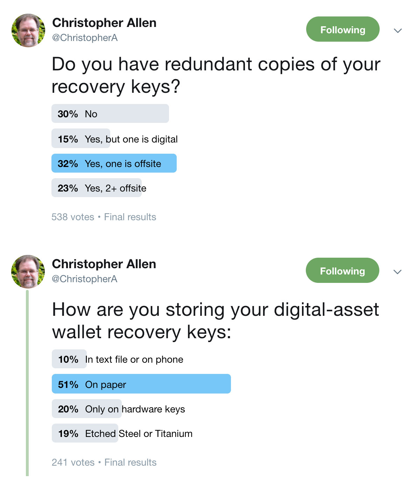
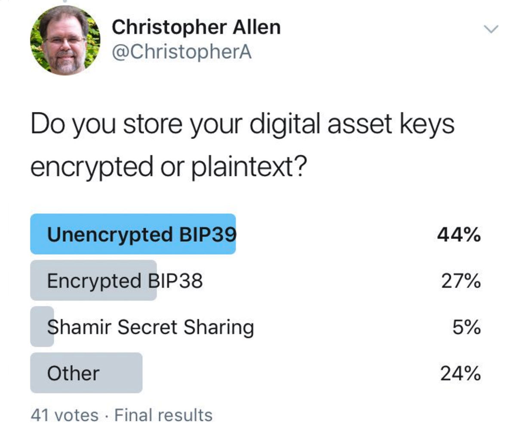

# Preface

## Foreword: The Key Management of Digital Assets

#### by Christopher Allen

I first became fascinated by the possibilities offered by public key cryptography when reading about the RSA algorithm in the early '90s. However, I didn't really start to deal with the problems of key management of my own large large cryptographic keys until the launch of PGP in 1992. 

Over those early years I've lost quite a few of my keys, mostly due to overly complex passwords that I thought I could remember. As I got better at that, I lost still more due to accidently erased folders or hard drives and a few others due to bitrot. I also got very early digital currency when I did some consulting with Digicash, but not only did I never cash it out, I can’t run the software anymore, as the servers it required have been gone for over a decade.

{float: right, width: "35%"}

The oldest keypair that I still have the private key for is now over 20 years old (ChristopherA@consensus.com ABB2B7CEE0983CD798D4266CCA7CBC1873262B3A DSA-1024 created 1998-12-09). I kept it for a long time due to the old, sentimental web-of-trust attestations associated with it, such as those from the founders of PGP and many early members of the SSL/TLS community, but I revoked it in 2015 as it was getting out-of-date with current standards.

This history gives me some perspective when it comes to the protection and management of keys for digital assets. Bitcoin in particular made some some massive improvements to the ability to manage lots of keys. However, problems with managing digital assets still exist: despite these improvements, I have seen my own colleagues lose millions of dollars in early bitcoin. 

Last year I surveyed a number of my professional colleagues in both the Bitcoin and Ethereum communities about their personal digital key management and custody practices. Despite the publication of very strong advice with projects like The Glacier Project, many of them had not actually implemented anything close to that level of sophistication. In most cases it was "Perfection is the Enemy of the Good" keeping them from doing what they know are better practices. Some even admitted that they were still using an old paper wallet or had a laptop locked up in their attic. Given the large destructive fires in California over the last several years, this worried me.

{float: right, width: "35%"}

When talking my colleagues I also learned that many didn’t want to share their best practices publically for operational security (op-sec) reasons, believing that it might put them at risk for attack or even physical coercion. Some of this is legitimate concern, especially for those living outside of the US, but to a certain extent I find in my work that "security by obscurity" is often a bad practice. Thus, the first version of the smart-custody scenarios included in this book are based on my own approach and methods, which I then shared with my professional colleagues for improvements.

When I started to share these scenarios outside the professional community, I discovered that there were some very different ways of thinking about digital asset risk that kept people from adapting them for their own needs. So I've also explained my own approach here, to encourage adoption. It's an approach to risk modeling that is meant to balance the "perfection" problem and to engender a general cryptographer-oriented way of thinking from an "adversarial" perspective. 

This topic is evolving rapidly, and many things will likely change over time But I hope that this book will help you to think differently about your digital assets and to know a bit more about how to get started, how to ask smart questions, and how to evolve your own procedures over time.

We are very open to your feedback and look forward to learning from you what we missed.

—	Christopher Allen

{pagebreak}

## What is #SmartCustody?

> _**"The use of advanced cryptographic tools to improve the care, maintenance, control, and protection of digital assets."**_
>

Our goals:

* To raise the bar on best practices for digital-asset custodianship by building a greater understanding of different custody use cases, risk models, and adversary threats.
* To prepare for new custody technologies that break old models for custodianship.

To accomplish these goals, we are creating a series of best-practices white papers and also offering a series of different workshops on these topics. We are additionally collaborating with cryptographic industry and regulatory stakeholders to establish standards, improve best practices, and create new cryptographic key-management and custody technologies.

This is the first of our [#SmartCustody](https://www.SmartCustody.com) best-practices white papers. To be informed of the release of future best-practices and other educational white papers and to learn about future workshops, subscribe to our email newsletter at [https://tinyletter.com/SmartCustody](https://tinyletter.com/SmartCustody).

{id: why-cold-storage}
## Why Cold Storage?

Among the best practices outlined in this document is a cold-storage scenario for self-custody.

Cold storage is primarily intended for digital-asset custodians who do not actively trade their digital assets. It offers a high level of protection for digital assets, because keys are secured offline or in hardware and _should_ _never be on networked computers._

However, cold storage should be considered as an option for _everyone_ who is managing digital assets. It can be the secure foundation for a more complex scenario that also involves hot wallets, offering the maximum security for whatever percentage of funds don't need to be actively available at all times.

A few questions can help you determine if you can move some of your funds from hot wallets to cold storage:

1. How much quick liquidity do you need?
2. How often are you moving your digital assets?
3. How often are you exchanging your digital assets?

After you answer these questions, you may discover that you don't actually need all of your funds to be always available. The remainder should then be moved off of exchanges into a cold-storage scenario, and the following can provide a model for that.

Even if you determine that all of your funds must remain hot, our cold-storage scenario still suggests a variety of best practices for managing digital-asset keys, and does so in the context of risks and adversaries that can be used to model other scenarios.

## The #SmartCustody Team

#SmartCustody is a project of [Blockchain Commons](https://www.BlockchainCommons.com), which supports blockchain infrastructure, internet security, and cryptographic research.

The leads for these #SmartCustody efforts are Christopher Allen ([@ChristopherA](https://twitter.com/ChristopherA)), Shannon Appelcline ([@Appelcline](https://twitter.com/Appelcline)), and Bryan Bishop ([@Kanzure](https://twitter.com/kanzure)). For more information see [Author Bios](#author-bios) at end of this white paper.

The procedures and contents of this white paper have been comprehensively peer-reviewed by a number of experts in the digital-asset ecosystem, including contributors to open-source project like Bitcoin Core and [The Glacier Project](https://glacierprotocol.org/), employees of blockchain technology companies like Blockstream, Ledger, and Tokensoft, and attorneys from a variety of disciplines. We expect to iterate these procedures and update this document regularly as new digital asset technologies and best practices become mature.
