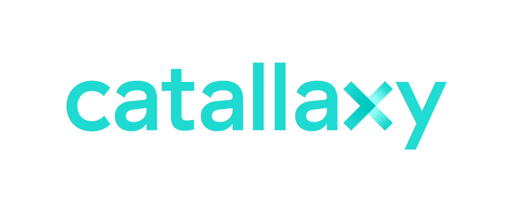

# Sponsors

The mission of the Blockchain Commons is to support blockchain infrastructure and the broader security industry through cryptographic research, cryptographic & privacy protocol implementations, architecture & code reviews, industry standards, and supportive documentation. We are a “not-for-profit” benefit corporation, with a strong commitment to open source and a defensive patent strategy. 

Our mission is funded by people like you: your personal or corporate patronage can help the Commons to accomplish its goals. Together, we can expand and improve the blockchain infrastructure that's used by our entire industry, and with your gift, we can remain independent while doing so. 

The following parties have contributed to this project in order to make it freely available to the public and to support continued updates as technology changes. If you're interested in sponsoring this or other Blockchain Commons projects, contact [ChristopherA](mailto:ChristopherA@blockchaincommons.com). You can also make a one-time contribution via our [Support #SmartCustody Book Crowdfunding](https://smartcustody.btcpay.blockchaincommons.com/) page.

### Sustaining Patrons

Sustaining patrons have made an ongoing commitment of funds for the support of Blockchain Commons and/or its #SmartCustody work.

{float: left, width: "30%"}

**[Digital Contract Design](https://contract.design)** creates contracts with trust minimization. They engage in Contract Design to show how contracts could be made more reliable; they offer Threat Analysis to demonstrate how well contract design holds up in an adversarial setting; and they work with the W3C Credentials Community Group and Rebooting Web-of-Trust community to provide a Self-Sovereign Identity Wallet.

{float: left, width: "30%"}

**[HTC Exodus](https://www.htcexodus.com/eu/)** is the product of HTC, who brings brilliance to life through leading innovation in smart mobile device and experience design. Beginning with a vision to put a personal computer in the palm of our customers’ hands, they have led the way in the evolution from palm PC to smartphone. Their goal for the Exodus blockchain phone is to rebuild trust, one phone at a time.

{pagebreak}

### Project Sponsors

Project sponsors have donated funds specifically for the  creation of this #SmartCustody book.

{float: left, width: "30%"}

**[Adamant Capital](https://www.adamantcapitalfund.com/)** believes that Bitcoin is retooling the financial industry. They run Adamant Fund I, a Bitcoin Alpha fund. Their mission is to responsibly outperform Bitcoin in a tax-efficient manner. Their vision is to build on Bitcoin as a collateral asset, as a basis for lending, as a financial benchmark, and as a developing technology.

{float: left, width: "30%"}

 **[Beam Privacy](https://beam.mw)** is a scalable confidential cryptocurrency: a Mimblewimble implementation. It completely conceals the values and metadata of transactions, in a prunable way which also reduces bloating on the blockchain. In addition to enhanced privacy and fungibility, this allows for much greater scalability. Beam's emphasis is on privacy, scalability, and usability. Download [their wallet](https://beam.mw/downloads) to try it out. 

{float: left, width: "30%"}

**[Blockchainbird](https://github.com/blockchainbird/bird)** is a free and open source software toolset with a manual to build an extra guarantee layer on existing database systems. It is free to use and adapt to your own needs. 

Smartphones and smart custody arranged? Then Bird gives wings to projects that are labeled as blockchain, but can in fact be implemented with databases.

{float: left, width: "30%"}

**[Catallaxy](https://catallaxy.rcgt.com/en/)** develops products and services in the domain of finance and accounting. The group of technology experts in cryptography, blockchain, data science and artificial intelligence develops solutions that can help build trust in the digital economy. Based in Montréal, Catallaxy is a subsidiary of [Raymond Chabot Grant Thornton](https://www.rcgt.com/en/), a professional services firm, also a member firm of [Grant Thornton International Ltd](https://www.grantthornton.global/en/).

{pagebreak}

{float: left, width: "30%"}

**[Hardcore Fund](https://hardcore.fund/)** is a nonprofit organization backed by hardcore bitcoiners. We donate to those who contribute to the Bitcoin ecosystem independently as an individual, a team or a nonprofit project. Our mission is to diversify the current bitcoin developement funding landscape and cover neutral developers from all over the world.  The fund is currently run and managed by Kevin Pan and Dovey Wan

{float: left, width: "30%"}

**[Ledger](https://www.ledger.com/)** develops security and infrastructure solutions for cryptocurrencies, as well as blockchain applications for individuals and companies, by leveraging a distinctive, proprietary technology. Their Ledger Nano S and the touchscreen Ledger Blue can both directly support 23 cryptocurrencies -- and dozens more via third party applications.

{float: left, width: "30%"}

**[Unchained Capital](https://www.unchained-capital.com/)** is a new kind of financial services company. They are the first collaborative asset management firm that offers loans and vaults for your Bitcoin. It was founded by people who believe that cryptocurrencies have the potential to change the world but only if they're useful. They set out to build financial products for long-term crypto-investors to get more value from their assets today and in the future.

{float: left, width: "30%"}

**[Winstead](https://www.winstead.com/Practices/Corporate-SecuritiesMA/Fintech-Cryptocurrencies-Emerging-Technologies)** is a law firm whose Fintech, Cryptocurrencies & Emerging Technologies team  counsels clients on structuring digital asset transactions -- from trading cryptocurrencies directly; participating in token launches; secondary trading of tokens; acquiring digital asset exposure through equity vehicles and derivatives; or making more traditional venture capital or other investments in companies building protocols, trading platforms other infrastructure.

{pagebreak}

### In-Kind Sponsors

In-kind sponsors have provided material such as books or hardware devices that were distributed at a #SmartCustody event or have provided space for an event.

{float: left, width: "30%"}

**[Blockstream](https://blockstream.com/)** has a mission to create the financial infrastructure of the future. They build crypto-financial infrastructure based on Bitcoin, the most robust and secure blockchain. Applying cutting-edge cryptography and security engineering, they are building the products and networks that make financial markets more efficient by reducing reliance on trust. 

{float: left, width: "30%"}

**[Cryptoasset Inheritance Planning](https://t.co/hsLxiZdQya) by Pamela Morgan** is a clear blueprint to inheritance planning for those holding cryptocurrency, tokens, crypto-collectibles, and other cryptoassets. Since 2015, Pamela has educated thousands of cryptocurrency owners around the world about why inheritance planning for cryptoassets matters and how to do it in a secure, usable, resilient, and efficient manner.

{float: left, width: "30%"}

**[CryptoTag](https://cryptotag.io/)** is a crypto security company from Amsterdam. They believe cryptocurrencies and blockchain will make our society a better place. They are a security company whose customers count on them to be there when all the other layers of security, like hardware and software layers, fail.

{pagebreak}

### Other Financial Contributors

Thanks to the following who have offered financial contributions to the #SmartCustody project in order to make it freely available to the public and to support continued updates as the technology changes.

- **Andreas M. Antonopoulos**
- **Anonymous (x3)**
- **Gabriele Domenichini**
- **Frederic Meyer**
- **David Strayhorn**

If you would like to support this project and be added to this list of financial contributors, you can do so via the [#SmartCustody Book Crowdfunding](https://smartcustody.btcpay.blockchaincommons.com/) page on our [BTCPay](https://btcpay.blockchaincommons.com/) server (also available via the QR code below). You can also contact [ChristopherA](mailto:ChristopherA@blockchaincommons.com) directly, particularly if you're interested in making a larger or continuing contribution.

{align: middle, width: "25%"}

