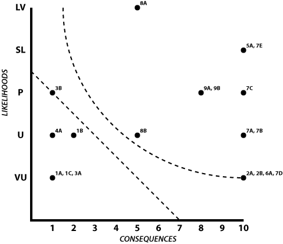

# Chapter One: Risk Modeling

#### _Managing storage & transaction vulnerabilities_

***Version: 2019-07-05 1.0.0***

## Introduction to Risk Modeling

There are many risks in the world of digital assets. If you store your private keys insecurely, you could be burgled or hacked. If criminals know that you hold cryptocurrency funds, you could be kidnapped or threatened. If you are careless or unlucky, you could lose your private keys to misadventure, disaster, or even just the miscopying of a string of numbers.

We categorize these various risks as *adversaries*. These are anthropomorphized dangers that each have their own motives for endangering your digital assets. Only by fully understanding them can you determine how to protect yourself against these dangers.

But how do you decide which adversaries are most likely to impact you? More importantly, how do you get past the very human tendency to misjudge risks — either by overestimating them or underestimating them? Risk modeling offers one way to do so: it’s a methodical, somewhat regularized way to look at your actual levels of exposure. Our model does so in a few steps: you will characterize your assets; list your vulnerabilities; assess your vulnerabilities; identify the actual risks; and finally correlate those risks to adversarial write-ups.

This Risk Modeling exercise also includes “Alice’s Story”, a simple custody situation meant to depict how the exercise can be used in the real world. It’s intended as a foundation that will allow you to model your own custody scenario, even if it’s more complex.

{pagebreak}

## Section I: Asset Characterization

### Step 1: Identify Your Assets

The first step in risk modeling is *asset characterization*, where you identify your assets. These are the items that you want to protect. There is some homogeneity among digital assets, but it’s still very helpful to eke out every difference you can think of, as that will inform your thinking about vulnerabilities and their risk levels.

For your ***cryptocurrency*** itself, you should identify where precisely the money is being held, and you may also wish to identify what sort of cryptocurrency it is.

***Asset Examples:***

* Bitcoin held at Coinbase
* Bitcoin held in cold storage
* Ethereum held in a paper wallet

But talking about the cryptocurrency being held somewhere is actually an abstraction. The ***keys*** protecting the cryptocurrency are actually _the_ crucial asset. There's just usually not a difference between the two: if your Bitcoin is at Coinbase, that means the keys are at Coinbase; and if your Ethereum is only accessible through a paper wallet, that’s because you printed your keys in the wallet.

However, if you use a more robust *cold storage procedure*, you might have redundant copies of your keys in several places. In that case, “Bitcoin held in cold storage” is too general of an asset; you instead need to consider each of your copies of a key as an asset, to correctly assess their risks.

***Examples of Assets:***

* Seed on Ledger in fireproof home safe
* Key on Cryptosteel in safety deposit box

Finally, you should consider whether there are other, more non-physical assets that you want to protect. Do you care about ***privacy*** regarding your identity? Are you concerned about ***compartmentalizing*** your activities? Do you want to ensure ***confidentiality*** of your total funds? Is ***ease of access*** something that you want to protect?

{blurb, class: tip}
**List each asset of value to you, including funds, keys, and non-physical assets that you want to protect.**
{/blurb}

***Alice’s Story.** Alice is a Bitcoin investor. Subsequent to its rise to \$1,000 in late 2013, she used a Coinbase account to buy at various dips. She invested about \$50,000 at prices between \$250 and \$400 between 2014 and 2016, netting a total of 150 BTC. She stopped investing after the price permanently climbed above \$400.*

*Though Alice has kept a lot of her funds at Coinbase, she’s occasionally moved some of it to paper wallets, based on suggestions that she’s read at Bitcoin websites. She felt that level of security was* good enough*. But then on December 16, 2017, Alice checked her Bitcoin value for the first time in a few months and discovered that her 150 BTC were now worth \$2.8 million dollars. Bitcoin has dropped from that height, but Alice’s coins are still worth more than a million dollars, and so Alice has realized that she needs to protect them better.*

*To begin her risk modeling procedure, Alice lists her assets. Besides her Coinbase account, and the cold storage of her paper wallet, Alice is also concerned about her privacy, because she fears that she would be targeted if people knew that she had one or two million dollars in cryptocurrency.*

1. *Bitcoins at Coinbase*
2. *Bitcoins in cold storage*
   a) *Paper wallets stored in a file cabinet*
3. *Privacy of cryptocurrency ownership*

{pagebreak}

### Step 2: Value Your Assets

Now that you’ve identified your assets, you need to value them. Use whatever scale you feel will help you to meaningfully separate valuations, provided that it’s something that you can easily represent on a graph (in Step 8). Our examples will use a 10-point scale.

For the ***cryptocurrency*** itself, these valuations will probably correspond to the value of the funds. Your most valuable cryptocurrency will probably be a “10”, but if it’s just a fraction of your savings and investments in other places, you might rate it as a “4” or a “5”.

The ***keys*** are a little harder to value. If you only have one key for a specific stash of cryptocurrency, then the valuation is exactly the same (and you probably didn’t list them separately). However, if you have multiple encrypted backup keys for a fund, they’re individually considerably less valuable because the loss or even theft of one copy of a key is much less likely to endanger the cryptocurrency itself. If you instead have multiple unencrypted backup keys, the valuation is much closer to the value of the cryptocurrency itself — both because they’re easier to recover from and because they’re more prone to theft.

For ***non-physical*** ***assets***, consider their value in relation to the digital assets themselves. Is your privacy or the possibility of correlation more or less valuable than your funds? Perhaps it’s half as valuable if the asset ultimately protects your funds, but perhaps it’s twice as valuable if the asset has a larger meaning in your life, such as privacy that protects your reputation.

{blurb, class: tip}
**Enumerate the value of each of your assets.**
{/blurb}

***Alice’s Story.** Alice has moved about 100 BTC to paper wallets over the years and has about 50 BTC sitting at Coinbase. That seemed like a reasonable amount of liquidity when bitcoins were valued at \$300, but is a lot to keep in a hot wallet now that bitcoins are valued at \$8,000.*

*Alice writes down a value for each of her assets, on a 10-point scale:*

1. *Bitcoins at Coinbase \[5\]*
2. *Bitcoins in cold storage*
   a) *Paper wallets stored in a file cabinet \[10\]*
3. *Privacy of cryptocurrency ownership \[8\]*

*Alice uses simple math to lay out her valuations. The paper wallets represent the most value, so she puts that at a 10. The Coinbase monies represent half of that, so she marks that a 5. Losing her privacy could lead to attacks on her funds, causing her to lose some or all of them, so Alice marked that as an 8, saying that it’s almost as valuable as her main stash of cryptocurrency.*

{pagebreak}

### Step 3: Diagram Your Process

Your digital assets face two different categories of risks: one when it’s being stored and another when it’s on the move. Thus, the next step is to sketch out your cryptocurrency process by translating your assets list into graphical nodes, then showing how money transfers among them. This will allow you to more easily identify all of the elements of your process — and thus determine their vulnerabilities.

To diagram your process, draw a simple illustration.

1. *Draw physical assets as *nodes* (circles).* This should be assets that represent physical cryptocurrency or keys. They show where your cryptocurrency is stored.
   a) If a physical asset has subassets (such as cold storage with     multiple copies of keys), draw those subassets as *subnodes*     (*smaller circles*) linked to the main node.

2. *Add any forgotten *nodes* to your diagram that are part of your cryptocurrency process but were not on your physical assets list.* This is where you see if you left anything off your asset listing. These other nodes could be accounts that don’t currently contain funds but that you plan to use as part of your process in the future, or they might just be stashes of less valuable cryptocurrency that you neglected.

3. *Add *alternate nodes* (dotted circles) for physical assets that aren’t cryptocurrency or where the cryptocurrency doesn’t belong to you.* These indicate your transferring cryptocurrency to another owner or exchanging it to or from a fiat currency account. They represent going outside of the cryptocurrency arena that you control (and thus outside of the risks you are modeling).

4. *Draw *interfaces* (arrows) between the nodes.* They show how cryptocurrency transfers from one node to another. Each interface should go in just one direction, so you might have up to two interfaces for each pair of nodes.

5. *Draw non-physical assets as *reminders* (squares).* They won’t link to anything, but are here to keep all of your assets in one (graphical) place.

***Examples of Nodes:***

* Bank of America bank account (fiat currency)
* Cold storage (cryptocurrency)
* Coinsquare (cryptocurrency)

***Examples of Interfaces:***

* Exchanging fiat currency for cryptocurrency
* Moving cryptocurrency to an exchange
* Making a cryptocurrency payment
* Sending change back from a cryptocurrency payment
* Moving cryptocurrency to cold storage
* Exchanging cryptocurrency for fiat currency

{blurb, class: tip}
**Draw a diagram that translates your assets into nodes and that shows the interfaces where cryptocurrency moves between nodes. Label the nodes and interfaces.**
{/blurb}

If you drew nodes that weren’t on your asset list, consider if they should be added to it. You don’t need to worry about the alternate nodes like fiat currency accounts and payment addresses (which are both beyond the scope of your cryptocurrency risk modeling), but if you found cryptocurrency accounts that you’d neglected earlier, you should definitely add those (and value them).

{blurb, class: tip}
**Update your asset lists and valuations with any forgotten nodes, per Steps 1 + 2.**
{/blurb}

***Alice’s Story.** Based on her asset list, Alice initially draws two nodes: her cold storage and her Coinbase account. She adds in the paper wallet as a subasset of her cold storage. There’s just one interface, an arrow from the hot wallet to the cold storage, for when she freezes funds.*

*However, Alice quickly realizes that she’s neglected some interfaces. if Bitcoin ever gets back to its previous high, Alice may want to sell it all, to retire to the Bahamas. This requires two new interfaces: an arrow back from the paper wallets to Coinbase, then a loopback at Coinbase to allow her to sell her cryptocurrency.*

*Next, Alice needs to add in alternative nodes that represent endpoints that go beyond what she controls in the cryptocurrency world. To start with, she adds a node for any payees and with it two more interfaces: an arrow from the hot wallet to the payees, then an arrow from the hot wallet back to itself for change. Finally, she adds a node for her Citbank fiat currency account (which has branches in the Bahamas!) and creates an interface for moving her funds to her bank account.*

*Finally, Alice adds in privacy, which is a non-physical asset.*

*Whew! Alice thought she had a simple, drama-free setup, but her final diagram of two cryptocurrency nodes, one subnode, two alternate nodes, six interfaces, and one reminder is somewhat complex:*

{class: center, width: "70%"}

*Alice didn’t add any nodes, so she doesn’t need to update her asset list.*

*In the meantime, she’s happy that she diagrammed out her whole procedure, because it shows how important that Coinbase account is, which makes her a little leary. But that’s a problem for the future. For now, she’s just seeing what her cryptocurrency setup looks like, and what risks it has. Coinbase as a single-point-of-failure (SPOF) in her diagram is clearly one of them.*

{pagebreak}

## Section II: Risk Characterization

### Step 4: Brainstorm Interface Vulnerabilities

Now that you’ve fully characterized your assets, by identifying, valuing, and diagramming them, you’re ready to move on to the next step, where you characterize the risks that could affect your assets.

You’ll do so by brainstorming *vulnerabilities*, which could cause problems in your digital-asset maintenance, especially those that could eventually lead to the loss of funds. To help your brainstorming you should also consider *threats,* which are active entities who might exploit these vulnerabilities, and *hazards*, which are environmental factors that could exploit these vulnerabilities.

You’ll start with vulnerabilities that could impact your interfaces: the places where cryptocurrency moves from one type of custody to another. Write those interfaces down on a piece of paper, then brainstorm about each one individually: what are the vulnerabilities, threats, or hazards that could cause you to lose your cryptocurrency when it moves across that interface?

Be sure that you are truly thinking about *interface* vulnerabilities that occur when cryptocurrency is *moving*, not nodal custody vulnerabilities. The latter will be the subject of Step 5.

***Examples of Interface Vulnerabilities:***

* Money sent to wrong address
* Incorrect amount of money sent to recipient
* Money lost by recipient
* Money stolen by man-in-the-middle (threat)
* Transaction scripted or timelocked wrong

Creating as thorough of a list as you can on your own, so that you can identify things specific to your setup, will give you a solid start, but afterward please feel free to look at Step 11 for more ideas.

Try to be thorough, but don’t go crazy. If something is laughably unlikely, then don’t worry about it, but try to walk right up to that line.

{blurb, class: tip}
**Make a numbered list of your interfaces, and for each brainstorm a lettered list of reasonable vulnerabilities. Consult Step 11 for additional possibilities when your brainstorm is finished.**
{/blurb}

***Alice’s Story.** Alice numbers her six interfaces, then lists possible ways funds could get lost in each of them:*

***Interface Vulnerabilities:***

1. *Freeze cash*
   a) *Paper wallet software did not generate a legitimate address*
   b) *I did not print paper wallet right*
   c) *I did not send to my paper wallet address*
2. *Unfreeze cash*
   a) *I did not send to my Coinbase account*
   b) *Coinbase did not record my transaction*
3. *Make payments*
   a) *I paid to wrong address*
   b) *I paid to spoofed address*
4. *Get change*
   a) *I set change amount wrong*
5. *Sell Bitcoin*
   a) *Purchaser reverses charge*
6. *Cash out*
   a) *Citibank did not record my transfer*

{pagebreak}

### Step 5: Brainstorm Custody Vulnerabilities

You’re now ready to move on to your list of nodes, where your funds are held in custody by someone. You can follow a similar process here, where you list your nodes on a piece of paper and brainstorm the dangers of each: how could you lose your funds to vulnerabilities, threats, and hazards while they are sitting on that node? If one of your nodes has subassets, you probably want to brainstorm about the subassets, not the category, as that will more specifically identify the real-world vulnerabilities (e.g., brainstorm about your Ledger wallet, not your cold storage generally).

Don’t worry about alternative nodes, like fiat currency accounts, as they're out-of-scope for this cryptocurrency risk modeling.

***Examples of Nodal Vulnerabilities:***

* Funds stolen by computer attacker (threat)
* Keys stolen by computer attacker (threat)
* Keys stolen in physical theft (threat)
* Keys destroyed in fire or earthquake (hazard)
* PIN for hardware wallet forgotten
* Exchange goes out of business

You might find that multiple nodes have identical vulnerabilities. If so, copy your list of vulnerabilities from one asset to another, but you should still keep them separate: though they have similar vulnerabilities, the likelihood of those vulnerabilities and the consequences might be different, resulting in different risk assessments (see Step 7).

Again, refer to Step 11 for more ideas of risks, after you’ve created an initial list.

{blurb, class: tip}
**Continue your numbered list by adding physical nodes, and for each brainstorm a lettered list of reasonable vulnerabilities. Consult Step 11 for additional possibilities when your brainstorm is finished.**
{/blurb}

***Alice’s Story:** Alice continues her list by detailing the vulnerabilities that she sees for her Coinbase account and her paper wallets. Though she was somewhat concerned with Coinbase as a single point of failure, when Alice writes out her vulnerabilities, she realizes that the paper wallets are extremely vulnerable too!*

7. *Cold Storage Paper Wallet*
   a) *Paper wallet is water damaged*
   b) *Paper wallet is burnt up in fire*
   c) *Paper wallet is thrown out as junk*
   d) *Paper wallet is stolen by robber*
   e) *Paper wallet is not understood by heirs*
8. *Coinbase Account*
   a) *Company is targeted by hackers*
   b) *Bitcoins are stolen by employee*

{pagebreak}

### Step 6: Brainstorm Non-Physical Vulnerabilities

Finally, you should look at any non-physical assets that you recorded, such as privacy, compartmentalization, and ease of use, and for each of them, brainstorm vulnerabilities for those assets.

***Examples of Non-Physical Asset Vulnerabilities:***

* Privacy lost due to address reuse
* Privacy lost by announcing Bitcoin ownership
* Ease of use lost by complicated cold storage setup
* Ease of use lost by 2FA
* Compartmentalization lost by constantly sending funds from one account to another

Once more, when you’re done with an initial list you might wish to consult Step 11 for additional ideas.

{blurb, class: tip}
**Continue your numbered list by adding non-physical assets, and for each brainstorm a lettered list of reasonable vulnerabilities. Consult Step 11 for additional possibilities when your brainstorm is finished.**
{/blurb}

***Alice’s Story:** Alice is a little itchy about the interface between her hot wallet and her cold storage. Though she has a couple of different paper wallets, she has reused some of her paper wallets multiple times, when she continued to add bitcoins to them. She also moved funds back to Coinbase a few times in the past, when she thought she was going to sell. This has created potential correlation between her different cold wallets and her Coinbase account. It might be possible to figure out what her total funds are.*

*Worse, she’s used the hot wallet to make purchases a few times — purchases that were shipped to her house under her name. This might allow people to correlate her real name and all of her Bitcoin funds!*

*This all relates to Alice’s non-physical privacy asset, so she writes these problems down as vulneraibilities in her setup:*

9. *Privacy*
   a) *Poor address hygiene could correlate cold and hot wallets*
   b) *Purchases from hot wallet could correlate name and Bitcoin     assets*

{pagebreak}

### Step 7: Assess Consequences & Likelihoods of Vulnerabilities

One of the most common mistakes in risk modeling is addressing *vulnerabilities* rather than addressing actual *risks.* The whole rigamarole of taking off your shoes and throwing out your liquids at airport security is a modern-day example of protecting against vulnerabilities (the possibility of bombs in shoes or being able to mix an explosive from liquid precursors) without actually assessing their risks (is a shoe bomb likely to work? is it likely to bring down a plane? Is a bomber going to be able to mix up a liquid explosive within the confines of an airplane?) Similarly, the vulnerabilities that you’ve identified to date for your digital-asset holdings may or may not be realistically exploitable and may or may not have large repercussions.

To turn a vulnerability into a risk requires a simple formula:

***risk = vulnerability consequence x vulnerability likelihood***

You will now begin the process of transforming the 20 or 30 potential vulnerabilities that you’ve identified into risks by enumerating a consequence and likelihood for each. And if you’re worried about the number of vulnerabilities you’re currently dealing with, don’t be, because this will be the first step in whittling that long list down into a shorter list of *final* risks.

For each vulnerability, enumerate a consequence and a likelihood:

***Consequence*** is the bad result if the vulnerability proves true, listed as a numerical value. This should be directly based on your asset valuation, from Step 2. If you would entirely lose an asset if a vulnerability proves true, then the consequence value is the same as the asset valuation. If you would lose half of it, then the consequence value is probably half of the asset valuation. The consequence values should be pretty easy to assess, because you already have those asset valuations.

***Likelihood*** is the chance that the vulnerability proves true. Obviously, any assessment of likelihood is going to be subjective: it’s going to be based on your gut and whatever level of understanding you have of the cryptocurrency industry. But, by separating likelihoods into ones that *feel* particular unlikely and that *feel* particularly likely, you’ll be assessing vulnerabilities in a robust and meaningful way.

Generally, if you can separate likelihoods into ***five*** levels, that should provide enough differentiation for you to later create a useful chart of risks. Use whatever five categories you would like. They could be letter grades, numbered priorities, or words that are mean something to you.

***Examples of Likelihood Measures:***

* A, B, C, D, F
* 1, 2, 3, 4, 5
* 25%, 20%, 15%, 10%, 5%
* Constant Problem, Frequent Problem, Occasional Problem, Rare Problem, Extremely Rare Problem
* Very Likely, Somewhat Likely, Possible, Unlikely, Very Unlikely [^ourlikely]
* Almost Certain, Probable, Even, Probably Not, Almost Certainly not [^cialikely]
* Super Scary, Cold Chill, Frightening, Concerned, Not Worried
* Great, Very Good, Good, OK, Poor

Use whatever method works best for you; the object is to clearly differentiate different vulnerabilities. Don’t worry if you use a different scale than your consequences: you can still lay them out neatly as two axes of a chart (see Step 8).

Try your best to be impartial about these likelihood calculations, which you can do by thinking about them independently from your individual cryptocurrency assets. Comparing the various vulnerabilities will probably help. You could also choose a trusted friend to help you determine likelihoods.

Also, consider adding time into the equation: if an asset is only rarely sitting in a certain wallet, or if an interface is only infrequently used, then the likelihood of a vulnerability being exploited is probably lowered.

***Examples of Nodal Vulnerability Likelihood Assessment:***

* Funds stolen by computer attacker \[occasional problem\]
* Keys stolen by computer attacker \[occasional problem\]
* Keys stolen in physical theft \[rare problem\]
* Keys destroyed in fire or earthquake \[extremely rare problem\]
* PIN for hardware wallet forgotten \[constant problem\]
* Custodian goes out of business \[rare problem\]

{blurb, class: tip}
**List a consequence and likelihood value for each of your vulnerabilities.**
{/blurb}

***Alice’s Story.** Alice is now ready to sit down and figure out the consequences and likelihoods of all the vulnerabilities that she’s brainstormed. She’s going to use five ranked likelihood words: very likely (VL), likely (L), possible (P), unlikely (U), very unlikely (VU).*

*She starts with her “freeze cash” interface, where she’s moving funds into cold storage. She never moves much money at once, so she figures the consequences are low, and she actually thinks that programmatic problems are very unlikely (VU), but ups the odds to just unlikely (U) when she could be the one making the mistake.*

*Things look a little more scary on the “unfreeze cash” interface, because that’s likely to occur when she wants to retire to the Bahamas, so the consequence would be the loss of all her money. Even though she still thinks the likelihood of programmatic errors are very unlikely, the consequences are very high. These assessments recur in the “sell bitcoin” and “cash out” interfaces.*

*The last interfaces are for “make payments” and “get change”. Alice thinks there are real opportunities for loss here, but she never makes big purchases, so the consequences are once more low.*

*Now, Alice moves on to her nodes. Here, she just matches her consequences to the value of the asset. For her two large stores of cryptocurrency, this means that the consequences could be quite bad; when that’s matched with high likelihoods, that’s a problem.*

*One thing that Alice notes is that it’s a little hard to think about her Coinbase account, because she’s currently using it for hot-wallet storage, but someday will use it for selling off all her funds. It might be best not to use the same node for these very different functions, which would also reduce Coinbase as a single point of failure, but again that’s an issue for the future. For now she rates her consequences based on what’s currently in the nodes.*

*Alice finishes up with the privacy issues, which could genuinely cause problems due to her casual address hygiene to date.*

1. *Freeze cash*
   a) *Paper wallet software did not generate a legitimate address     \[C: 1, L: VU\]*
   b) *I did not print paper wallet right \[C: 2, L: U\]*
   c) *I did not send to my paper wallet address \[C: 1, L: VU\]*
2. *Unfreeze cash*
   a) *I did not send to my Coinbase account \[C: 10, L: VU\]*
   b) *Coinbase did not record my transaction \[C: 10, L: VU\]*
3. *Make payments*
   a) *I paid to wrong address \[C: 1, L: VU\]*
   b) *I paid to spoofed address \[C: 1, L: P\]*
4. *Get change*
   a) *I set change amount wrong \[C: 1, L: U\]*
5. *Sell Bitcoin*
   a) *Purchaser reverses charge \[C: 10, L: SL\]*
6. *Cash out*
   a) *Citibank did not record my transfer \[C: 10, L: VU\]*
7. *Cold Storage Paper Wallet*
   a) *Paper wallet is water damaged \[C: 10, L: U\]*
   b) *Paper wallet is burnt up in fire \[C: 10, L: U\]*
   c) *Paper wallet is thrown out as junk \[C: 10, L: P\]*
   d) *Paper wallet is stolen by robber \[C: 10, L: VU\]*
   e) *Paper wallet is not understood by heirs \[C: 10, L: SL\]*
8. *Coinbase Account*
   a) *Company is targeted by hackers \[C: 5, L: VL\]*
   b) *Bitcoins are stolen by employee \[C: 5, L: U\]*
9. *Privacy*
   a) *Poor address hygiene could correlate cold and hot wallets \[C:     8, L: P\]*
   b) *Purchases from hot wallet could correlate name and Bitcoin     assets \[C: 8, L: P\]*

*Alice knows that some of these likelihoods might not be entirely right. Listing them all out and considering them comparatively helps her to think about them more dispassionately, but she figures that she still may be overestimating some likelihoods and underestimating others. If she wanted to be really thorough, she’d talk odds over with someone else, and perhaps she’ll do that at some time in the future. But for now, this is a good first cut.*

{pagebreak}

### Step 8: Chart Consequences & Likelihoods to Reveal Risks

By now, you might already have a rough idea of which vulnerabilities are actually risks that you need to watch out for. However, you can make a more robust analysis by graphing everything in a chart.

1. *Label the horizontal axis.* Use your consequences as the horizontal axis, running from 0 to the top consequence that *you considered*.
2. *Label the vertical axis.* Use your likelihood as the vertical axis, running from 0 to the top likelihood that *you considered*.
   a) **Ranked Likelihoods.** If you used ranked words for your     likeilhoods, just lay them out in order, with the biggest     likelihood being at the top of the axis and the smallest being     the closest to the origin (for example: F, D, C, B, A, along     the vertical axis).
3. *Place all vulnerabilities on the chart.* Make a point for each vulnerability at the intersection of its consequence and likelihood. Label the point with the letter and number for the vulnerability (e.g., 9A).
4. *Draw a risk-tolerance line.* Finally, you’re going to lay out the risk-tolerance line that identifies those vulnerabilities that you should be paying attention to. It will run from part way along the vertical axis to part way along the horizontal axis, creating a triangle of non-risks below it and an open space of actual risks above it.
   a) Figuring out this risk-tolerance line is very individual and     will relate to your own level of risk tolerance, so there’s no     set rule for how to lay it out, but rather a general     methodology that you can use to adjust it until you’re     comfortable with it.
   b) *Evaluate an initial line.* Use a straightedge to lay a     potential risk-tolerance line across your graph. Run it from     about 70% of the way up your vertical axis to about 70% of the     way along your horizontal axis. Take a look at what’s on the     line or above it and what’s below the line and think about how     that fits your feeling about risks.
      * **Ranked Likelihoods**. For five ranked likelihood words,         70% will be halfway between the second and third most         likely words.
   c) *Generally adjust your line.* If you feel that your risk     tolerance is higher, push the straight edge up to 80% or 90%     on each side; if you feel that your risk tolerance is lower,     push the straight edge down to 60% or 50% on each side.
      * **Ranked Likelihoods**. For five ranked likelihood words,         80% is your second most likely option and 60% is your         third most likely option.
   d) *Independently adjust your line.* Alternatively, consider just     adjusting one of the axis. If you are more afraid of unlikely     events, push the straightedge down along the vertical axis,     and if you are less afraid of unlikely events, push it up. If     you are more afraid of losing some of your money, pushing the     straight edge back on your horizontal axis, and if you less     afraid of losing some of your money, push it forward.
   e) *Draw a final line.* When you’re happy that the line matches     your risk tolerance, draw it in.
   f) *Consider an alternative risk-tolerance curve.* A alternate     method draws an asymptotic curve approaching the 20% point for     both axes (or the 15% point for less risk tolerance or the 25%     point for more risk tolerance). This does a better job of     cutting out low-probability and low-value risks but is harder     to draw accurately by hand. If you feel up to it, draw it in,     then reassess your risks based on what’s above both lines     (risks), what’s below both (non-risks), and what’s in-between     (possible risks).
      * **Ranked Likelihoods**. For five ranked likelihood words,         20% will be at your fifth and least likely word.

{blurb, class: tip}
**Draw a chart of your vulnerabilities based on their consequences and likelihood. Draw a risk-tolerance line across the chart to identify the risks. Optionally, eyeball an asymptotic curve to help triangulate high and low risks.**
{/blurb}

***Alice’s Story.** Alice charts out all of her vulnerabilities, based on their consequence and likelihood, then draws the risk-tolerance line at 70% from axis to axis.*

{class: center, width: "70%"}

*Looking at the chart, Alice is relatively happy with it as a reflection of her-risk tolerance level. It suggests that there’s little to worry about when she’s freezing small amounts of cash (1), and that when she’s making payments, the only thing she should be concerned with is making sure that no one gave her a fake address (3B) — and even that is pretty marginal.*

*It also highlights where she should have the most concern: the set of interfaces relating to eventually selling off her bitcoins (2: unfreeze cash, 5: sell bitcoin, and 6: cash out); both of her asset stores (8: hot and 7: cold wallets); and her privacy (9).*

*Alice also draws an asymptotic curve at 20%. Well, it’s more of an arc, but it’s the best she can easily do. It puts the lower-likelihood risks for her cash out (2A, 2B, 6A, 7D) right on the edge, so she’s going to consider them lower risks. It also verifies for her that the spoofed-address payment issue (3B) isn’t a big concern because of the small value of her Bitcoin payments.*

{pagebreak}

### Step 9: Consider Asset Valuation Changes

So what do you do with risks? Generally, there are four options to resolve them. You’ve already *accepted* some vulnerabilities by determining that they’re low risk or low consequence. There are three other options: *prevention* (where you modify your assets to lower risks), *interdiction* (where you attack the vulnerabilities, threats, or hazards to lower risks), and *mitigation* (where you prepare for the risk by reducing the consequence).

One method of *mitigation* is to modify the valuation of assets to drop them below your risk-tolerance line:

1. *Consider the value of assets.* Look at each of the assets that has a risk, and consider whether their valuation could be decreased sufficiently to push the related nodal risks below the risk-tolerance line.
   a) Generally, it’s beneficial to move funds from hot wallets to     cold storage. So, for each of your hot wallets, consider if     the funds there are actually being used for active trading. If     not, you should move some or all of the funds.
   b) Even if you can’t push an asset below your risk-tolerance line,     it can be worthwhile to move it closer to the line, because     that’s implicitly a reduction in risk
   c) Reducing some risks will inevitably result in increasing others.     This is OK. If you’re generally happier with the gestalt of the new asset valuations, and in particular if you’ve shifted     risk from hot wallets to cold storage, then you’ve benefited     your overall setup.
   d) Don’t bother trying to reduce the valuation of cold storage or     those hot wallets where the funds are actually being actively     used; you’ll instead want to resolve their risks via     interdiction, prevention, or different mitigation methods.
2. *Modify consequences.* Based on your asset valuation changes, modify the consequences for those assets, and also consider any linked interfaces and see if their consequences changed as well. (Generally, an interface *originating* with an asset is the one likely to be changed when the asset changes.)
3. *Rechart if needed*. If any valuation changes were made, rechart as per step 8.

This is the first time when you are really examining your procedure for flaws and trying to correct them. You characterized your assets in Steps 1-2 and then you characterized their risks in Steps 3-8. Now you’re stepping back and asking if your asset valuations actually make sense.

***Examples of Valuation Changes:***

* Decide that fewer funds are needed in hot wallet
* Backup keys for cold storage
* Decide that privacy valuation can be reduced by giving some funds to spouse

It could be that you make no changes here, and if you do it’s going to be somewhat seat-of-the-pants.

{blurb, class: tip}
**Make a plan to move funds that might push risks below the risk-tolerance line or that might replace hot wallets with cold storage.**
{/blurb}

***Alice’s Story.** Alice’s ***hot-wallet related risks*** are the easiest to resolve. There’s just no reason to have 50 BTC in her hot wallet, given the current value of bitcoin. So she freezes 40 more BTC. This changes her asset valuation:*

1. *Bitcoins at Coinbase \[~~5~~ 1\]*
2. *Bitcoins in cold storage*
   a) *Paper wallets stored in a file cabinet \[10\]*
3. *Privacy of cryptocurrency ownership \[8\]*

*This might change the risk analysis for the interfaces originating at the Coinbase node. Most of the Coinbase-originating interfaces already presume very small amounts of money moving, but there was one part of the freeze cash interface that considered a bigger loss; that’s now reduced. *

1. *Freeze cash*
   a) *Paper wallet software did not generate a legitimate address     \[C: 1, L: VU\]*
   b) *I did not print paper wallet right \[C: ~~2~~ 1, L: U\]*
   c) *I did not send to my paper wallet address \[C: 1, L: VU\]*

*More notably, the Coinbase node itself has dramatically reduced consequences:*

8. *Coinbase Account*
   a) *Company is targeted by hackers \[C: ~~5~~ 1, L: VL\]*
   b) *Bitcoins are stolen by employee \[C: ~~5~~ 1, L: U\]*

*Alice has no idea what do to reduce the ***privacy risks***.*

*Finally, she thinks carefully about the ***cold-wallet related risks***. Many of them originate from the fact that her paper wallets are all in the same place and they could all be stolen or destroyed in the same way. Spreading out her paper wallets or making additional copies of them would reduce the consequences of fire, flood, robbery, or enthusiastic cleaning, but they’d still be above the risk-tolerance line. Moreso, these are her prime assets, so she wants to prevent the risks, not just mitigate them. So, even though she might be able to reduce her valuations here, she thinks the better answer is carry them forward into the risk resolution section.*

*Here’s what Alice’s new chart looks like, with the changes to her hot wallet valuation:*

{class: center, width: "70%"}

{pagebreak}

### Step 10: List Final Risks

You should now have an updated chart that shows which vulnerabilities are actually risks, because the combination of their consequences and the likelihood exceeds your risk-tolerance threshold. Write out all of the risks that lie clearly above your risk-tolerance line. List them in your best estimation of decreasing order: the further a risk is above your risk-tolerance line, the higher it should go on your list, with the object being to produce a list that has your most notable risks first and your most marginal risks last.

Marginal risks that were on a line or between an asymptotic curve and a straight line may be listed or not, as you see fit.

{blurb, class: tip}
**Use your chart to list risks that lie on or above your risk-tolerance line in decreasing order of risk.**
{/blurb}

***Alice’s Story.** Alice decides to leave the marginal risks out for the moment, and just lists out the risks that clearly lie above both of her risk-tolerance lines.*

1. *5A: Sell Bitcoin: Purchaser reverses charge*
2. *7E: Paper Wallet: Not understood by heirs*
3. *7C: Paper Wallet: Thrown out as junk*
4. *7A: Paper Wallet: Water damaged*
5. *7B: Paper Wallet: Burnt up in fire*
6. *9A: Poor address hygiene could correlate cold and hot wallets*
7. *9B: Purchases from hot wallet could correlate name and Bitcoin assets*

*This provides a much more constrained list, which was the point of the exercise. It allows Alice to attack the biggest problems first (and possibly return to others at a later date).*

{pagebreak}

## Section III: Risk Resolution

### Step 11: Correlate Final Risks to Digital Adversaries

At this point, you might want to immediately start brainstorming ways to interdict, prevent, and further mitigate your risks. If you’re knowledgeable about smart custody, and feel like you already know how to reduce your risks, then jump forward to Step 12. However, we have another methodology that may (once more) allow you to approach your risk modeling in a *methodical* way.

What follows is a list of adversaries drawn from the **Chapter Three: Adversaries**. These are sort of like risks, but each of them is an anthropomorphized adversarial entity that contains many related risks, and which details many related solutions. We believe that considering an anthropomorphized adversary of this sort makes it easier to consider the “motives” that might affect you, and also makes it easier to find solutions that address your risks. It’s our prime deviation from standard risk modeling methodologies.

Go through the adversary list and checkmark all adversaries that correlate with the risks you identified. Your exact risk might not be here, so try and pick the adversaries that have risks that seem the closest to what you wrote.

The ultimate object here is to take the general, off-the-cuff risks that you identified and to turn them into more abstract, general adversaries, which will help you identify general solutions to these problems.

***Examples of Digital Asset Adversaries***

1. [*Adversary: Bitrot*](#adversary-bitrot) — *a hardware, software, or media failure leading to loss*
   * Entropy causes software to stop running, as computer     is upgraded.
   * Entropy kills computer.
   * Entropy kills hardware.
   * Entropy kills hardware wallet.
   * Entropy makes Bitcoin keys (or seeds) obsolete.
2. [*Adversary: Blackmail*](#adversary-blackmail) — *threat of exposure*
   * Attacker sends ransom note to demand bitcoins.
   * Attacker uses Ransomware to demand bitcoins.
3. [*Adversary: Censorship*](#adversary-censorship) — *network denial that prevents the use of funds*
   * Attacker blocks site from creating transactions.
   * Attacker blocks you from creating transactions.
4. [*Adversary: Coercion*](#adversary-coercion) — *threat of death, disability, or detention*
   * Attacker kidnaps you.
   * Attacker threatens you.
   * Attacker kidnaps your family, friends, or pets.
   * Attacker threatens your family, friends, or pets.
5. [*Adversary: Convenience*](#adversary-convenience) — *decreased security due to ease of use*
   * You reduce security, enabling attacks.
   * You grant privileges to someone untrustworthy.
6. [*Adversary: Correlation*](#adversary-correlation) — *a connection of funds based on their usage*
   * Analyst connects your Bitcoin addresses.
   * Analyst connects your real address to Bitcoin funds.
7. [*Adversary: Death / Incapacitation*](#adversary-death--incapacitation) — *a mortal loss or disability that could endanger funds*
   * Heirs can’t access cryptocurrency.
   * Heirs don’t know about cryptocurrency.
8. [*Adversary: Denial of Access*](#adversary-denial-of-access) — *physical denial that prevents use of funds*
   * You can’t access physical location of funds.
   * You can’t move freely.
9. [*Adversary: Disaster*](#adversary-disaster) — *a sudden, large-scale destructive event*
   * Bomb destroys keys or makes them inaccessible.
   * Earthquake destroys keys or makes them inaccessible.
   * Fire destroys keys or makes them inaccessible.
   * Flood destroys keys or makes them inaccessible.
   * Other natural disaster destroys keys or makes them inaccessible.
   * Warfare destroys keys or makes them inaccessible.
10. [*Adversary: Institutional Theft*](#adversary-institutional-theft) — *a theft by a trusted institution or its employee*
    * Employee backdoors system.
    * Employee secretly copies keys.
    * Employee steals keys.
    * Institution falsely claims they never received payment.
    * Institution steals everything & disappears.
11. [*Adversary: Internal Theft*](#adversary-internal-theft) — *a theft by a trusted person such as an heir or executor*
    * Hacker tricks trustee.
    * Trustee loses key.
    * Trustee refuses to multi-sign.
    * Trustee steals keys.
12. [*Adversary: Key Fragility*](#adversary-key-fragility) — *an accidental key loss*
    * Someone throws out your keys.
    * System incorrectly generates keys.
    * You lose your encryption method for keys.
    * You lose your PIN.
    * You miscopy your keys.
    * You misplace your keys.
13. [*Adversary: Legal Forfeiture*](#adversary-legal-forfeiture) — *a legal civic or state seizure of funds*
    * Court seizes funds.
    * Federal agent seizes funds.
    * IRS seizes funds.
14. [*Adversary: Loss of Fungibility*](#adversary-loss-of-fungibility) — *a blacklisting of funds based on their provenance*
    * Analyst discovers Bitcoin previously used by undesirable entity.
    * Analyst discovers Bitcoin previously used for illegal activity.
15. [*Adversary: Nation-State Actor*](#adversary-nation-state-actor) — *wide-ranging threats related to surveillance and coercion*
    * Federal agents steal funds.
    * Federal laws threaten funds.
    * State surveils usages of funds.
16. [*Adversary: Network Attack, Personal*](#adversary-network-attack-personal) — *a personal online attack*
    * Attacker breaks into account holding private keys.
    * Attacker steals private key for Bitcoin.
    * Attacker steals password or other credential to Bitcoin account.
17. [*Adversary: Network Attack, Systemic*](#adversary-network-attack-systemic) — *a server online attack *
    * Attacker steals from exchange.
    * Bankruptcy occurs at online company.
    * Keys become unavailable due to exchange disappearance.
18. [*Adversary: Non-Financially Motivated Attackers*](#adversary-non-financially-motivated-attackers) — an *attack not intended to steal funds*
    * Attacker breaks things for fun.
    * Attacker steals funds to give away.
    * Malware destroys keys.
    * Spyware correlates fund usage.
19. [*Adversary: Physical Theft, Casual*](#adversary-physical-theft-casual) — *an opportunistic physical theft*
    * Thief steals computer, smartphone, or other key-holding device.
    * Thief accidentally steals keys.
20. [*Adversary: Physical Theft, Sophisticated*](#adversary-physical-theft-sophisticated) — *a purposeful physical theft of private keys*
    * Thief purposefully steals keys.
    * Thief tricks you into handing over keys.
21. [*Adversary: Process Fatigue*](#adversary-process-fatigue) — *errors caused by the complexity of the overall procedure*
    * You lose funds while perfecting your procedure.
    * You lose keys while checking keys.
    * You overly obfuscate your keys.
22. [*Adversary: Social Engineering*](#adversary-social-engineering) — *a social theft*
    * Attacker creates fake recipient address.
    * Attacker phishes Bitcoin user.
    * Attacker tricks Bitcoin user into installing malware
23. [*Adversary: Supply-Chain Attack*](#adversary-supply-chain-attack) — *a logistical theft*
    * Attacker modifies computer before purchase.
    * Attacker modifies hardware wallet before purchase.
    * Attacker modifies USB stick before purchase.
24. [*Adversary: Systemic Key Compromise*](#adversary-systemic-key-compromise) — *a key-generation compromise*
    * System generates addresses incorrectly.
    * System generates keys insecurely.
25. [*Adversary: Terrorist / Mob*](#adversary-terrorist--mob) — a *potentially mortal threat related to coercion*
    * Attacker kidnaps you — and death is likely.
    * Attacker threatens you — and threats are real.
    * Attacker kidnaps your family, friends, or pets — and death     is likely.
    * Attacker threatens your family, friends, or pets — and threats     are real.
26. [*Adversary: Transaction Error*](#adversary-transaction-error) — *incorrect transaction details leading to loss*
    * You create an invalid smart contract.
    * You copy the wrong address.
    * You miscalculate the change amount and send too much to miners.
    * You send the wrong amount of funds.
    * You send to the wrong address.
    * You timelock your funds incorrectly.
27. [*Adversary: User Error*](#adversary-user-error) — *an operator mistake leading to loss*
    * You don’t maintain your key location.
    * You forget your key location.

That's a big list, but the object isn't to thoroughly understand all of these adversaries, but instead to convert your ideas about vulnerabilities into our standard adversary profiles. And if some of them are scary, that probably means that you should be thinking about them (and hopefully avoiding them).

After you’ve selected your adversaries, your should write them out in a list of decreasing problems. This might match precisely with your risk list, but some adversaries might get bumped up because they correlated to several risks that you identified. Keep the references to your asset and interface numbers, so that you can reference them later.

{blurb, class: tip}
**Convert your risks to a list of adversaries.**
{/blurb}

***Alice’s Story.** Reading through the list of adversaries, Alice links each of her risks to something from the adversary list:*

1. *5A: Sell Bitcoin: Purchaser reverses charge — **Social Engineering***
2. *7E: Paper Wallet: Not understood by heirs — **Death / Incapacitation***
3. *7C: Paper Wallet: Thrown out as junk — **Key Fragility***
4. *7A: Paper Wallet: Water damaged — **Disaster***
5. *7B: Paper Wallet: Burnt up in fire — **Disaster***
6. *9A: Poor address hygiene could correlate cold and hot wallets — **Correlation***
7. *9B: Purchases from hot wallet could correlate name and Bitcoin assets — **Correlation***

*Most of these were pretty obvious, but Alice has a bit of trouble figuring out how to classify somewone reversing credit card charges after getting her Bitcoin (#1). She finally decided it was an “social engineering”, since it feels like another sort of confidence-man attack.*

*She then organizes her adversaries into an ordered list, so she knows how to prioritize them. She uses her order from the true risks, but moves disaster up above key fragility since it’s linked to two different problems:*

1. *Social Engineering \[5A\]*
2. *Death / Incapacitation \[7E\]*
3. *Disaster \[7A, 7B\]*
4. *Key Fragility \[7C\]*
5. *Correlation \[9A, 9B\]*

*She’s now ready to figure out what to do about these problems!*

{pagebreak}

### Step 12: Take Steps to Foil Adversaries

Once you’ve identified the adversaries most relevant to you, you need to determine how to foil them. To begin, read the *Chapter Two* more closely for the problems that you’ve recorded through this process. Browse through the entire write-up for each of those adversaries, to better understand the adversary and its relationship to your particular procedure. Pay special attention to the sections at the end: the list of Process, Hot Wallet, and Cold Storage Solutions.

Once you’ve read through the adversaries and understood them, you should adopt solutions as appropriate:

1. *Introduce a Cold Storage Procedure.* If you already have a cold-storage procedure, you should update it with our *Cold Storage Procedure*. If you don’t have a cold-storage procedure, you should consider introducing one, especially if some of your adversaries suggest doing so.
2. *Incorporate Cold Storage Solutions.* Many potential solutions deal generally with the general procedures for cold storage, suggesting how to make it less prone to failure. Consider these and adopt them as required.
3. *Add Cold Storage Optional Steps.* There may also be specific and precise optional steps that can be added to your cold-storage procedure. These steps can be simply integrated into our standard *Cold Storage Procedure*.
4. *Incorporate Hot Wallet Solutions.* Hot Wallet Solutions suggest procedural updates that will keep online funds safer (though online funds are always in greater danger). Consider incorporating them for any hot wallet sites that you have identified as being in danger. Also consider one more time if you can move assets from hot wallets to cold storage (or if you can move them from a more vulnerable hot wallet to a less vulnerable one).
5. *Incorporate Process Solutions.* Finally, some adversaries will require more general process solutions, where you’ll need to make changes to your overall way of doing things. This is especially true for interface risks and non-physical asset risks, but it can also apply to general cryptocurrency storage processes. These are the most extensive solutions listed in the Adversaries document.

You will probably *not* choose to use all of the Solutions for your Adversaries, but at least consider each in turn. Then, choose a reasonable subset to work on for your first cut. Don’t overdo it, or you could end up losing the ability to do *anything*. Instead, use the best or most important. Pay attention to solutions related to your highly ranked adversaries or that show up more than once. Maybe you’ll return to the rest at some time in the future.

{blurb, class: tip}
**For each of your adversaries, adapt solutions for cold storage, for hot wallets, and for your processes.**
{/blurb}

***Alice’s Story.*** Alice reads through her five adversaries, and creates an extensive list of possible solutions.

***Process Solutions:***

1. Maintain Emergency Procedure.
2. Practice Anonymity. **(x2)**
3. Practice Anonymizing Your Funds.
4. Practice Key Hygiene.
5. Proactively Visit Sites.
6. Redundantly Relay Your Secrets. **(x2)**
7. Register Your Funds.
8. Reveal Your Funds.
9. Take the Time. **(x2)**
10. Use Funds Multisignatures.
11. Verify Your Keys.

The process solutions are full of good advice, but there’s more than Alice can deal with at one time. So, she focuses on the ones that either show up multiple times or else are closely related. She’s going to work at being better with anonymity (\#2) by creating new IDs to talk about Bitcoin that don’t correlate to her real identity. And, because it’s closely related, she’s going to improve her key hygiene and never reuse an address again (\#4). Finally, she’s going tell her husband, Oscar, about all of her funds (\#8), which is closely related to making sure he has the secrets necessary to access them (\#6). She writes the rest of the possible solutions in a notebook for future consideration.

***Cold Storage Solutions:***

1. Fortify Your Key Storage.
2. Redundantly Store Your Keys. **(x3)**
3. Widely Separate Your Keys.
4. **Cold Storage Scenario** *Optional Steps:*
   a) Hire a Lawyer
   b) Use Bags (Fire-Resistant)
   c) Use Metal Enhancement (Redundant Metal Devices) **(x2)**
   d) Use a (USB) Laser Printer

Alice clearly needs to improve her cold storage procedure, especially since she moved more funds there. The key takeaway seems to be that she needs to redundantly store her keys, probably in a safety deposit box, and that she should use something more durable than her paper wallets.

After working through the Cold Storage Scenario she applies most of the optional steps suggested. She ends up with a Ledger in a fire resistant bag in a fireproof safe at home, a second Ledger in a safety deposit box, and a trio of CryptoTags divided between her home safe, her safety deposit box, and her lawyer. Though she lives in the San Francisco East Bay, she rents a safety deposit box down in San Jose, to fulfill the key separation that’s suggested. They’re not exactly widely separated, but they’re on slightly different earthquake fault lines, and they’re about 55 miles away, which makes it less likely that one natural disaster will hit both. And yet, they’re close enough that she won’t introduce Process Fatigue: she can just check in with her new bank when she visits friends and family down in San Jose, which she does a couple of times a year.

Alice doesn’t see any new hot wallet solutions and she’s still pretty unhappy about the exposure of her hot-wallet funds and the problems she’s discovered about Coinbase being a single point of failure in her model and about it being used for both spending money and (in the future) selling off her Bitcoin.

Alice thinks carefully about the advice, “Only keep keys on an exchange or brokerage for the minimum amount of time required to make a transaction.” She finally decides that she’s technically competent enough that she can handle her own hot wallet, which will limit the threat of Personal Network Attacks. So, she moves her funds to a new Electrum wallet. In the future, she’ll only use her Coinbase account when she wants to sell off her funds, which should dramatically minimize that exposure.

{pagebreak}

## Section IV: Process Repetition

### Step 13: Repeat the Process

And you’re done! For now.

Risk modeling is a continuous process, as your assets, valuations, and procedures *will* change over time. But that’s especially true after your first trip through this process. In Step 12, you probably made changes to your procedure and maybe to the setup of your hot wallet and your cold storage. This means that your procedure no longer looks like it did at the start of this process!

But, you’ve done your job for the moment. Take a rest and be confident that your digital assets are more secure than they used to be. Then, in a few weeks or a few months return, and run through this risk modeling again. After two or three times through this process, your digital asset procedure should become relatively stable. At that point, you can just return to this process every year or two, to see if any changes to your assets need to be reflected in an updated procedure.

{blurb, class: tip}
**If you made notable changes to your digital asset procedures, repeat this process in three months or less. If things seem stable, then instead come back in a year or two.**
{/blurb}

***Alice’s Story:*** Thanks to the adjustments to her cold storage and to the introduction of an Electrum wallet, Alice’s digital asset procedure has changed a fair amount:

{class: center, width: "70%"}

She added a node (the Electrum wallet) and she split up the interfaces coming out of her cold storage, as she could now move funds to her Coinbase account or to her Electrum wallet. (That also cleaned up the problem with Alice’s Coinbase account being a single point of failure.) Finally, she added three new subnodes to her cold storage.

Alice’s setup has been changed enough that it may now have vulnerabilities that she didn’t previously think about. So, she puts a TODO item on her calendar to repeat this exercise in two months.

***Other Peoples' Story:*** For further examples of using this risk modeling methodology see Ilya Evdokimov's ["Working with SmartCustody Risk Assessment Framework"](https://medium.com/@evdokimov.ilya/working-with-smartcustody-risk-assessment-framework-40ce82538eac) on _Medium_ and "The Frank Family Fund Example" in **Chapter Five** of this book.

{pagebreak}

## Summary

The object of this risk modeling exercise was threefold.

First, you were taken through a process (Steps 1-10) intended to help you identify risks related to your digital assets in as analytical of a way as possible. Human beings are generally awful at identifying risks because emotions get in the way. So we think that sharks or terrorists are existential threats to our everyday lives, but we underestimate actual risks like getting into a car accident. Analyzing things more abstractly hopefully helped you to step back and make a more balanced assessment.

Second, you summarized the adversaries building block, which you'll meet in more depth in **Chapter Three: Adversaries** so that you could cull through a wide collection of solutions and find the ones that would be the most helpful to you (Steps 11-12).

Third, you repeated the process (Step 13), or at least planned to do so in the future. You'll learn something more each time you repeat the exercise, eliminating both false positives (where you identified something as a risk that wasn't) and false negatives (where you missed a crucial vulnerability). 

The specifics of this risk modeling exercise aren’t important, except as a tool to help you arrive at your desired goal: more secure digital assets. If something doesn’t work for you, transform it, adjust it, or remove it. Just be aware of your goal and of that you’re trying to get there by taking emotions out of your decision making and by examining extensive lists of possible problems and solutions as a reference. 

[^ourlikely]: This is the set of terms we use in our examples.

[^ciaLikely]: These are the ["Words of Estimative Probability"](https://www.cia.gov/library/center-for-the-study-of-intelligence/csi-publications/books-and-monographs/sherman-kent-and-the-board-of-national-estimates-collected-essays/6words.html). We don't use them because none of the risk-modeling odds are likely to be anywhere close to "even"; the vulnerabilities should all be much lower likely events. But, if these call out to you, definitely use them.
