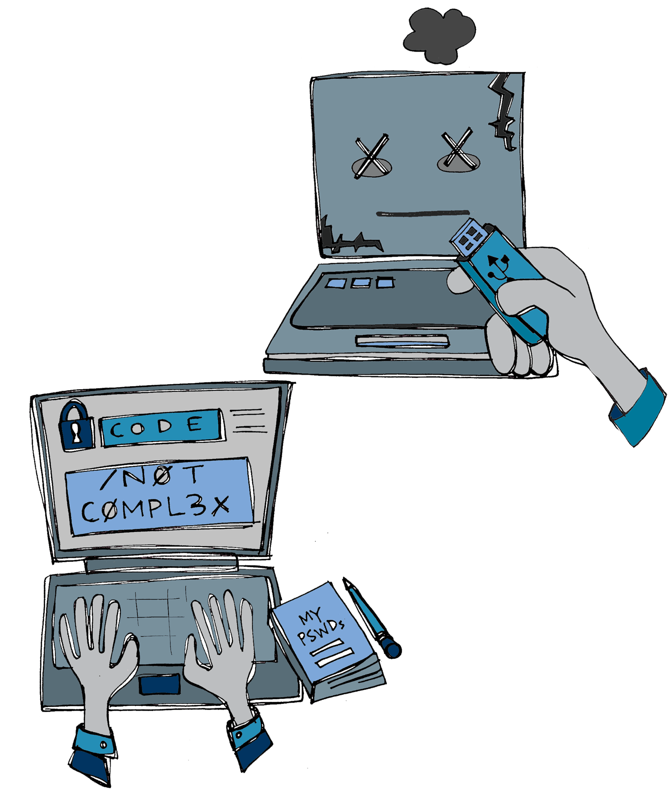
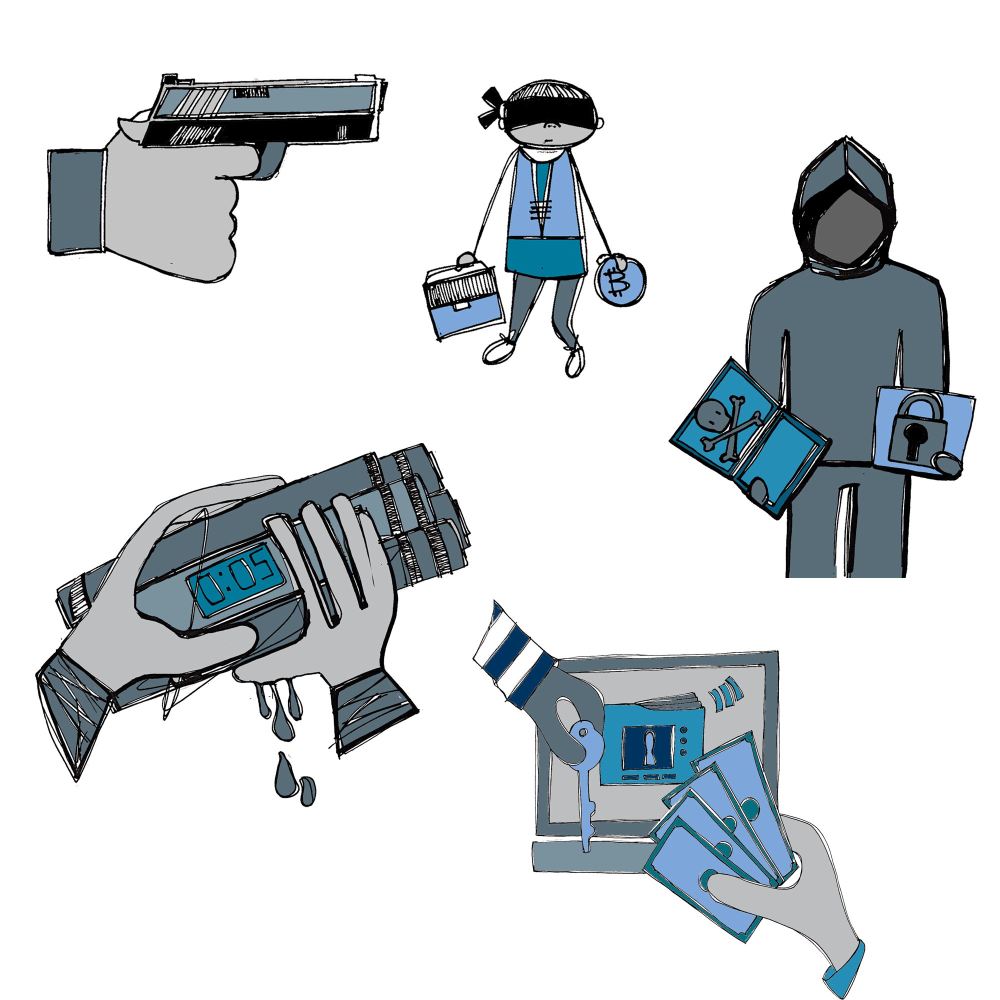
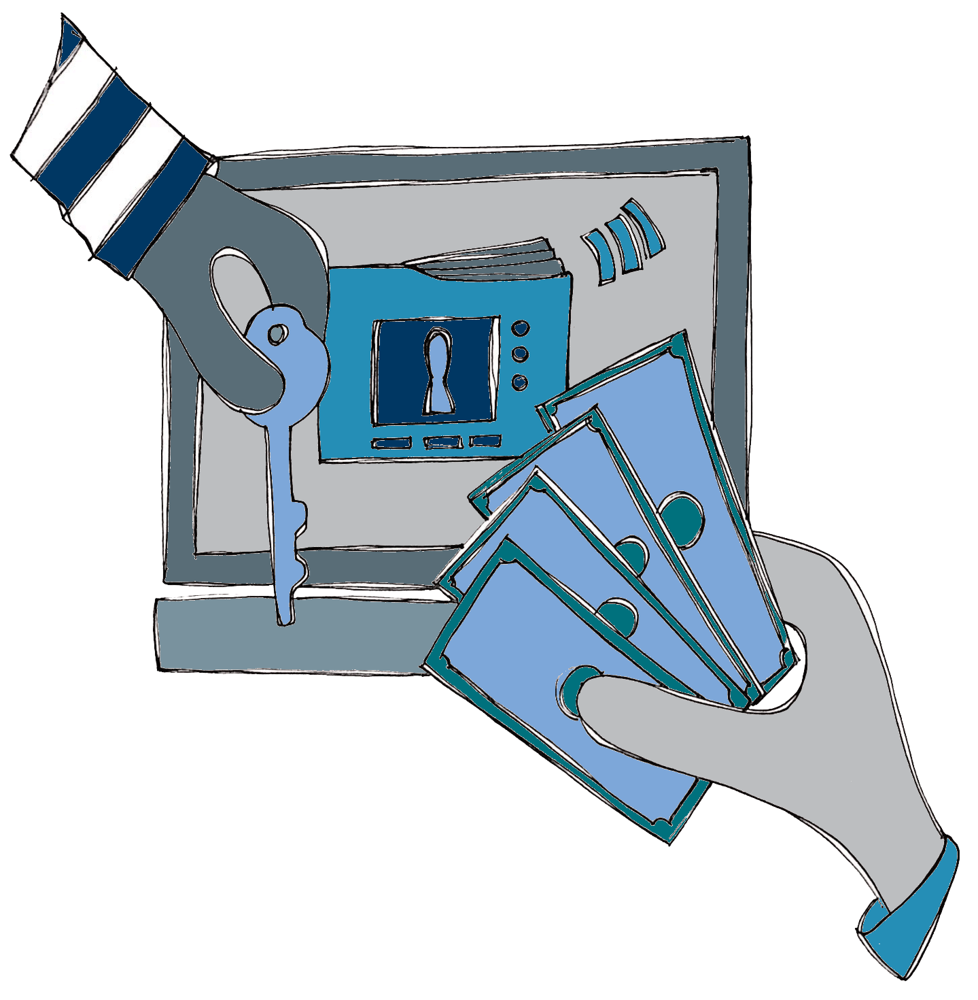
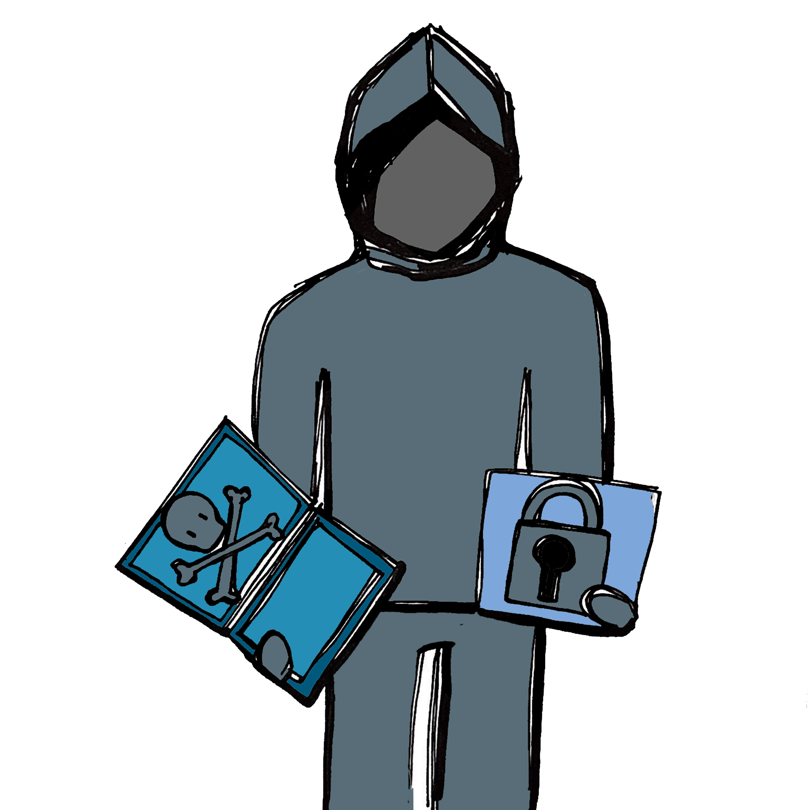
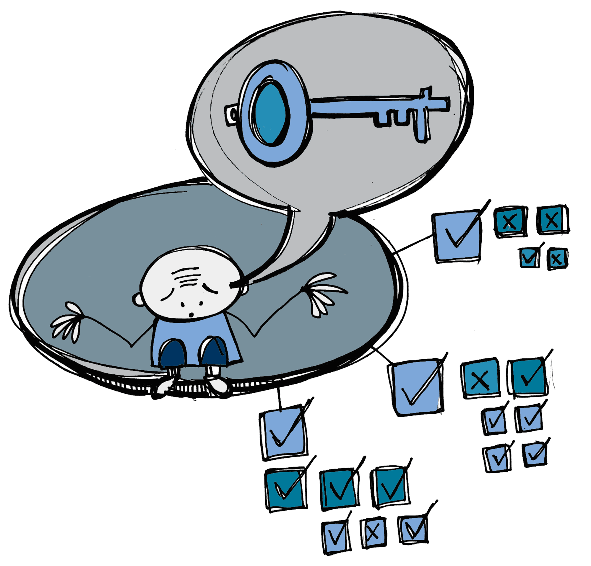
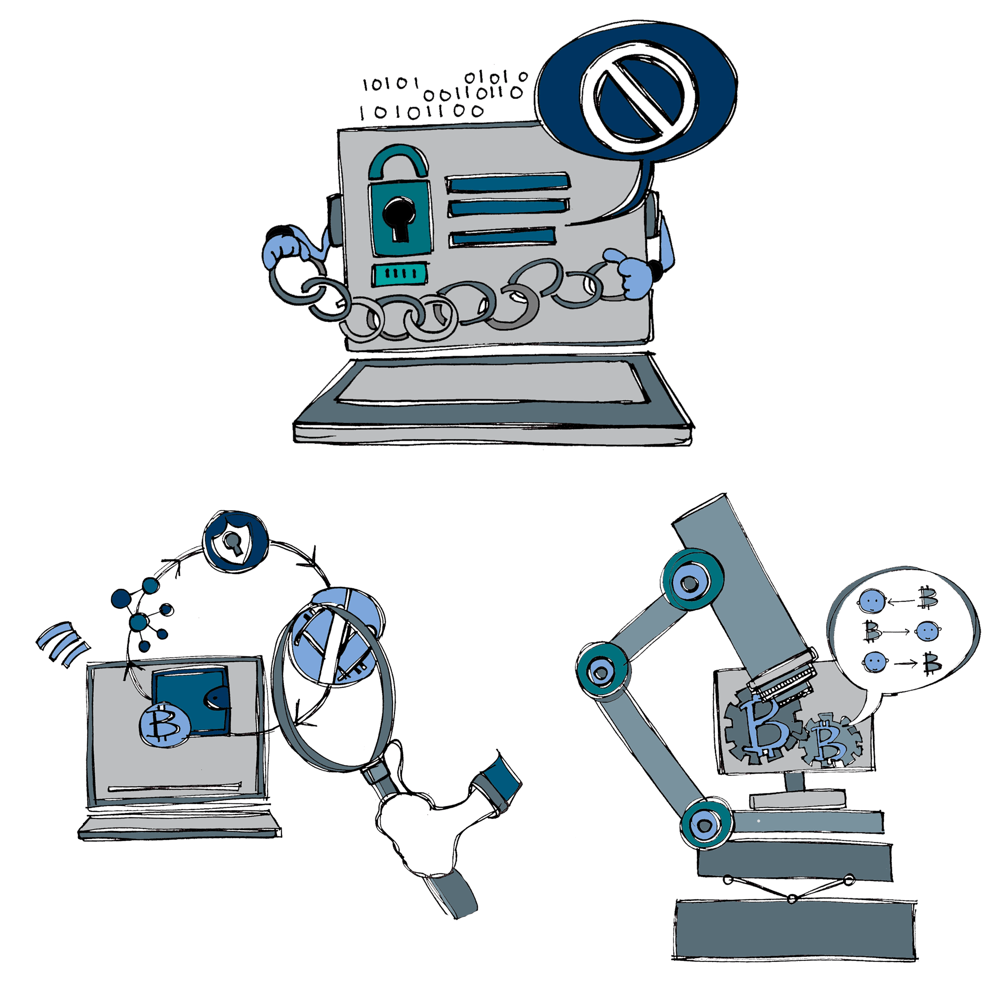
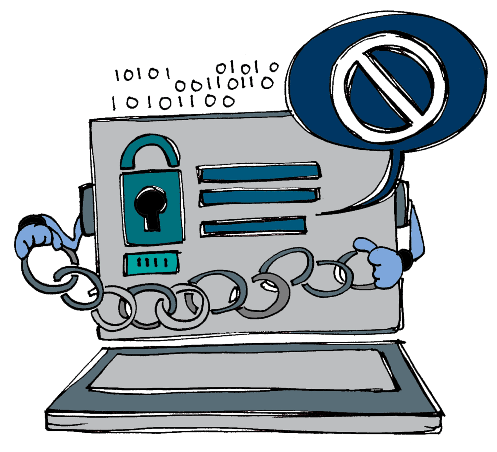

# Chapter Two: Adversaries

#### _Anthropomorphized risks for digital assets_

***Version: 2019-04-26***

> ***NOTE: This is a draft in progress, so that we can get some feedback
> from early reviewers. It is not yet final for publication.***

### Disclaimer

*The information below is intended to inform a set of best practices. It
may not address risks specific to your situation, and if it does not,
you should modify appropriately. While this information may inform best
practices, there is no guarantee that following this advice will
sufficiently ensure the security of your digital assets. In addition,
this information is only a window on best practices at a specific moment
in time. Be aware that the Bitcoin & blockchain ecosystems may have
evolved and the risk assessments of specific products may have changed
since the publication of this draft. In other words: be cautious, be
careful, and be aware of the current Bitcoin & blockchain landscape
before you use this information.*

### Copyright

Unless otherwise noted, the contents of this document are Copyright
©2017-2019 by Christopher Allen and are licensed CC-BY-SA.

### Credits

**Lead Authors**: Christopher Allen
[*@ChristopherA*](https://twitter.com/ChristopherA), Shannon Appelcline
[*@Appelcline*](https://twitter.com/Appelcline)

**Contributors:** Greg Maxwell, Bryan Bishop
[*@kanzure*](https://twitter.com/kanzure)

**Reviewers:** Ryan Grant, Tuur Deemester
[*@TuurDemeester*](https://twitter.com/TuurDemeester), Angus Champion de
Crespigny [*@anguschampion*](https://twitter.com/AngusChampion), Adam
Shostack [*@adamshostack*](https://twitter.com/adamshostack)

> **Sponsors:** [*Adamant
> Capital*](https://www.adamantcapitalfund.com/),
> [*Blockstream*](https://blockstream.com/), [*Cryptoasset Inheritance
> Planning*](https://t.co/hsLxiZdQya) by Pamela Morgan, [*Digital
> Contract Design*](https://contract.design),
> [*CryptoTag*](https://cryptotag.io/),
> [*Ledger*](https://www.ledger.com/), and
> [*Winstead*](https://www.winstead.com/Practices/Corporate-SecuritiesMA/Fintech-Cryptocurrencies-Emerging-Technologies)

## About Adversaries

When creating a digital-asset management procedure, a user adds steps to
the procedure based on his vulnerability to a set of more than twenty
*adversaries*: if an adversary seems like a danger to a user, then he
should introduce optional steps that foil the adversary and otherwise
should implement appropriate solutions. Applicable optional steps are
listed for many adversaries, measured against a baseline of a user who
protects his coins only with a personal safe and a single Ledger.

The term “adversary” is slightly different from the more common “risk”
used in the security business. By anthropomorphizing these threats, we
can consider their motivations. This helps a custodian to gain some
distance from the scenario by making it less personal and so makes it
easier for them to determine which adversaries are actual risks *to
them*. For example, a user may fear his government stealing his money.
This might be tightly tied up with his self-definition as a libertarian
or a white hat. But when he flips the script and instead considers the
motives of an anthropomorphized government, he removes himself from the
equation and can see that the motive of the government is to stop
criminal activity and to collect unpaid taxes; he can then make a more
informed decision about whether that adversary’s motivations are
actually relevant to his situation.

Following are extensive descriptions of each adversary, covering their
motives, their risks, and their solutions.They are divided into
categories which help to organize the *most common* origin of each
adversary. Short case studies are included for all adversaries, some of
them abstracting potential problems, others referring to historical
exploits.

1.  **Loss by Acts of God**
    a.  [*Adversary: Death / Incapacitation*](#_md0oubcgwdzo) — *a mortal loss or disability that could endanger funds*
    b.  [*Adversary: Denial of Access*](#adversary-denial-of-access) — *physical denial that prevents use of funds*
    c.  [*Adversary: Disaster*](#adversary-disaster) — *a sudden, large-scale destructive event*
2.  **Loss by Computer Error**
    a.  [*Adversary: Bitrot*](#_l760ztwakmh4) — *a hardware, software, or media failure leading to loss*
    b.  [*Adversary: Systemic Key Compromise*](#section-4) — *a key-generation compromise*
3.  **Loss by Crime, Theft**
    a.  [*Adversary: Institutional Theft*](#adversary-institutional-theft) — *a theft by a trusted institution or its employee*
    b.  [*Adversary: Internal Theft*](#adversary-internal-theft) — *a theft by a trusted person such as an heir or executor*
    c.  [*Adversary: Network Attack, Personal*](#_2st8zurfuu0n) — *a personal online attack*
    d.  [*Adversary: Network Attack, Systemic*](#_35bedcdpyqm3) — *a server online attack *
    e.  [*Adversary: Physical Theft, Casual*](#section-6) — *an opportunistic physical theft*
    f.  [*Adversary: Physical Theft, Sophisticated*](#_a6tzkv3mpu4k) — *a purposeful physical theft*
    g.  [*Adversary: Social Engineering*](#adversary-social-engineering) — *a social theft*
    h.  [*Adversary: Supply-Chain Attack*](#adversary-supply-chain-attack) — *a logistical theft*
4.  **Loss by Crime, Other Attacks**
    a.  [*Adversary: Blackmail*](#adversary-blackmail) — *threat of exposure*
    b.  [*Adversary: Coercion*](#section-11) — *threat of death, disability, or detention*
    c.  [*Adversary: Non-Financially Motivated Attackers*](#section-12) — an *attack not intended to steal funds*
    d.  [*Adversary: Terrorist / Mob*](#_thf35x4lotcb) — a *potentially mortal threat related to coercion*
5.  **Loss by Government**
    a.  [*Adversary: Legal Forfeiture*](#adversary-legal-forfeiture) — *a legal civic or state seizure of funds*
    b.  [*Adversary: Nation-State Actor*](#_r30mkanx1jnw) — *wide-ranging threats related to surveillance and coercion*
6.  **Loss by Mistakes**
    a.  [*Adversary: Convenience*](#adversary-convenience) — *decreased security due to ease of use*
    b.  [*Adversary: Key Fragility*](#section-16) — *an accidental key loss*
    c.  [*Adversary: Process Fatigue*](#adversary-process-fatigue) — *errors caused by the complexity of the overall procedure*
    d.  [*Adversary: Transaction Error*](#adversary-transaction-error) — *incorrect transaction details leading to loss*
    e.  [*Adversary: User Error*](#adversary-user-error) — *an operator mistake leading to loss*
7.  **Privacy-related Problems**
    a.  [*Adversary: Censorship*](#_hcr2fbjga6nl) — *network denial that prevents the use of funds*
    b.  [*Adversary: Correlation*](#adversary-correlation) — *a connection of funds based on their usage*
    c.  [*Adversary: Loss of Fungibility*](#section-20) — *a blacklisting of funds based on their provenance*

## Category: Loss by Acts of God

***Origin.** Bad luck.*

***Definition.** A loss that wasn’t caused by any intelligent attacker.*
An Act of God is something that just happens. You can’t prevent it, you
can only make it less likely or insure that it damages you less if it
occurs. 

***Iconic Image.** Lightning strikes your computer.* When lightning
suddenly (and surprisingly) hits your computer, it might destroy your
only copy of your private keys. You can make this less likely by storing
your computer somewhere that lightning is unlikely to strike, and you
can reduce the damage by maintaining additional copies of your private
keys, but no matter what, that lightning is coming down!

***Ulterior Motive.** None.* Though all of these adversaries list
motivations, there is no intelligent ulterior motive behind an Act of
God. No one is trying to steal your Bitcoins or prevent you from
accessing them. Forces of nature are just working against you, as they
do in a universe founded on the Second Law of Thermodynamics.

### Adversary: Death / Incapacitation

***Motivation.** “I am your last firing neurons, and I seek to drag
everything you ever knew down with you, into the darkness.”*

***Key Words:** Passive.*

The lack of centralization and the high levels of anonymization for
cryptocurrency make it hard to know when someone is holding
cryptocurrency. This is usually considered a feature, but in the case of
death or incapacitation, an asset holder usually want their heirs or
guardians to know about the cryptocurrency, lest it be lost forever.

***Abstract Case Study: Suffering a Stroke.*** Bob, an early bitcoin
entrepreneur, suffers a stroke that leaves him considerably mentally
impaired. His medical bills quickly pile up. Since he left no
information about his bitcoins, his wife Alice is forced to sell their
house to pay them.

***Historic Case Study: The QuadrigaCX Question.*** The most famous
attack of the grim reaper ever reported upon cryptocurrency is certainly
the case of QuadrigaCX, where the company claimed that CEO Gerald Cotten
had died suddenly in India and taken with him the passwords that
provided the only access to the company’s cold storage, worth about
\$145 million dollars. Certainly, this shows how Death/Incapacitation
*could* have a large impact on cryptocurrency, but the actual veracity
of the claim remains up in the air, as there was initially some question
whether Cotten had actually died, and later it was revealed that \$100
million dollars were missing from QuadrigaCX’s cold-storage wallets.
[*Engadget*](https://www.engadget.com/2019/03/08/quadrigacx-bitcoin-missing-millions/),
[*CoinDesk*](https://www.coindesk.com/100-million-short-quadrigacx-audit-cant-account-for-26k-missing-bitcoin).

***Historic Case Study: Dying with Deposits.*** A moderator of a bitcoin
discussion group knew that he was dying. He was holding not only his own
bitcoin funds, but some for the forum as well. After he passed, the
other staff of group spoke with his next of kin, to recover their funds,
but the next of kin didn’t know about the funds, let alone how to
recover them. Some time later, the funds still had not moved, suggesting
that they were genuinely lost.

***Risks:***

1.  **Funds Loss.** Because of the high level of anonymization for
cryptocurrency, no one is ever going to call up an asset holder’s
heirs or guardians to tell them about the funds. That means that
if the asset holder hasn’t notified them themselves, the funds
will be lost forever.

2.  **Key Loss.** If the asset holder was too careful in hiding their
    > private keys or even just in the methods of obfuscation or
    > protection that they used, then their heirs or guardians won’t be
    > able to access cryptocurrency funds even if they know about them.
    > This could also be an issue in multi-sig scenarios, where one or
    > more holders are killed or incapacitated, and suddenly a solution
    > intended to protect bitcoins becomes a new problem.

***Process Solutions:***

1.  **Register Your Funds.** Register and document your funds fully with
    > your nation-state to maximize legal protections. *Dangers: [*Legal
    > Forfeiture*](#adversary-legal-forfeiture), [*Nation-State
    > Actor*](#_r30mkanx1jnw).*

2.  **Redundantly Relay Your Secrets.** Tell someone else the secrets
    > required to unobscure or unprotect your private keys or to access
    > your funds. *Dangers: [*Internal
    > Theft*](#adversary-internal-theft).*

3.  **Reveal Your Funds.** Write a letter to your heirs or guardians and
    > be explicit about the existence of your funds. Include
    > instructions on how to access them. Provide information about the
    > necessary passwords or PINs to unlock the private keys. Safely
    > store this letter with a very trusted person, such as your estate
    > lawyer, or in a very trusted place, such as a safety-deposit box.
    > *Dangers: [*Internal Theft*](#adversary-internal-theft),
    > [*Institutional Theft*](#adversary-institutional-theft).*

***Cold Storage Solutions:***

1.  **Redundantly Store Your Keys.** Maintain multiple representations
    > of your master keys. Store encrypted keys in local storage and
    > unencrypted keys in more protected storage, such as a safety
    > deposit box. *Dangers: [*Casual Physical Theft*](#section-6),
    > [*Institutional Theft*](#adversary-institutional-theft).*

2.  ****[Cold Storage
    > Scenario](https://docs.google.com/document/d/1fOmMH2B8E3_vDDBNEL8dEX15jwdFohDlpeThMpjVBh8)
    > Optional Steps:**** Hire a Lawyer.

### Adversary: Denial of Access

***Motivation.** “I want to control your movements, to keep you from
getting to your bank or to your house. As is often the case, I have a
deeper motivation, but it probably has nothing to do with your
cryptocurrency. Instead, my motives likely relate to an instability in
your city, state, or country. I might be a riot, a political insurgency,
or a popular uprising.”*

{width="3.638888888888889in"
height="3.638888888888889in"}

***Alternative Categories:** Crime, Misc.*

***Key Words:** Cold Storage, Physical.*

Access to cryptocurrency is usually blocked by censorship, when someone
on the internet purposefully obstructs the ability to transact funds.
However, that blockage can also take physical form if access to
private-key storage locations is prevented. This imagines a fairly
large-scale problem that is likely only possible in a politically
unstable region.

***Abstract Case Study: Blocking by Mistake.*** Frank is cheap, so he
stores his Cryptosteel in his company’s safety deposit box, which he has
access to. The company goes into bankruptcy, and Judy has its assets
frozen. Frank tries to recover his Cryptosteel from the safety deposit
box but finds he’s denied access … which wouldn’t be a problem except
for the fact that the dog ate the paper copy of his recovery seed at
home.

***Risks:***

1.  **Key Denial.** Much as with Censorship, the user still has
    > theoretical access to his keys, but can’t actually get to them.

***Process Solutions:***

1.  **Neutrally Store Your Funds.** Maintain funds or keys outside of
    > the sphere of control of fascist and authoritarian nation-states.

***Cold Storage Solutions:***

1.  **Redundantly Store Your Keys.** Maintain multiple representations
    > of your master keys. Store encrypted keys in local storage and
    > unencrypted keys in more protected storage, such as a safety
    > deposit box. *Dangers: [*Casual Physical Theft*](#section-6),
    > [*Institutional Theft*](#adversary-institutional-theft).*

2.  **Widely Separate Your Keys.** Maintain multiple physical
    > representations of your master keys in places that are widely
    > separated. Consider locales under different legal jurisdictions
    > and with different physical risks.

3.  ****[Cold Storage
    > Scenario](https://docs.google.com/document/d/1fOmMH2B8E3_vDDBNEL8dEX15jwdFohDlpeThMpjVBh8)
    > Optional Steps:**** Hire a Lawyer, Use Metal Enhancement
    > (Redundant Metal Devices).

*See Related — [*Censorship*](#_hcr2fbjga6nl).*

### Adversary: Disaster

***Motivation.** “I want to destroy. I want to crumble and burn. I want
to ruin with water, to blow things into the air. I am bombs, bullets,
and explosions. I am sudden and unexpected but disastrous
destruction.”*{width="3.638888888888889in"
height="3.2916666666666665in"}

***Key Words:** Cold Storage, Physical.*

A sudden, large-scale destructive event can destroy copies of private
keys. It is usually a natural event such as an earthquake, fire,
hurricane, or tsunami. It could also be an accident such as a building
collapse; or it could be a man-made catastrophe, such as a bomb blast,
an EMP blast, or full-scale warfare.

***Historic Case Study: Flooding Keys.*** A bitcoin user had a strong
procedure for protecting his keys. Every quarter he reprinted his paper
wallet to ensure that the ink didn’t fade and immediately shredded the
old one. Unfortunately, he placed his paper wallet in the basement,
which flooded; the ink was washed off the wallet. The user came to IRC
for help, and though they suggested dumping his printer’s memory buffer,
it was already too late.

***Risks:***

1.  **Key Destruction.** The physical representations of private keys
    > could be lost. Electronic devices could be damaged sufficiently
    > that keys can no longer be recovered. Printed copies of keys could
    > be burned by fire, ruined by water, or destroyed by physical
    > force.

2.  **Key Loss.** Even if not destroyed, the physical representation of
    > a key could become unavailable. It might be buried under a
    > destroyed building, lost behind the lines of a war, or washed out
    > to sea.

***Cold Storage Solutions:***

1.  **Fortify Your Key Storage.** Ensure that the physical
    > representations of keys are protected against disaster. Write on
    > waterproof paper or etch on fire-resistant steel or titanium. Use
    > sturdy, fortified hardware devices that are more likely to survive
    > disasters. Use fire-proof bags as an additional level of
    > protection.

2.  **Redundantly Store Your Keys.** Maintain multiple representations
    > of your master keys. Store encrypted keys in local storage and
    > unencrypted keys in more protected storage, such as a safety
    > deposit box. *Dangers: [*Casual Physical Theft*](#section-6),
    > [*Institutional Theft*](#adversary-institutional-theft).*

3.  **Widely Separate Your Keys.** Maintain multiple physical
    > representations of your master keys in places that are widely
    > separated. Consider locales under different legal jurisdictions
    > and with different physical risks.

4.  ****[Cold Storage
    > Scenario](https://docs.google.com/document/d/1fOmMH2B8E3_vDDBNEL8dEX15jwdFohDlpeThMpjVBh8)
    > Optional Steps:**** Use Bags (Fire-Resistant); Use Metal
    > Enhancement (Redundant Metal Devices); Use a (Second) USB Drive.

## Category: Loss by Computer Error

***Origin.** Computers & software.*

***Definition.** A loss caused by computer hardware or software.* All
cryptocurrency depends upon computers, but they can let you down when
their hardware or software fails, due to poor production, poor
programming, or just poor luck (which would be a Loss by Computer Error
caused by Act of God).{width="3.625in"
height="4.291666666666667in"}

***Iconic Image.** Smoke billowing up from a computer.* A dying computer
is the most evocative example of computer error, but Loss by Computer
Error could be caused by the quieter destruction of aging parts or the
simple incompatibility of obsolescence. Similarly, you could have smoke
(metaphorically) billowing up from a computer program, which failed to
do what it should do due to programmer error.

***Ulterior Motive.** None.* As with an Act of God, no one is explicitly
trying to take your funds through Computer Error. There’s just bad luck,
focused on your computer hardware or software, which makes you unable to
access your funds — perhaps, forever!

### Adversary: Bitrot

***Motivation.** “I am entropy writ large. I want to break down your
storage, crash your hard drives and degrade your optical media. I want
to prevent your computers from booting, your programs from running, and
your data from reading; in the end, I always win.”*

***Alternative Category:** Act of God.*

***Key Words:** Cold Storage, Technological.*

{width="3.638888888888889in"
height="3.638888888888889in"}

Electronic storage methods for private keys can become unusable over
time. This could be a physical hardware problem: hard drives can crash
or old computers can fail. It could be an issue with electronic storage
media: USB flash drives are often cheaply made, while optical media can
fail in a relatively short amount of time depending on its specific
manufacture. It could be a problem with aging software: a new version of
software might have a bug or might not work like old software, a
hardware device might have its software fail over time, or a new
computer might no longer be able to run an old, required piece of
software. It could be a time-related hardware incompatibility: old media
may no longer be readable on new devices, or old plugs may not fit into
new ports.

***Abstract Case Study: Obsoleting Software.*** Carol loads up her
Bitcoin wallet for the first time since she upgraded to Windows 10 … and
discovers that it doesn’t run. Digging further, she learns that it’s
been years since the developer of the wallet updated it. She has no idea
of how to recover her keys from the wallet.

***Historic Case Study: Obsoleting Seeds.*** A user on StackExchange
reported that he had a 15-word recovery phrase and a passphrase for his
Bitcoins, but he had no idea what wallet had generated it. This isn’t
the standard 24-word phrase used by Ledger or Trezor, nor the variant
phrases used by Electrum or GreenAddress. Despite having the codes, he
didn’t know what to do with them.
[**StackExchange**](https://bitcoin.stackexchange.com/questions/65171/how-to-restore-wallet-from-15-word-seed-mnemonic).

***Historic Case Study: Throwing Out Bitcoins.*** James Howells of the
UK is widely reported to have accidentally thrown out the hard drive
with keys for 7,500 bitcoins after he broke down his laptop for parts.
[**News
Story**](https://www.cnbc.com/2017/12/20/man-lost-127-million-worth-of-bitcoins-and-city-wont-let-him-look.html).

***Risks:***

1.  **Key Destruction.** Some of the more disastrous forms of bitrot
    > result in the total annihilation of the key.

2.  **Key Loss.** In other cases, the key might still be on the
    > hardware, but if the hardware doesn’t boot or if the software
    > doesn’t run, it’s nonetheless lost.

***Cold Storage Solutions:***

1.  **Backup Your OS File System.** Make a copy of the known-working
    > operating system files that you used on the computer that manages
    > your keys.

2.  **Maintain Setup Information.** Record as much information as you
    > can about your computer and wallet setup, so that an expert can
    > help to restore your state. Try to use open-source software and
    > backup the source code. Verify that the source code corresponds to
    > the version of the software that you are using. Also store wallet
    > documentation.

3.  **Physically Store Your Keys.** Store a physical representation of a
    > key on a non-electronic medium, such as paper (or steel).
    > *Dangers: [*Disaster*](#adversary-disaster), [*Casual Physical
    > Theft*](#section-6), [*Institutional
    > Theft*](#adversary-institutional-theft).*

4.  **Rotate Your Key Storage.** Move your keys on to newer hardware as
    > it becomes available. *Dangers:
    > [*Correlation*](#adversary-correlation).*

5.  **Verify & Rotate your Backups:** Make multiple backups of working
    > operating files that are kept in different locations. Use
    > alternating backups or consider a “[*Tower of
    > Hanoi*](https://en.wikipedia.org/wiki/Backup_rotation_scheme#Tower_of_Hanoi)”
    > rotation strategy. Be sure to verify your backups as part of a
    > regular schedule.

6.  **Verify Your Key Storage.** Regularly test your key storage to make
    > sure that it’s still working. If a key storage method becomes
    > inoperative, quickly replace it.

7.  ****[Cold Storage
    > Scenario](https://docs.google.com/document/d/1fOmMH2B8E3_vDDBNEL8dEX15jwdFohDlpeThMpjVBh8)
    > Optional Steps:**** Use a USB Drive; Use a (Second) USB Drive.

*See Related — [*Key Fragility*](#section-16)*

### Adversary: Systemic Key Compromise

***Motivation.** “I lie in wait. I want you to think that your keys were
generated correctly, but after you’ve turned your attention to other
things, I will spring my surprise. I am the best pal of hackers and
crooks, who use my exploits to steal your money.”*

{width="3.638888888888889in"
height="3.638888888888889in"}

***Alternative Category:** Mistakes.*

***Key Words:** Technological.*

A systemic problem in the generation of keys can leave them broadly
vulnerable to compromise. For example, a key-generation program’s random
seed might have been insufficiently random. This might be a result of an
error in the key generation or purposeful malevolence on the part of the
key generators. This may also be an attack on a system meant to steal
all of the keys on that system or to deny access to it.

***Historic Case Study: Whitehatting BlockchainInfo.*** A mistake in an
update caused 0.0002% of Blockchain.info’s private keys to be generated
insecurely. 250 Bitcoins quickly went missing, but it was soon revealed
that a whitehat was sweeping up the funds, with the intention of
returning them. **[News
Story](https://cointelegraph.com/news/white-hat-hacker-returns-missing-bitcoins-to-blockchaininfo).**

***Historic Case Study: Trusting Libraries.*** Systemic compromises can
arise from deep libraries used in cryptocurrency apps. JavaScript’s
secureRandom() function at one time generated low-entropy numbers that
weren’t truly random due to a type error. Unfortunately, it was used in
numerous cryptocurrency products for many years before this was
discovered. **[Security
Alert](https://lists.linuxfoundation.org/pipermail/bitcoin-dev/2018-April/015873.html),
[News
Story](https://btcmanager.com/vulnerability-in-javascript-function-may-mean-long-term-bitcoin-hodlers-are-at-risk/).**

***Risks:***

1.  **Funds Loss.** A sophisticated attacker could use the compromise to
    > discover private keys. This would most likely occur in aggregate,
    > rather than the asset holder being individually targeted.

2.  **Cascade: Censorship.** One of the possible results of a systemic
    > key compromise is the censorship of the system.

***Process Solutions:***

1.  **Maintain Emergency Procedure.** Write a procedure that describes
    > what to do if your security has been compromised. Follow it
    > quickly and precisely. Generally, move funds if their keys have
    > any possibility of compromise. *Dangers: [*Process
    > Fatigue*](#adversary-process-fatigue).*

2.  **Monitor the Industry.** Be aware of happenings in the Bitcoin
    > industry, particularly security compromises.

3.  **Rotate Your Keys.** Regularly change the keys being used to
    > protect funds by sending those funds on to new addresses.
    > *Dangers: [*Key Fragility*](#section-16).*

***Hot Wallet Solutions:***

1.  **Question Policies & Procedures.** Know the security policies and
    > procedures of any company that you’re working with; be sure that
    > they have rigorous, well-documented security procedures that they
    > follow religiously, and that they treat any variance from their
    > procedure as a problem that must be investigated. Also, be sure
    > that there are no negative policies that might affect your usage
    > of its services.

## Category: Loss by Crime, Theft

***Origin.** Thieves.*

***Definition.** A loss caused by a criminal taking your keys (and thus
funds) from you.* Explicit theft is what most cryptocurrency holders are
worried about, though it might not actually be the most common cause of
loss. There can be a number of different sorts of Theft, differing based
on who is doing the stealing (an anonymous thief or a trusted friend)
and how they’re doing the theft (by network, physically, or by a
confidence scheme).{width="3.625in"
height="3.3055555555555554in"}

***Iconic Image.** A masked burglar taking keys from a safe.* Our iconic
image of theft is drawn from heist movies, but more often Theft occurs
as a result of a sophisticated network attack where the thief is never
anywhere near your physical key storage.

***Ulterior Motive.** Greed.* The thief wants to take your
cryptocurrency from you, so that he can have it himself.

### Adversary: Institutional Theft

***Motivation.** “I pretend to be a good employee, but I’m always
waiting for my chance for a great score. I want to sift through the
goods entrusted to my company and to take the best for myself. However,
I don’t want to be caught, so I need to be cautious in my
larceny.”*{width="3.638888888888889in"
height="3.638888888888889in"}

***Key Words:** Active.*

Keys could be stolen by the staff members at a trusted institution such
as a bank or a Bitcoin exchange. This could be a bank employee violating
dual-access-key protocol and illicitly accessing a safety deposit box or
it could be an engineer stealing private keys out of a database. Unlike
casual or sophisticated theft, the physical representation of the key
might not be stolen, just the data, making it harder for the victim to
realize that a theft has occurred at all!

In rare cases, a whole institution might be corrupt. They might steal
the coins or some of their customers, they might falsely claim that a
hacker had made off with funds, or they might just disappear quietly,
never to be heard from again.

***Abstract Case Study: Backdooring the System.*** Mallory always plans
for the future. While working at an exchange as their security expert he
builds several backdoors into the system. Years later, when the value of
bitcoin has skyrocketed, he utilizes them, and the exchange finds their
funds suddenly missing.

***Historic Case Study: Blocking Hackers.*** Sometimes an Internal Theft
might actually be a purposeful choice on the part of a company to
retrieve stolen goods! When coins were stolen from the OzCoin mining
consortium they were moved to a StrongCoin Wallet. This was obvious due
to a correlation danger at StrongCoin: every time funds are spent at
StrongCoin, a small fee is paid to a specific address. OzCoin alerted
StrongCoin who recovered the funds by creating a new version of their
JavaScript wallet especially for the hackers; as soon as they tried to
access the funds, the coins were sent to another address, so that
StrongCoin could then return them to OzCoin. **[News
Story](https://bitcoinmagazine.com/articles/ozcoin-hacked-stolen-funds-seized-and-returned-by-strongcoin-1366822516/).**

***Risks:***

1.  **Funds Loss.** Though it’s certainly possible that an institutional
    > thief at a bank doesn’t know what he’s getting, most likely he is
    > a sophisticated thief who is looking for private keys in order to
    > steal the funds.

***Process Solutions:***

1.  **Monitor the Industry.** Be aware of happenings in the Bitcoin
    > industry and the hardware devices you uses, particularly
    > concerning security compromises.

2.  **Monitor Your Funds.** Regularly monitor funds to make sure they’re
    > not disappearing. Make sure that alarms are obtrusive. Have a plan
    > in place to quickly save remaining funds if some disappear.

***Cold Storage Solutions:***

1.  **Create Tamper Evidence.** Store keys or other secret materials in
    > tamper-evident bags; place padlocks on your Cryptosteel. *Dangers:
    > [*Process Fatigue*](#adversary-process-fatigue).*

2.  **Obscure or Protect Your Keys.** Store keys in an obscured way that
    > would be readily obvious to the asset holder, but not to a thief.
    > Alternatively, protect keys with a PIN or other code. *Dangers:
    > [*Key Fragility*](#section-16).*

3.  ****[Cold Storage
    > Scenario](https://docs.google.com/document/d/1fOmMH2B8E3_vDDBNEL8dEX15jwdFohDlpeThMpjVBh8)
    > Optional Steps:**** Use Bags (Tamper-Evident), Seal Metal Tiles,
    > Use Metal Enhancement (Redundant Metal Devices).

***Hot Wallet Solutions:***

1.  **Create Cold Storage Procedure.** Adapt a [*Cold Storage
    > Procedure*](https://docs.google.com/document/d/1fOmMH2B8E3_vDDBNEL8dEX15jwdFohDlpeThMpjVBh8)
    > that moves some or all of your funds off of your hot wallet. Only
    > keep keys on an exchange or brokerage for the minimum amount of
    > time required to make a transaction. *Dangers:
    > [*Disaster*](#adversary-disaster), [*Casual Physical
    > Theft*](#section-6).*

2.  **Question Policies & Procedures.** Know the security policies and
    > procedures of any company that you’re working with; be sure that
    > they have rigorous, well-documented security procedures that they
    > follow religiously, and that they treat any variance from their
    > procedure as a problem that must be investigated. Also, be sure
    > that there are no negative policies that might affect your usage
    > of its services.

### Adversary: Internal Theft

***Motivation.** “You trusted me with your private keys. I intend to
violate that trust because I want to steal your funds for my own use.
And, I’ll do my best to cover it
up.”*{width="3.638888888888889in"
height="3.1666666666666665in"}

***Key Words:** Active.*

A person trusted with private keys could steal funds. This might be an
asset holder’s heir or executor; within a corporate setting, it could be
one of the persons trusted to use the keys or someone using social
hacking to convince or coerce a trusted person to do the wrong thing.
This is a difficult situation because the asset holder has typically
trusted someone with a key because they need to have it in order to do
their job. The problem is that the trust was mislaid or coercion was
used.

***Historic Case Study: Stealing from Shapeshift.*** Shapeshift.io’s IT
lead stole 315 bitcoins from them, then fled. However, that wasn’t the
end of the story. Afterward, he sold information about the company’s
security to a hacker, initiating a second breach, then sold the hacker
access to a backdoor he’d installed, creating a third. **[News
Story](https://news.bitcoin.com/looting-fox-sabotage-shapeshift/).**

***Risks***

1.  **Funds Loss.** Since the untrustworthy person knows exactly what
    > they’re getting and how to use it, the end result is obviously the
    > theft of your funds.

***Process Solutions:***

1.  **Create Paper Trails.** Leave records for all access to funds. Make
    > this a required part of a procedure.

2.  **Limit Funds Spending.** Use smart custody options to limit what
    > funds can be spent at one time. *Dangers: [*User
    > Error*](#adversary-user-error).*

3.  **Monitor Your Funds.** Regularly monitor funds to make sure they’re
    > not disappearing. Make sure that alarms are obtrusive. Have a plan
    > in place to quickly save remaining funds if some disappear.

4.  **Use Funds Multisignatures.** Lock funds with a multisignature,
    > which requires two or more people (possibly from a larger group of
    > people) to sign off for use of funds. *Dangers: [*Internal
    > Theft*](#adversary-internal-theft), [*User
    > Error*](#adversary-user-error) .*

5.  **Use Funds Timelocks.** Lock funds with a timelock, which doesn’t
    > allow a specific person to access the funds until a specific time.
    > Create a regular procedure to update the timelock as it nears
    > expiration. *Dangers: [*User Error*](#adversary-user-error).*

***Cold Storage Solutions:***

1.  ****[Cold Storage
    > Scenario](https://docs.google.com/document/d/1fOmMH2B8E3_vDDBNEL8dEX15jwdFohDlpeThMpjVBh8)
    > Optional Steps:**** Seal Metal Tiles, Use Bags (Tamper-Evident),
    > Use Metal Enhancement (Redundant Metal Devices).

### Adversary: Network Attack, Personal

***Motivation.** “I know you personally have cryptocurrency, and I want
to steal it. I will use my expertise with programming or with hacking to
attack you on the internet, and then your bitcoin will be mine.”*

***Alternative Categories:** Computer Error.*

***Key Words:** Active, Hot Wallet, Technological.*

{width="3.638888888888889in"
height="2.3333333333333335in"}

A networked attack against an specific person or company’s
cryptocurrency holdings. A hacker may eavesdrop or change data on a site
or *en route* to a site. For Bitcoin transactions, they might try to
change the recipient of a transaction or they might try to access the
credentials of the asset holder, so that they can generate a transaction
as they see fit. They could also try to hack into the site where the
private keys are held.

***Abstract Case Study: Eavesdropping on Wifi.*** Alice connects to the
free wi-fi network at the airport. When she goes to her Javascript web
wallet, she gets a certificate warning and ignores it, because those
things pop up all the time. She doesn’t realize that Eve is intercepting
all connections to this wallet at the airport and has just compromised
her wallet’s credentials. Bob uses the same free wi-fi at the airport
and connects to the same web wallet. Except, Bob never types in the
“https://” at the front of his URL; he expects his browser to fill it in
for him. As a result he *doesn’t* get any warning when Eve intercepts
his connection on the unchanged “http://” URL.

***Historic Case Study: Spoofing Bitcointalk.*** An attacker forged a
fax to a domain registrar to take control of the Bitcointalk domain.
After doing so they pointed it to CloudFlare and were able to get a new
SSL cert issued for the domain. Connections to Bitcointalk now went to
the CloudFlare proxy, which stole any credentials, before going back to
Bitcointalk. The attacker didn’t care about the Bitcointalk credentials
themselves, but assumed the same logins and passwords would also be used
at other sites, such as Bitcoin exchanges. They were foiled by the fact
that the proxy immediately collapsed under the Bitcointalk load and the
Bitcointalk admins then noticed and figured out the problem.

***Historic Case Study: Hacking Coinbase Accounts.*** A CEO of an
internet startup decided to move some of his investments to
cryptocurrency. For his digital currency exchange, he chose Coinbase, a
site that had never been hacked. His Coinbase account was linked to his
Gmail account, itself protected with 2FA linked to his cell phone.
Despite all of those protections, hackers attacked the CEO by going
after the weakest link in the chain: his T-Mobile cellphone account.
They moved his cell phone number to a different device, used that to
retrieve Google’s two-factor authentication messages, and used that to
break into Coinbase. He isn’t the only user who’s been actively targeted
in this way. [**News
Story**](http://fortune.com/2017/08/22/bitcoin-coinbase-hack/).

***Risks:***

1.  **Funds Loss.** The ultimate goal of an Personal Network Attack is
    > usually funds theft, but that can occur via several means.

    a.  **Account Compromise.** In a masquerade attack, an Personal
        > Network Attacker might take control of your account at a
        > Bitcoin brokerage or exchange, giving them access to any keys
        > and any records or logs stored there.

    b.  **Transaction Corruption.** In an en-route attack, an Personal
        > Network Attacker might corrupt a transaction that you have in
        > process, misdirecting it.

2.  **Cascade: Correlation.** If an attacker gains access to logs or
    > records, they can probably trace an asset holder’s usage of funds.

3.  **Cascade: Transaction Error.** If an attacker manages to substitute
    > a recipient address, the user will send funds to the wrong place.

***Process Solutions:***

1.  **Maintain Emergency Procedure.** Write a procedure that describes
    > what to do if your security has been compromised. Follow it
    > quickly and precisely. Generally, move funds if their keys have
    > any possibility of compromise. *Dangers: [*Process
    > Fatigue*](#adversary-process-fatigue).*

2.  **Monitor Your Funds.** Regularly monitor funds to make sure they’re
    > not disappearing. Make sure that alarms are obtrusive. Have a plan
    > in place to quickly save remaining funds if some disappear.

3.  **Practice Anonymity.** Do not let people know you have bitcoins;
    > ensure that you in no way ever link your key to your real persona.

***Hot Wallet Solutions:***

1.  **Create Cold Storage Procedure.** Adapt a [*Cold Storage
    > Procedure*](https://docs.google.com/document/d/1fOmMH2B8E3_vDDBNEL8dEX15jwdFohDlpeThMpjVBh8)
    > that moves some or all of your funds off of your hot wallet. Only
    > keep keys on an exchange or brokerage for the minimum amount of
    > time required to make a transaction. *Dangers:
    > [*Disaster*](#adversary-disaster), [*Casual Physical
    > Theft*](#section-6).*

2.  **Maintain Account Security.** Be sure that all online accounts have
    > very robust passwords and that the companies have high security
    > ratings.

3.  **Practice Session Security.** Ensure that all online communications
    > are encrypted.

***Cold Storage Solutions:***

1.  ****[Cold Storage
    > Scenario](https://docs.google.com/document/d/1fOmMH2B8E3_vDDBNEL8dEX15jwdFohDlpeThMpjVBh8)
    > Optional Steps:**** Use a USB Drive.

### Adversary: Network Attack, Systemic

***Motivation.** “I’m a big kahuna among hackers. I don’t go after your
little bitcoin wallets, I go after the exchanges or other bitcoin sites
instead. Nonetheless, you might just find yourself at a literal loss
when I bankrupt the company holding your wallet.”*

***Alternative Categories:** Computer Error.*

***Key Words:** Active, Hot Wallet, Technological.*

{width="3.638888888888889in"
height="3.1805555555555554in"}

Users are usually most concerned about Personal Network Attacks which
target them directly; due to the decentralized nature of Bitcoin, each
user is their own last line of defense. However, hackers might instead
decide to go after the companies that users are working with. This is
both a big danger, because it’s been a prime source for Bitcoin
intrusions, and a big problem, because the user doesn’t have any control
over this level of infrastructure.

***Historic Case Study: Unsigning the Transactions.*** In the early days
of Bitcoin, there were sites that processed transactions, but which had
bugs in their code. It was possible to send some of them invalid,
unsigned transactions, and they would still think they had gotten paid.
Some of these early sites were taken advantage of, and their customers
lost money.

***Historic Case Study: Bankrupting Betcoin Dice.*** Hackers took over
Ghash.io, giving them about 25-30% of network hashing power. They mined
a block that gave Ghash’s funds to themselves, but before they announced
it, they made a bunch of bets at Betcoin Dice. Some paid out, then Ghash
announced a block that reversed the bets, effectively creating a double
spend. Betcoin Dice lost 1000 bitcoins. **[Forum
Post](https://bitcointalk.org/index.php?topic=327767.0).**

***Historic Case Study: Filling the Graveyard.*** Many other blockchains
has suffered systemic network attacks over the years. **[Blockchain
Graveyard](https://magoo.github.io/Blockchain-Graveyard/).** One recent
report states that there were more than \$900 million dollars in losses,
most of them from Systemic Attacks, just in the first nine months of
2018.
[**CoinDesk**](https://www.coindesk.com/nearly-1-billion-stolen-in-crypto-hacks-so-far-this-year-research).

***Risks:***

1.  **Funds Loss.** Though it’s a company being attacked, if they lose
    > their cash, and can’t recover it through insurance claims, this
    > directly impacts the users.

2.  **Key Denial or Key Loss.** Attackers might deny users temporary or
    > permanent access to their online keys, even if they’re not able to
    > access those keys themselves.

3.  **Cascade: Correlation.** Attackers who have taken over a site can
    > do all kinds of nefarious things, such as spy upon users and
    > correlate their various addresses.

***Process Solutions:***

1.  **Maintain Emergency Procedure.** Write a procedure that describes
    > what to do if your security has been compromised. Follow it
    > quickly and precisely. Generally, move funds if their keys have
    > any possibility of compromise. *Dangers: [*Process
    > Fatigue*](#adversary-process-fatigue).*

2.  **Monitor the Industry.** Be aware of happenings in the Bitcoin
    > industry and the hardware devices you uses, particularly
    > concerning security compromises.

***Hot Wallet Solutions:***

1.  **Create Cold Storage Procedure.** Adapt a [*Cold Storage
    > Procedure*](https://docs.google.com/document/d/1fOmMH2B8E3_vDDBNEL8dEX15jwdFohDlpeThMpjVBh8)
    > that moves some or all of your funds off of your hot wallet. Only
    > keep keys on an exchange or brokerage for the minimum amount of
    > time required to make a transaction. *Dangers:
    > [*Disaster*](#adversary-disaster), [*Casual Physical
    > Theft*](#section-6).*

2.  **Maintain Account Security.** Be sure that all online accounts have
    > very robust passwords and that the companies have high security
    > ratings.

3.  **Question Policies & Procedures.** Know the security policies and
    > procedures of any company that you’re working with; be sure that
    > they have rigorous, well-documented security procedures that they
    > follow religiously, and that they treat any variance from their
    > procedure as a problem that must be investigated. Also, be sure
    > that there are no negative policies that might affect your usage
    > of its services.

***Cold Storage Solutions:***

1.  ****[Cold Storage
    > Scenario](https://docs.google.com/document/d/1fOmMH2B8E3_vDDBNEL8dEX15jwdFohDlpeThMpjVBh8)
    > Optional Steps:**** Use a (Second) USB Drive.

### Adversary: Physical Theft, Casual

***Motivation.** “I just want an easy score, and your house looks like
it. Obviously, I’m taking your jewelry and your electronics. But, if you
got a safe, I’ll try to take that too. I have no idea what I’ll do with
it, or with the contents if I can get it open. If I see some weird
numbers, I’ll probably just trash them.”*

***Key Words:** Active, Cold Storage, Physical.*

{width="3.638888888888889in"
height="3.0833333333333335in"}

An entirely opportunistic real-world theft could, by chance, scoop up
private keys. This is typically a burglary or a robbery that results in
the acquisition of a computer device or safe that happens to contain
private keys, but which weren’t the motivation for the theft. Casual
Theft often results in denial rather than loss.

***Abstract Case Study: Waiting for the Other Shoe.*** Dan’s house is
broken into. His electronics are stolen, including his laptop. Though
his bitcoin keys are on the laptop, and his procedure says he should now
move his funds as soon as possible, he doesn’t worry about it because
the whole hard drive is encrypted. A few months later, his bitcoins all
disappear in the night.

***Abstract Case Study: Losing a Phone.*** Bob accidently leaves his
phone in his car, and a thief breaks the window and steals it. The phone
contains Bob’s old Bitcoin wallet; it used to only have “play” money,
but due to the increase in the value of Bitcoin it is now worth \$50
thousand dollars. Bob can’t remember where he kept his recovery phrase.

***Risks:***

1.  **Key Loss.** Because the physical representation of the key has
    > been taken, it will no longer be available to the asset holder.

2.  **Cascade: Sophisticated Theft.** A casual theft could lead to
    > Sophisticated Theft if the thief realizes what he has and how to
    > use it.

***Process Solutions:***

1.  **Maintain Emergency Procedure.** Write a procedure that describes
    > what to do if your security has been compromised. Follow it
    > quickly and precisely. Generally, move funds if their keys have
    > any possibility of compromise. *Dangers: [*Process
    > Fatigue*](#adversary-process-fatigue).*

***Cold Storage Solutions:***

1.  **Obscure or Protect Your Keys.** Store keys in an obscured way that
    > would be readily obvious to the asset holder, but not to a thief.
    > Alternatively, protect keys with a PIN or other code. *Dangers:
    > [*Key Fragility*](#section-16).*

2.  **Redundantly Store Your Keys.** Maintain multiple representations
    > of your master keys. Store encrypted keys in local storage and
    > unencrypted keys in more protected storage, such as a safety
    > deposit box. *Dangers: [*Casual Physical Theft*](#section-6),
    > [*Institutional Theft*](#adversary-institutional-theft).*

### Adversary: Physical Theft, Sophisticated

***Motivation.** “I know you have cryptocurrency and I want to steal
your keys. I’m not a fancy hacker, email spoofer, or spear phisher.
Instead, I’m someone who can successfully stage a real-world crime. I’ll
break into your house or your safety deposit box. Cut the music for my
heist scene.”*

***Key Words:** Active, Cold Storage, Physical.*

{width="3.638888888888889in"
height="3.1666666666666665in"}

Unlike a Casual Theft, a Sophisticated Theft is a real-world crime that
specifically targets cryptocurrency keys. They could be going after
computers, hardware wallets, CryptoTags, or some other storage that
contains a key.

***Abstract Case Study: Listening In.*** Mallory rents a suite next to a
Bitcoin bank. He then sets up listening devices to engage in an EMI side
channel attack, extracting crucial information from electromagnetic
leaks.

***Abstract Case Study: An Evil Maid Attacking.*** Bob leaves his
computer in his hotel room, and Mallory, now masquerading as a maid,
sneaks in and installs a keylogger, possibly after booting from a
corrupted USB stick. When Bob .ater types in his encryption keys,
they’ll be sucked up by the keylogger and available to Mallory.

***Risks:***

1.  **Funds Loss.** The goal of the thief is to acquire private keys so
    > that he can then steal the funds associated with them.

2.  **Key Loss.** Technically a thief might physically steal private
    > keys. However, that’s really the least of the problems with a
    > sophisticated theft. Because the private keys were purposefully
    > stolen, the goal of the attacker is to acquire the related funds
    > as soon as possible. Thus, the fact that the asset holder no
    > longer has access to a key becomes quickly irrelevant.

***Process Solutions:***

1.  **Maintain Emergency Procedure.** Write a procedure that describes
    > what to do if your security has been compromised. Follow it
    > quickly and precisely. Generally, move funds if their keys have
    > any possibility of compromise. *Dangers: [*Process
    > Fatigue*](#adversary-process-fatigue).*

2.  **Practice Anonymity.** Do not let people know you have bitcoins;
    > ensure that you in no way ever link your key to your real persona.

3.  **Use Paranoid Key Procedures.** Take extreme protective methods
    > when generating keys or when accessing accounts. Turn off phones.
    > Remove cell phones. Unplug electronics. Cover windows. Tape your
    > computer’s camera and muffle your microphone. Do not work in rooms
    > adjacent to property that you don’t own. In extreme cases, rent a
    > random car in a far remote location to serve both as a faraday
    > cage and as protection against observation. *Dangers: [*Process
    > Fatigue*](#adversary-process-fatigue).*

***Cold Storage Solutions:***

1.  **Create Tamper Evidence.** Store keys or other secret materials in
    > tamper-evident bags; place padlocks on your Cryptosteel. *Dangers:
    > [*Process Fatigue*](#adversary-process-fatigue).*

2.  **Obscure or Protect Your Keys.** Store keys in an obscured way that
    > would be readily obvious to the asset holder, but not to a thief.
    > Alternatively, protect keys with a PIN or other code. *Dangers:
    > [*Key Fragility*](#section-16).*

3.  ****[Cold Storage
    > Scenario](https://docs.google.com/document/d/1fOmMH2B8E3_vDDBNEL8dEX15jwdFohDlpeThMpjVBh8)
    > Optional Steps:**** Use Bags (Tamper-Evident).

### Adversary: Social Engineering

***Motivation.** “I’m the thief who doesn’t get my hands dirty. Instead,
I’m a confidence man who tricks you into doing my dirty work for me.
Maybe I talk with you in person or on the phone, or maybe I steal in
bulk by spamming out phishing messages. In either case, my goal is to
get access to your credentials or your computer and go from there.”*

***Key Words:** Active.*{width="3.625in"
height="2.3055555555555554in"}

The in-person confidence man is largely gone, but everyone in the modern
world is constantly barraged by fake tech-support calls and phishing
emails that attempt to trick us into either revealing our logins and
passwords or else installing malware on our machines. From there, the
social engineers can roll out keyloggers, jump into accounts, and drain
cryptocurrency funds.

***Historic Case Study: Spearphishing Bitpay.*** An attacker
[*spearphished*](https://en.wikipedia.org/wiki/Phishing#Spear_phishing)
Bitpay, contacting the CFO and pretending to be an associate in the
Bitcoin industry in order to convince them to login to a phishing page
where the CFO revealed his Bitpay credentials. These credentials were
then used to contact the CEO of Bitpay and convince him to transfer
5,000 Bitcoins, then worth \$1.8 million dollars, over the course of
three emails. [**News
Story**](https://cointelegraph.com/news/bitpay-hacked-for-over-18-million-in-bitcoins).

***Abstract Case Study: Staging a BitCON.*** Mallory befriends Carol and
convinces her to demonstrate how Bitcoin works. Mallory is able to spy
out enough specifics about Carol’s Bitcoin accounts that she’s later
able to break into them.

***Historic Case Study: Poisoning Ads.*** The COINHOARDER group focused
its phishing on poisoned advertisements, which linked to fake exchange
sites using lookalike names such as blockchien.info and
block-clain.info. This allowed them to steal credentials for use on the
real site.
[**Analysis**](https://blog.talosintelligence.com/2018/02/coinhoarder.html).

***Risks:***

1.  **Funds Loss.** The end-game of any social engineering attack
    > focused on cryptocurrency is going to be the theft of your funds,
    > and it’s most likely to happen very quickly.

***Process Solutions:***

1.  **Maintain Emergency Procedure.** Write a procedure that describes
    > what to do if your security has been compromised. Follow it
    > quickly and precisely. Generally, move funds if their keys have
    > any possibility of compromise. *Dangers: [*Process
    > Fatigue*](#adversary-process-fatigue).*

2.  **Practice Anonymity.** Do not let people know you have bitcoins;
    > ensure that you in no way ever link your key to your real persona.

3.  **Proactively Visit Sites.** Never reactively visit sites in
    > response to instructions from a phone call, email, or other
    > communication. Instead, always type a site name by hand. If
    > necessary, get yourself out of an acute situation, such as
    > speaking with someone on the phone, before you access a site.

4.  **Take the Time.** Be very careful when you’re working. Double-check
    > everything. Don’t take transferring large amounts of funds
    > lightly, ever.

5.  **Use Funds Multisignatures.** Lock funds with a multisignature,
    > which requires two or more people (possibly from a larger group of
    > people) to sign off for use of funds. *Dangers: [*Internal
    > Theft*](#adversary-internal-theft), [*User
    > Error*](#adversary-user-error).*

### Adversary: Supply-Chain Attack

***Motivation.** “I’m the slyest of thieves because I worm my way into
your life without your even knowing. I corrupt your hardware before it
gets to you. My goal is to mess with your devices so that I can mess
with your digital assets, and you may never figure out how I did it!”*

{width="3.625in" height="3.75in"}

***Key Words:** Active, Physical, Technological.*

A supply-chain attack depends on corrupting a hardware wallet, computer,
or other piece of hardware that’s used in the digital-asset ecosystem
*before* it ever gets to its user. Most likely, this is the job of a
fraudulent middle-man such as a hardware-wallet reseller, but it could
be anyone in the supply chain from the original manufacturer to the
postal delivery service. Obviously, you have to trust *someone*, which
means that overcoming a supply-chain attack requires figuring out *who*
to trust.

***Historic Case Study: wallet.failing?*** Multiple security experts
have pointed out the dangers of an attacker accessing a hardware wallet
before it reaches the hands of a user. One expert inserted an RF chip to
remotely trigger transactions while another noted that non-random seeds
could be generated by a compromised hardware wallet.
[**News**](https://threatpost.com/cryptocurrency-wallet-hacks-spark-dustup/140445/),
[**Analysis**](https://saleemrashid.com/2018/03/20/breaking-ledger-security-model/).

***Historic Case Study: Distrusting Computers*.** When a certain
individual was attempting to prove that he was Satoshi Nakamoto, Gavin
Andresen was well aware of possible supply-chain attacks, so he required
that tests be done on a “completely new, clean” computer. As required,
the computer was delivered to Andresen in a “factory-sealed” box, but it
was delivered by an administrative assistant employed by the other
individual, which means that the supply chain could still have been
compromised.
**[News](https://www.forbes.com/sites/ktorpey/2018/02/27/man-who-claimed-to-be-bitcoins-creator-may-be-asked-to-prove-it-in-10-billion-lawsuit/#1c4abef733d6).**

***Risks:***

1.  **Funds Loss.** If someone is going to the trouble of corrupting
    > your supply chain, they’re probably doing it so that they can
    > steal your money.

2.  **Key Loss.** However, they potentially have complete control over
    > your hardware, so maybe they’ll just destroy your keys.

***Process Solutions:***

1.  **Buy from Manufacturers.** Purchase hardware that will be used to
    > protect digital assets directly from the manufacturers, to
    > minimize the chance of middle-men corrupting the hardware.

2.  **Minimize the Supply Chain.** Ensure that there are as few steps as
    > possible in the purchase and delivery of any hardware used to
    > protect your digital assets. If you could personally acquire
    > hardware directly from the manufacturing floor, that would be
    > ideal; practically, reduce in-between steps as much as you can.

3.  **Practice Anonymity.** Do not let people know you have bitcoins;
    > ensure that you in no way ever link your key to your real persona.

***Cold Storage Solutions:***

1.  **Use Well-Known Hardware.** Ensure that any hardware used for your
    > cold storage is manufactured by a well-known, well-trusted, and
    > top-tier manufacturer.

2.  ****[Cold Storage
    > Scenario](https://docs.google.com/document/d/1fOmMH2B8E3_vDDBNEL8dEX15jwdFohDlpeThMpjVBh8)
    > Optional Steps:**** Erase Your Ledger(s), Use a USB Drive.

## Category: Loss by Crime, Other Attacks

***Origin.** Criminals.*

***Definition.** A loss caused by some criminal act other than explicit
theft.* Some crimes go larger scale, threatening you and yours, rather
than just taking your money without your involvement. Alternatively,
some crimes go in different directions, criminally depriving you of your
cryptocurrency without the criminals taking it for
themselves.

***Iconic Image.** A man in a long overcoat with a gun.* Just as most
people fear theft over other types of cryptocurrency loss, they really
fear violence leading to theft, which is the main sort of escalated
crime that is found in this listing of other criminal attacks.

***Ulterior Motive.** Mixed.* For escalated theft, the ulterior motive
is greed, but other sorts of crime can have more complex causes, from
mischievousness to hacktivism to malice.

### Adversary: Blackmail

***Motivation.** “I’m holding something hostage. Perhaps I know
something about you that you want to remain private. Perhaps I’ve
encrypted your data or stolen your information. The point is, I’m going
to do something very bad with what I’m holding unless you give me what I
want. And what I want is money! Delivered to an anonymous account, of
course.”*

***Key Words:** Active.*

{width="3.625in"
height="3.6944444444444446in"}

Blackmail is ultimately a second-tier crime. The criminal has already
gotten something you want, whether it be something he stole or just his
silence. Now, he wants to convert that item into money. He’s chosen
cryptocurrency as his payment method because it’s harder to trace it to
a real person. Maybe he knows you have cryptocurrency, and that makes
you a particularly juicy target. Or maybe he doesn’t care. To date, the
most well-known internet Blackmail schemes have tended to be
assembly-line productions, involving phishing emails or worms sent to
lots of users: like spam, they’ve succeeded based solely on volume.

The difference between Blackmail and Coercion is that Blackmail tends to
be less physically threatening.

***Historical Case Study: Encrypting Your Drive.*** Ransomware has been
a prime attack vector for malware in recent years. The malware encrypts
a hard drive, and the victim is told that they’ll only get their data
back if they pay a ransom in Bitcoins.
[**Analysis**](https://nakedsecurity.sophos.com/2019/02/14/inside-a-gandcrab-targeted-ransomware-attack-on-a-hospital/).

***Historical Case Study: Rooting Your Camera.*** Some blackmail is
based on pure bluffing, such as the “sextortion” scam that has been
circling the internet for a few years. Spam emails claim to have rooted
the victim’s camera, and threaten to release embarrassing pictures of a
sexual nature taken with the camera. They have no basis in fact, but
newer versions try and lend credence to the claim by including one of
the victim’s passwords in the email, a password that was collected via
some other means. Allegedly, the only way to avoid the release of the
pictures is payment of Bitcoins.
**[Analysis](https://www.eff.org/deeplinks/2018/07/sextortion-scam-what-do-if-you-get-latest-phishing-spam-demanding-bitcoin).**

***Risks:***

1.  **Continued Blackmail.** The biggest risk of blackmail is more
    > blackmail. If an attacker feels that you’re vulnerable, they’ll do
    > their best to exploit that vulnerability, again and again. Giving
    > in to blackmail is rarely the right answer.

2.  **Information Loss.** Of course, if you don’t give in to blackmail,
    > you might lose information that’s been stolen or encrypted.

3.  **Reputation Loss.** Alternatively, you might encourage the release
    > of information that’s embarrassing.

4.  **Funds Loss.** On the flip side, if you give in to the blackmail,
    > you’re losing funds.

***Process Solutions:***

1.  **Practice Anonymity.** Do not let people know you have bitcoins;
    > ensure that you in no way ever link your key to your real persona.

2.  **Protect Your Information.** Ensure that your critical information
    > has strong protection, particularly backups; and if there is some
    > embarrassing information out there, do what you can to either
    > quash it or embrace it.

*See Related — [*Coercion*](#adversary-coercion)*

### Adversary: Coercion

***Motivation.** “I know you have cryptocurrency. Well, I’ve got power
in the real world. I can threaten you, your family, your friends, your
home, or your business — and, I can follow through on those threats! I
want to get what you have, and I’m going to force you to give it to me
by any means necessary.”*

{width="3.638888888888889in"
height="2.0833333333333335in"}

***Key Words:** Active, Physical.*

An entity, whether it be a nation-state, a terrorist group, the mob, or
a smart mugger, can threaten a cryptocurrency holder with the goal of
forcing them to give away their funds (or in some other way corrupt the
cryptocurrency market). Though there are solutions that absolutely
prevent this sort of coercion from succeeding, they also place the
victim in danger of the risks being carried out anyway, especially if
the activated solutions are not understood by the public beforehand and
are not provably activated. Often the best solution is to cooperate, or
at least to seem to cooperate, in order to avoid severe consequences.

The difference between Blackmail and Coercion is that Coercion tends to
be less focused on properties, reputations, and other non-physical
elements.

***Abstract Case Study: SWATing.*** Over the course of a month, Dan’s
power and his DSL line are turned off. He contacts the utilities and is
told that these occurred at his request. He then receives an email that
says, “we know where you live, send us half your bitcoins or next time
we swat you and maybe you end up dead.” A picture of his house from
Google Street View is included.

***Historical Case Study: Kidnapping.*** Ukranian cryptocurrency
exchange executive Pavel Lerner was grabbed off the street outside his
office, and held in an undisclosed location. He was told that he would
not be released unless he paid \$1 million dollars in bitcoins. [**News
Story**](https://cointelegraph.com/news/kidnapping-of-bitcoin-exchange-executive-showed-importance-of-financial-privacy)**.**
A similar kidnapping occurred in Dubai and resulted in the transfer of
25 BTC. [**News
Story**](https://www.khaleejtimes.com/news/crime-and-courts/3-fake-dubai-cops-kidnap-traders-/to-rob-bitcoins).

***Risks:***

1.  **Death.** An asset holder’s life could be threatened if they do not
    > comply.

2.  **Funds Loss.** The goal of coercion is usually to steal funds.

3.  **Physical Damage.** An asset holder could be threatened with
    > torture or permanent disability if they do not comply.

4.  **Physical Detention.** An asset holder could be kidnapped and held
    > until they comply.

***Process Solutions:***

1.  **Create False Funds.** Create a lesser cache of funds to be given
    > over in case of coercion. Some hardware wallets support this with
    > a “plausible deniability” or “alternate passphrase” function.

2.  **Limit Funds Spending.** Use smart custody options to limit what
    > funds can be spent at one time. *Dangers: [*User
    > Error*](#adversary-user-error).*

3.  **Practice Anonymity.** Do not let people know you have bitcoins;
    > ensure that you in no way ever link your key to your real persona.

4.  **Use Funds Multisignatures.** Lock funds with a multisignature,
    > which requires two or more people (possibly from a larger group of
    > people) to sign off for use of funds. *Dangers: [*Internal
    > Theft*](#adversary-internal-theft), [*User
    > Error*](#adversary-user-error).*

5.  **Use Funds Timelocks.** Lock funds with a timelock, which doesn’t
    > allow a specific person to access the funds until a specific time.
    > Create a regular procedure to update the timelock as it nears
    > expiration. *Dangers: [*User Error*](#adversary-user-error).*

6.  **Require Public Interaction.** Cross thresholds that put an
    > adversary at risk. Store one of the necessary keys at a physical
    > location where interactions with other people can be judged for
    > signs of coercion. Include the presence or status of your loved
    > ones in the judgements. Establish code words that actually mean,
    > "Help"! Make the procedure slow enough that help could arrive.
    > *Dangers: [*Process Fatigue*](#adversary-process-fatigue)*.

*See Related — [*Blackmail*](#adversary-blackmail), [*Nation-State
Actor*](#_r30mkanx1jnw), [*Terrorist / Mob*](#_thf35x4lotcb)*

### Adversary: Non-Financially Motivated Attackers

***Motivation.** “I don’t care about your money, but I’ll still going to
mess with you. Maybe I’m your enemy, who wants revenge or to out you in
some way. Maybe you just have something I want — be it an artifact, a
job, or some knowledge. The key is: I know who you are, I know what you
have, and I want to use that knowledge as a lever for my own purposes.”*

{width="3.638888888888889in"
height="3.638888888888889in"}

***Key Words:** Active.*

Attackers may not care about acquiring your cryptocurrency, but could
instead have other motives, such as wanting to reveal your transactions
or wanting to keep you from accessing your own funds. Or, they could
have totally alien motives: never imagine that you understand why a
non-financially motivated attacker does the things he does!

Nature is the ultimate non-financially motivated attacker. It introduces
pure chaos. Given enough time, it might do anything that a financially
motivated attacker could!

***Abstract Case Study: Infecting the Machines.*** Trudy writes malware
that infects and crashes peoples’ computers. No reason. She just enjoys
knowing that she’s ruining the lives of people who are too stupid to
defend themselves. Dan has his bitcoins on a computer that is hit by
Trudy’s newest virus.

***Historic Case Study: Destroying Parity.*** Parity multisigs wallets
for Ethereum all depended upon a single code library; because of flaws
in the code, a regular user was able to take ownership of the library,
then destroy it. This caused \$280 million dollars in Ethereum funds to
be locked up. The actual motive of the attacker isn’t known. He claims
it was a beginner mistake, but it also could have been a malicious
attack or a poorly considered attempt to steal funds. [**News
Story**](https://medium.com/chain-cloud-company-blog/parity-multisig-hack-again-b46771eaa838),
[**Twitter Feed**](https://twitter.com/devops199?lang=en).

***Risks:***

1.  **Cascade: Correlation.** Some non-financially motivated attackers
    > may be trying to determine who you are and what you’re doing with
    > your cryptocurrency.

2.  **Cascade: Censorship.** Some non-financially motivated attackers
    > may just want to keep you from accessing your funds.

3.  **Cascade: Key Loss.** Some non-financially motivated attackers may
    > just be destructive.

***Process Solutions:***

1.  **Practice Anonymity.** Do not let people know you have bitcoins;
    > ensure that you in no way ever link your key to your real persona.

### Adversary: Terrorist / Mob

***Motivation.** “I want your money and I am willing to kill, maim, or
destroy to get it. Plus, I’ve got a reputation to uphold. If you force
me to, I will* have *to do bad stuff. I ain’t worried about the legal
repercussions, because I’m already subverting the whole system.”*

{width="3.638888888888889in"
height="3.0416666666666665in"}

***Key Words:** Active, Physical.*

In large part, a terrorist or mob adversary is a special case of the
“coercion” adversary. A terrorist organization or an organized crime
organization is likely to use coercion to acquire cryptocurrency funds,
but they’re more likely than most to carry through on mortal threats if
they are foiled via various Smart Custody solutions that can be used to
protect cryptocurrency from coercive threats. On the flip-side, since
they’re innately criminal organizations, a nation-state might offer
protection against them.

***Abstract Case Study: Killing Uncle Bob.*** Alice is too open about
her bitcoin holdings, and the local mob finds out. Mallory, a
representative of the mob, tells her that they’ll kill her Uncle Bob if
she doesn’t make a payment of 10 bitcoins to a specific address. She
refuses and they kill Uncle Bob.

***Risks: ***

1.  **Cascade: Blackmail.** The threats of a criminal adversary could be
    > blackmail.

2.  **Cascade: Coercion.** Or they could be coercive in a more damaging
    > way.

***Process Solutions:***

1.  **Practice Anonymity.** Do not let people know you have bitcoins;
    > ensure that you in no way ever link your key to your real persona.

2.  **Register Your Funds.** Register and document your funds fully with
    > your nation-state to maximize legal protections. *Dangers: [*Legal
    > Forfeiture*](#adversary-legal-forfeiture), [*Nation-State
    > Actor*](#_r30mkanx1jnw).*

*See Related — [*Blackmail*](#adversary-blackmail),
[*Coercion*](#section-11)*

## Category: Loss by Government

***Origin.** Government.*

***Definition.** A loss caused by the government exerting its sovereign
rights.* The government can just take your money if they want, perhaps
by arbitrary edict, perhaps through espionage, perhaps as part of a
legal process.

***Iconic Image.** A man in black, wearing sunglasses.* Many people turn
to cryptocurrency due to a loss of faith in the government, symbolized
by the iconic men in black, who spies on the government’s citizens.
However, it’s much more likely that you could lose your money in a court
case, when the judge hands down a verdict.

***Ulterior Motive.** Authority.* If you lose your cryptocurrency to the
government, it’s ultimately a sign of their executive, judicial, or
legislative authority. They take your cryptocurrency because they can —
and perhaps because they must, to maintain that authority.

### Adversary: Legal Forfeiture

***Motivation.** “I desire your funds, please, but only because I am
rightfully owed them. You violated a contract, neglected to pay a bill,
or were held liable for a tort. So, pay up.”*

{width="3.638888888888889in"
height="2.6805555555555554in"}

***Key Words:** Active.*

Just like any other asset, cryptocurrency can be subject to legal
forfeiture. This is usually not considered an issue, under the
assumption that forfeiture as part of a civic lawsuit or state action is
legal. However, it becomes very problematic if a nation-state is corrupt
and has been bribed by a party to a lawsuit or is attacking the asset
holder illegally, for its own self-interest. Even a legitimate
nation-state might allow its citizens to fall prey to fraudulent
lawsuits.

***Abstract Case Study: Extorting Legally.*** Mallory discovers that
Carol has bitcoins. She walks up to her door on an cold day where
there’s ice on the ground and *whoops* falls down. She soon has a doctor
proclaiming that she’s been crippled for life. Mallory then uses the
legal system to seize Carol’s bitcoins.

***Risks:***

1.  **Funds Loss.** Obviously the danger of legal forfeiture is the loss
    > of the funds themselves.

2.  **Cascade: Denial of Access.** A legal forfeiture can sometimes
    > cause a purposeful denial of access to a house, safe, or safety
    > deposit box.

***Process Solutions:***

1.  **Neutrally Store Your Funds.** Maintain funds or keys outside of
    > the sphere of control of fascist and authoritarian nation-states.

2.  ### **Practice Anonymity.** Do not let people know you have bitcoins; ensure that you in no way ever link your key to your real persona.

### Adversary: Nation-State Actor

***Motivation.** “I am the all-powerful state. I can do whatever I want
to my citizens. I can surveil, I can seize. I can imprison, I can
threaten. I can make their lives so awful that cryptocurrency is the
least of their concerns. However, I am hopefully bound by laws and
morality: if my citizens obey the rules and don’t interact with
criminals, and if I am truly a law-abiding nation, then they have
nothing to worry about. I just want to keep my nation and its people
safe.”*

{width="3.638888888888889in"
height="3.75in"}

***Key Words:** Active.*

A nation-state could exert its tremendous power to corrupt the
cryptocurrency market. This could be a surveillance threat, where a
government is listening in on transactions, or it could be a coercive
threat, where the state uses its authority to force a cryptocurrency
holder into some action. Overall a nation-state has such expansive
powers that almost all risks are possible, requiring almost all
solutions.

More problematically, individuals might take on the mantle of the
nation-state and use its powers in ways that are either abusive or
illegal.

***Abstract Case Study: Targeting Lawfully.*** Alice operates a Bitcoin
business in China, where the currency has come under increasing scrutiny
in recent years. She is not a financial institution, so she should be
able to legally operate, but the grey area surrounding the currency in
China leaves her vulnerable. Grace, a government operative, takes
advantage of this. She needs information on one of Alice’s customers and
uses the questionable status of Bitcoin in the country to threaten
Alice.

***Historic Case Study: Stealing Safe Deposit Boxes.*** During a series
of fiscal crises, the state of California reduced their time period for
property to be considered abandoned to a paltry three years, and safety
deposit boxes were then confiscated and auctioned off. Sufficiently
aggressive banks began seizing safety deposit boxes that were unchecked,
even when they remained in contact with the customer on other topics!
Bitcoin keys stored in safety deposit boxes could be vulnerable to this
malfeasance. **[News
Story](https://www.sfgate.com/cgi-bin/article.cgi?f=/c/a/2007/07/02/LOSTPROPERTY.TMP).**

***Historic Case Study: Walking the Silk Road.*** While investigating
Silk Road, Secret Service agent Shaun Bridges gained the login
credentials of an admin and used them to steal 20,000 Bitcoins from Silk
Road by transferring them to Mt. Gox. He then moved his funds from Mt.
Gox just before the US government seized \$2.1 million dollars worth of
Mt. Gox funds. He then stole another 1,600 bitcoins that had been seized
from Bitstamp — this time *after* being found guilty to the first crime!
**[News
Story](https://arstechnica.com/tech-policy/2015/12/rogue-secret-service-agent-who-stole-from-silk-road-sentenced-to-nearly-6-years/),
[News
Story](https://motherboard.vice.com/en_us/article/vv7dgj/great-moments-in-shaun-bridges-a-corrupt-silk-road-investigator),
[News
Story](https://arstechnica.com/tech-policy/2017/11/ex-agent-corrupted-by-silk-road-sentenced-to-2-additional-years/).**

***Risks:***

1.  **Key Loss.** A nation-state could purposefully seize private keys
    > or they could casually do so while seizing electronics or safety
    > deposit boxes.

2.  **Cascade: Coercion.** Authoritarian action could lead to personal
    > threat.

3.  **Cascade: Correlation.** Surveillance could lead to the gathering
    > of personally identifying information.

4.  **Cascade: Legal Forfeiture.** Many of the concerns about a
    > nation-state actor involve it working in illegal ways, but it
    > could also choose to act within the constraints of its own legal
    > system, sometimes by using surprise changes or favorable
    > interpretations of vague laws.

***Process Solutions:***

1.  **Neutrally Store Your Funds.** Maintain funds or keys outside of
    > the sphere of control of fascist and authoritarian nation-states.

2.  **Practice Anonymity.** Do not let people know you have bitcoins;
    > ensure that you in no way ever link your key to your real persona.

3.  **Use Paranoid Key Procedures.** Take extreme protective methods
    > when generating keys or when accessing accounts. Turn off phones.
    > Remove cell phones. Unplug electronics. Cover windows. Tape your
    > computer’s camera and muffle your microphone. Do not work in rooms
    > adjacent to property that you don’t own. **I**n extreme cases,
    > rent a random car in a far remote location to serve both as a
    > faraday cage and as protection against observation. *Dangers:
    > [*Process Fatigue*](#adversary-process-fatigue)*

***Cold Storage Solutions:***

1.  **Obscure or Protect Your Keys.** Store keys in an obscured way that
    > would be readily obvious to the asset holder, but not to a thief.
    > Alternatively, protect keys with a PIN or other code. *Dangers:
    > [*Key Fragility*](#section-16).*

2.  **Widely Separate Your Keys.** Maintain multiple physical
    > representations of your master keys in places that are widely
    > separated. Consider locales under different legal jurisdictions
    > and with different physical risks.

*See Related — [*Coercion*](#section-11)*

## Category: Loss by Mistakes

***Origin.** YOU.*

***Definition.** A loss caused by the user making an error.* The most
dangerous threat to your cryptocurrency is probably *you*. Most often
this is the result of your making an easy but uncorrectable error, but
it could also be due purposefully deciding not to follow the most secure
procedures.

***Iconic Image.** A man with head on keyboard, weeping.* The worst
thing about a Loss by Mistake is that it’s your fault: there’s no one
else to blame. And, there’s often nothing that you can do about it
afterward.

***Ulterior Motive.** None.* Like an Act of God or Computer Error,
there’s no purposeful intent behind this loss of funds, just apathy,
fatigue, distraction, or something else that keeps you from giving 100%
to your cryptocurrency management. (Which is a good reason to only
engage in your cryptocurrency management when you’re in top form.)

### Adversary: Convenience

***Motivation.** “I know that you want things to be simple. I encourage
that. Life should be easy. Don’t use that tamper-evident bag. Don’t keep
your safety deposit box in another state, away from California’s fault
lines. And if you’re going on a trip, definitely ease up on the security
of your bitcoins, so that you can access them from the road. I’m sure
nothing bad can happen from all of this ease of
use!”*{width="3.638888888888889in"
height="3.638888888888889in"}

***Key Words:*** *Passive.*

Convenience can be the bane of any security procedure. It could be due
to sheer laziness: because of Process Fatigue, a bitcoin holder might
eliminate some of the more onerous elements of his procedure, such as
the need to check his bitcoins twice a year, or the need to go out to a
(potentially distant) safety deposit box to do so. However, there can
also be real, pragmatic, and understandable reasons for increasing the
Convenience of bitcoin access, despite the cost to security. A
businessman going on a trip might ask for bitcoins to be moved from
their normal multi-sig transaction to one that he can sign for alone,
increasing his convenience of access, but opening up those bitcoins to
any number of either adversaries.

***Abstract Case Study: Trusting the Wrong Person.*** Alice is going to
be out of town all month. She expects to make some very large bitcoin
purchases during that time period, so she needs her coins more
conveniently accessible than her normal cold storage procedure allows.
She opts not to go with the convenience of carrying them on one of her
electronic devices because she’s afraid they could be seized. Instead,
she gives her husband, Bob, access to her keys. When she calls up Bob to
have him make a transaction, she finds his phone line disconnected. He’s
gone, with her bitcoin wealth!

***Risks:***

1.  **Funds Loss.** The worst danger of increased Convenience is the
    > loss of the coins that are no longer have strong protections.

2.  **Key Loss.** Alternatively, less rigorous procedures could lead to
    > the loss of keys.

3.  **Cascade: Personal Network Attack.** Many convenience changes might
    > take keys out of cold storage; this opens them up to Personal
    > Network Attacks.

4.  **Cascade: Coercion.** Increased access to coins could lead to
    > increased vulnerability to coercion.

5.  **Cascade: Theft, All.** Increased accessibility and decreased
    > security might lead to more Casual, Institutional, Internal, or
    > Sophisticated Thefts.

6.  **Cascade: User Error.** Lower attention to details can make User
    > Error more likely.

***Process Solutions:***

1.  **Create Checklists**. Create simple checklists and print many
    > copies. Physically check each box as you work down your list of
    > procedures.

2.  **Maximize Security.** Subject to the needs of Convenience and the
    > dangers of Process Fatigue, maintain the best security possible
    > for the situation.

*See Related: [*Process Fatigue*](#adversary-process-fatigue)*

### Adversary: Key Fragility

***Motivation.** “I am entropy writ small. All I need to do is mislay a
digit or two from a ridiculously large number, and my job is done.
Perhaps you could make my job easier by encoding or obscuring your key
or by maintaining just a single copy; complexity and singularity both
beget fragility in different ways..”*

***Alternative Categories:** Computer Error.*

***Key Words:** Cold Storage, Passive,
Technological.*{width="3.638888888888889in"
height="3.4722222222222223in"}

A key may be lost because its complexity makes it innately prone to
loss. This could be a physical loss, where the physical representation
of the key is accidentally lost, misplaced, or destroyed. It could be a
computer error, where a disk lost a file or a backup became unreliable.
It could be a corruption at key generation; a scribing error, where the
wrong key was written down; or a recovery corruption where the wrong key
is recreated from an external source. When key storage is obscured or
protected, it might not be the key itself that is lost, but instead the
method to unobscure the key or the code to decode it.

***Abstract Case Study: Losing Addresses.*** Alice generates an address
on an exchange so that she can send funds there, and immediately sends
bitcoins, but the exchange has a massive failure. The address is never
recorded! Alice shows them that she sent the funds, but they have no
record of the address, and she’s unable to prove it’s really theirs.

***Historic Case Study: Breaking VanityGen.*** A patched version of the
VanityGen address creator generated compressed keys. Unfortunately,
there was a bug with how it padded out keys. 1 time in 256 when it
serialized the private key, it would prepend a 0 to the address and lose
the last byte.

***Historic Case Study: Forgetting the PIN.*** A Wired author stored 7.4
BTC on a Trezor and protected it with a PIN. A cleaning service threw
away the paper with the PIN, which also contained the recovery words.
The author soon realized that he didn’t remember the PIN and every time
he entered it incorrectly, the Trezor doubled a timeout period before he
could try again. **[News
Story](https://www.wired.com/story/i-forgot-my-pin-an-epic-tale-of-losing-dollar30000-in-bitcoin/).**

***Risks:***

1.  **Key Loss.** Whatever the exact means by which the key is lost or
    > corrupted, it becomes unavailable.

***Process Solutions:***

1.  **Redundantly Relay Your Secrets.** Tell someone else the secrets
    > required to unobscure or unprotect your private keys or to access
    > your funds. *Dangers: [*Internal
    > Theft*](#adversary-internal-theft).*

2.  **Take the Time.** Be very careful when you’re working. Double-check
    > everything. Don’t take transferring large amounts of funds
    > lightly, ever.

3.  **Verify Your Keys.** Test that your key is correct by signing and
    > verifying a test message using your key. If you’re really
    > paranoid, create a test transaction using your private key or
    > create and send a small transaction from your funds. *Dangers:
    > [*Correlation*](#adversary-correlation).*

***Cold Storage Solutions:***

1.  **Redundantly Store Your Keys.** Maintain multiple representations
    > of your master keys. Store encrypted keys in local storage and
    > unencrypted keys in more protected storage, such as a safety
    > deposit box. *Dangers: [*Casual Physical Theft*](#section-6),
    > [*Institutional Theft*](#adversary-institutional-theft).*

2.  ****[Cold Storage
    > Scenario](https://docs.google.com/document/d/1fOmMH2B8E3_vDDBNEL8dEX15jwdFohDlpeThMpjVBh8)
    > Optional Steps:**** Use Metal Enhancement (Redundant Metal
    > Devices); Use a (USB) Laser Printer.

*See Related — [*Bitrot*](#_l760ztwakmh4), [*Transaction
Error*](#adversary-transaction-error), [*User
Error*](#adversary-user-error)*

### Adversary: Process Fatigue

***Motivation.** “I am laziness and exhaustion. I want to encourage you
to skip the most time-consuming steps of a procedure, because they’re
too much trouble. I want to introduce small errors as you go, because
you’re tired of this repetitive yet mindful task. I want to turn your
procedure against itself, so that the very process intended to protect
your funds causes you to lose
them.”*{width="3.638888888888889in"
height="3.486111111111111in"}

***Key Words:** Passive.*

A digital-asset process can be so complicated that it causes errors in
the procedure or in the avoidance of it. This inattention can result in
immediate problems such as incorrect recording of a private key, errors
in moving funds, or inadvertent correlation. Alternatively, a complex
procedure can be lost over time, as members who know the procedure leave
and are replaced within an organization (a form of humancentric
Bitrot!). These errors can also cascade into any number of other
problems. Still, doing something is usually better than doing nothing.

***Abstract Case Study: Losing a Key.*** Bob needs to go check his
safety deposit box but discovers the safety deposit box key isn’t where
it belongs. Oh well! It’ll surely turn up by next year.

***Abstract Case Study: Refusing the Imperfect.*** Whenever she has some
spare time, Carol works on her bitcoin storage procedure. She’s trying
to get it just right. Of course, while she’s working on the procedure,
her master seeds are being stored on a piece of paper jammed in a desk
drawer.

***Abstract Case Study: Waiting for the Right Time.*** A cryptocurrency
company pays its employees a cryptocurrency bonus. Everyone gets
cryptocurrency. However, some employees weren’t ready to hold their
bitcoins when they received their first bonus, so they asked the company
to hold onto them. The company goes bankrupt.

***Risks:***

1.  **Key Loss.** The most likely result of process fatigue is the loss
    > of a key, which somehow becomes mislaid or corrupted due to the
    > inattention to the procedure. This usually is the result of one of
    > several possible cascades.

2.  **Cascade: Bitrot.** Not regularly assessing and rotating key
    > storage increases the chance of bitrot.

3.  **Cascade: Key Fragility.** Not regularly testing keys also
    > increases the chance of key fragility.

4.  **Cascade: User Error.** Finally, the lack of attention to a
    > procedure can increase the odds of user error.

***Process Solutions:***

1.  **Check Your Work.** Double-check your work; even better, have
    > someone else double-check your work; even better, have an official
    > procedure requiring someone else to double-check your work.

2.  **Create Checklists**. Create simple checklists and print many
    > copies. Physically check each box as you work down your list of
    > procedures.

3.  **Minimize Your Process.** Choose a minimum number of adversaries,
    > and use only the solutions related to those adversaries.
    > Occasionally revisit your procedure and cut out any steps that are
    > proving too difficult — but carefully consider the dangers that
    > are reintroduced by doing so.

*See Related: [*Convenience*](#adversary-convenience)*

### Adversary: Transaction Error

***Motivation.** “I am the slightest error in a transaction. I’m the
script that can’t complete, the address that goes to the wrong place, or
even the fee that wasn’t big enough. I want your transaction to do
something that you don’t expect. I am startling results that are
ultimately detrimental to you.”*

***Alternative Categories:** Computer Error.*

***Key Words:** Passive,
Technological.*{width="3.638888888888889in"
height="3.25in"}

Errors introduced into a transaction can lead to the loss of some or all
funds. Though it is hard to simply mistype an address in Bitcoin, due to
error-checking, there are other potential threats. A Transaction Error
could be due to an Personal Network Attack (where an attacker
substituted an address), or it could be due to system error (where a
system produced an incorrect address).

There can be other transaction issues too, such as sending the wrong
type of transaction (e.g., a P2PKH when a multisig or smart contract was
intended) or paying too high of a fee or paying to a cryptocurrency
fork.

The fundamental issue is lack of transparency in the address itself and
in the overall transaction, both of which are natively represented as
somewhat intimidating sets of letters and numbers. Anything that
improves that transparency, or that tests those computer values,
addresses this adversary.

***Abstract Case Study: Copying the Wrong Address.*** Mallory spams the
Bitcoin network with dust payments that lodge in users’ wallets. Later,
Frank moves some money. He intends to send it to one of his wallet own
addresses, but when he’s looking at his wallet, he accidentally copies
Mallory’s sender address rather than his own recipient address. The
money transfer goes to Mallory.

***Abstract Case Study: Waiting Out the Clock***. Bob writes a script
with a Timelock for a time of 1609459200, so that the transaction will
unlock on January 1, 2021. Except he forgets the last digit, and instead
sets it to 160945920. Since the lock time is less than 500 million it’s
interpreted as a blockheight; at a block every 10 minutes, those funds
will become available again in a bit more than 3,000 years.

***Abstract Case Study: Paying the Miners.*** Carol sends \$100 (.01
BTC) from an old 1 BTC transaction that she got in the early days of the
technology. She remembers to send the remainder to a change address, but
is confused over the value of the original transaction and only sends
herself .48 rather than the .98 BTC that she intended. She doesn’t
double-check her math, nor does she use an interface that does so. The
happy miner of her transaction earns about \$5,000 from her.

***Historic Case Study: Hacking the CoinDash ICO.*** While CoinDash was
conducting an ICO, hackers broke into their web site and replaced the
funding address with one of their own. \$7 million dollars in Ethereum
were sent to the hackers instead of CoinDash. **[News
Story](https://www.coindesk.com/7-million-ico-hack-results-coindash-refund-offer/).**

***Risks:***

1.  **Funds Delay.** The least problematic sorts of transaction error
    > just lead to delayed funds, where you have to resend them when you
    > realize that you messed up.

2.  **Funds Loss.** In the worst cases, all of the funds could be lost
    > due to sending it away or due to theft after not locking it with
    > the intended sort of signature.

3.  **Funds Vulnerability.** Locking a transaction with the wrong sort
    > of signature can alternatively just make the funds more
    > vulnerable: now, a single person can sign for them rather than
    > multiple people.

4.  **Partial Funds Loss.** A fee-related transaction error is an
    > example of partial funds lost: Perhaps you paid \$100 instead of
    > \$10 or \$1 — though this is a situation where most interfaces
    > have gotten better at preventing errors over time.

***Process Solutions:***

1.  **Check Your Work.** Double-check your work; even better, have
    > someone else double-check your work; even better, have an official
    > procedure requiring someone else to double-check your work.

2.  **Create Checklists**. Create simple checklists and print many
    > copies. Physically check each box as you work down your list of
    > procedures.

3.  **Take the Time.** Be very careful when you’re working. Double-check
    > everything. Don’t take transferring large amounts of funds
    > lightly, ever.

4.  **Verify Your Scripts.** Double-check that your script has valid
    > responses. For large-scale funds held by a script, you may want to
    > first test them with smaller amounts of funds. *Dangers:
    > [*Correlation*](#adversary-correlation).*

5.  **Verify Your Transactions.** Double-check the recipient addresses
    > for any transactions. Make sure the change address really belongs
    > to you. Make sure that the fee looks rational. Validate the
    > transaction on testnet to verify it.

*See Related — [*Key Fragility*](#section-16), [*User
Error*](#adversary-user-error) .*

### Adversary: User Error

***Motivation.** “I’m that niggling mistake that wouldn’t be a major
problem in most financial situations. I want you to make a typo or to
use the wrong address, so that you don’t get your money or send it to
the wrong place. I want you to lose your keys, so that you can’t recover
your funds. I am all the anxieties you have about Bitcoin made real.”*

{width="3.638888888888889in"
height="3.638888888888889in"}

***Key Words:** Passive.*

Funds could be lost due to a user mistake. This can overlap with Key
Fragility if the asset holder doesn’t correctly record his key; or with
Transaction Error if the asset holder doesn’t correctly record an
address. However, there are other possible errors in the Bitcoin
ecosystem such as falling for a phishing attempt or forgetting to pay
for a safety deposit box. Many other adversaries can cascade from user
errors, so be careful.

***Abstract Case Study: Forgetting the PIN.*** Alice has heard of other
people losing their PINs, but knows it can’t happen to her. But then she
types in the wrong PIN three times to her Ledger, and it erases her
keys.

***Abstract Case Study: Forgetting to Pay for a Safety Deposit Box:***
Dan has put his recovery phrase on a piece of paper that is located in
his safe deposit box. He forgets to notify his bank of an address
change, and they seize the contents of the box, shredding its paper
contents as there are no valuables. [*Unclaimed Property
Article*](http://www.uppo.org/blogpost/925381/281568/Unclaimed-Safe-Deposit-Box-Basics).

***Risks:***

1.  **Funds Loss.** There’s no arbiter on the Bitcoin network, so if an
    > asset holder makes a mistake, funds can be irretrievably lost.

2.  **Cascade: Key Fragility.** A User Error can cause incorrect key
    > recording.

3.  **Cascade: Transaction Error.** A User Error can cause incorrect
    > address recording, or foul up other elements of a transaction.

***Process Solutions:***

1.  **Check Your Work.** Double-check your work; even better, have
    > someone else double-check your work; even better, have an official
    > procedure requiring someone else to double-check your work.

2.  **Create Checklists**. Create simple checklists and print many
    > copies. Physically check each box as you work down your list of
    > procedures.

3.  **Take the Time.** Be very careful when you’re working. Double-check
    > everything. Don’t take transferring large amounts of funds
    > lightly, ever.

4.  **Verify Your Keys.** Test that your key is correct by signing and
    > verifying a test message using your key. If you’re really
    > paranoid, create a test transaction using your private key or
    > create and send a small transaction from your funds. *Dangers:
    > [*Correlation*](#adversary-correlation).*

5.  **Verify Your Transactions.** Double-check the recipient addresses
    > for any transactions. Make sure the change address really belongs
    > to you. Make sure that the fee looks rational. Validate the
    > transaction on testnet to verify it.

****[Cold Storage
Scenario](https://docs.google.com/document/d/1fOmMH2B8E3_vDDBNEL8dEX15jwdFohDlpeThMpjVBh8)
Optional Steps:**** None.

*See Related — [*Key Fragility*](#section-16), [*Transaction
Error*](#adversary-transaction-error)*

## Category: Privacy-related Problems

***Origin.** Society.*

***Definition.** A problem that costs you privacy, or a problem created
by a lack of privacy.* Privacy problems come in two parts. First, you
can lose privacy through various means (such as Correlation), and second
that lack of privacy can cause you other problems (like Censorship or
even the various Criminal acts discussed herein). The adversaries in
this category encompass both of these
possibilities.

***Iconic Image.** A man hiding his nakedness with his hands.* Loss of
privacy is innately embarrassing, but its problems can go far beyond
that.

***Ulterior Motive.** Mixed.* Someone might destroy privacy for any
number of reasons, including curiosity, nosiness, or maliciousness. Once
they’ve destroyed privacy, they might use that lack of anonymity for
purposes of greed (e.g., blackmail), revenge, or pure sadism.

### Adversary: Censorship

***Motivation.** “I don’t want your money, I just want to make sure you
can’t have it. But, I have a deeper motivation than that. Maybe I’m
threatening you, maybe I’m blackmailing you, and maybe I’m getting my
revenge. Whatever the case, I personally know you, I know you have
cryptocurrency, and I’m making sure that you can’t use it.”*

***Alternative Categories:** Loss by Crime,
Misc.*{width="3.638888888888889in"
height="3.3055555555555554in"}

***Key Words:** Active, Technological.*

An entity or a consortium of entities can potentially prevent an asset
holder from transacting their cryptocurrency. This may be a simple
denial-of-service (DOS) attack on the asset holder or on their ISP.
Alternatively, it could be a more nefarious agreement among miners or
block signers to not include the asset holder’s transactions in blocks.
This can be a very expensive problem to resolve, which means that the
best solution is to make sure that no one knows who you are, and thus
doesn’t know who to censor.

***Abstract Case Study: Extorting Funds.*** Frank is open about his
bitcoin wealth and freely posts his contact info on bitcoin forums. He
gets an email saying that his transactions will no longer be processed
if he doesn’t pay a consortium 1% of his bitcoin funds. Indeed, his
transactions stop going through.

***Historic Case Study: Blocking WikiLeaks.*** WikiLeaks was blockaded
by several traditional financial institutions such as Mastercard, VISA,
and PayPal in December 2010. Afterward, Satoshi Nakamoto is reputed to
have asked WikiLeaks not to use bitcoins for donations, and some miners
were reluctant to process WikiLeaks transactions. However, there wasn’t
sufficient consensus to extend the financial blockade to bitcoin.
**[News
Story](https://www.forbes.com/sites/jonmatonis/2012/08/20/wikileaks-bypasses-financial-blockade-with-bitcoin/#6a7803b47202),
[Another New
Story](https://www.coindesk.com/assange-bitcoin-wikileaks-helped-keep-alive/).**

***Risks:***

1.  **Funds Denial.** Though the asset holder still has complete access
    > to his key and thus exclusive access to his funds, he can’t
    > actually use them, so they might as well be lost (until something
    > is done to clear up the censorship).

***Process Solutions:***

1.  **Practice Anonymity.** Do not let people know you have bitcoins;
    > ensure that you in no way ever link your key to your real persona.

2.  **Practice Key Hygiene.** Follow the best practices of using
    > different addresses for every transaction that you conduct. Each
    > time you make a transaction with the same address, you are leaking
    > information to your counterparty, which could be used to identify
    > and either censor or correlate future transactions.

3.  **Request Preferential Mining or Mine Your Own Blocks.** Gain
    > control of some portion of the block creation infrastructure, most
    > likely by purchasing enough mining power that you can occasionally
    > generate a block. Of, more simply, pay a miner directly to mine
    > your transaction.

***Hot Wallet Solutions:***

1.  **Question Policies & Procedures.** Know the security policies and
    > procedures of any company that you’re working with; be sure that
    > they have rigorous, well-documented security procedures that they
    > follow religiously, and that they treat any variance from their
    > procedure as a problem that must be investigated. Also, be sure
    > that there are no negative policies that might affect your usage
    > of its services.

*See Related – [*Correlation*](#adversary-correlation).*

### Adversary: Correlation

***Motivation.** “I want information. I watch cryptocurrency
transactions with an eagle eye, ready to swoop in on any mistake. If you
keep making the same payments or receiving the same payments or using
the same addresses, I’ll figure it out. I want to connect the dots to
determine who is spending cryptocurrency for what, and I can figure that
puzzle out if you give me enough
pieces.”*{width="3.638888888888889in"
height="3.638888888888889in"}

***Key Words:** Active, Technological.*

Cryptocurrency use is pseudo-anonymous and somewhat private. However,
it’s not totally so: it’s possible to build up correlation. Through
statistical analysis and through the discovery of accidental
revelations, a third-party could tie together an asset holder’s usage of
various funds to paint a larger picture of their finances and contacts.

***Abstract Case Study: Correlating over Coffee.*** Alice is sloppy with
her bitcoins and tends to use one address for everything. She goes out
to buy a coffee with bitcoins; while she sips away at the café, working
at her laptop, the barista notes the huge number of bitcoins going into
the address. She follows Alice home, planning larceny.

***Abstract Case Study: Correlating Identities.*** Carol uses the same
online identity on bitcointalk and on twitter. Eastern European hackers
monitor twitter, see her talking about bitcoins, track that back to
bitcointalk, and find wallet addresses mentioned there that reveal her
bitcoin wealth. They then set their scripts lose, hoping to break into
her computer and steal her keys.

***Risks:***

1.  **Funds Revelation.** An asset holder’s ownership of various funds
    > can be revealed. This can make it possible to track what they
    > spent funds on and who they’re associated with. It also puts them
    > in greater danger from any number of other adversaries.

2.  **Cascade: Censorship.** If they know who you are, they can block
    > you.

3.  **Cascade: Coercion.** If they know who you are, they can threaten
    > you.

4.  **Cascade: Legal Forfeiture.** If they know who you are, you can
    > become a target for a nation-state or for a civil action.

5.  **Cascade: Loss of Fungibility.** If funds have been correlated,
    > they may lose fungibility.

6.  **Cascade: Sophisticated Theft.** If they know you you are, you can
    > become a target for thieves.

***Process Solutions:***

1.  **Practice Anonymity.** Do not let people know you have bitcoins;
    > ensure that you in no way ever link your key to your real persona.

2.  **Practice Anonymizing Your Funds.** Occasionally use methods like
    > CoinJoin, SendShared, or Zerocoin to anonymize your transactions.
    > On Blockstream’s Liquid, always make use of Confidential
    > Transactions.

3.  **Practice Key Hygiene.** Follow the best practices of using
    > different addresses for every transaction that you conduct. Each
    > time you make a transaction with the same address, you are leaking
    > information to your counterparty, which could be used to identify
    > and either censor or correlate future transactions.

### Adversary: Loss of Fungibility

***Motivation.** “I want to figure out how your cryptocurrency has been
used in the past. That way, I can decide whether to accept your funds
based on their history. Maybe they were used for criminal activities or
maybe they were stolen; I don’t want to accept those tainted funds. Or
maybe they were owned by someone I don’t like, and I’m trying to punish
people for transacting with them. Whatever the reason, it’s vital that I
be able to backtrack the history of your coins.”*

{width="3.638888888888889in"
height="3.138888888888889in"}

***Key Words:** Active, Technological.*

Fungibility presumes that all bitcoins (or other cryptocurrency units)
are indistinguishable and interchangeable. This ensures that all
currency has the same value: a bitcoin doesn’t become more valuable
because (for example) it was held by Satoshi or less valuable because
(for example) it was used to pay for illegal activities. Unfortunately,
the fungibility of Bitcoin is in danger because some exchanges and
wallet services have begun using tracing services; worse, they have
begun freezing accounts where they don’t like their activities.

***Abstract Case Study: Gambling with Funds.*** Dan stores his funds at
an exchange. He uses some of them to try out a Bitcoin gambling site,
and the next time he returns to the exchange he finds his account locked
because he’s violated a no-gambling policy that was created by the
exchange to pacify the US Department of Justice.

***Risks:***

1.  **Funds Denial.** The big problem with loss of fungibility is that
    > the entire cryptocurrency ecosystem might become unwilling to
    > accept a coin with a bad history.

2.  **Key Loss.** More trivially, if you find your account locked by a
    > particular exchange, you might lose access to keys generated by
    > the exchange for a while.

***Process Solutions:***

1.  **Practice Anonymizing Your Funds.** Occasionally use methods like
    > CoinJoin, SendShared, or Zerocoin to anonymize your transactions.
    > On Blockstream’s Liquid, always make use of Confidential
    > Transactions.

***Hot Wallet Solutions:***

1.  **Create Cold Storage Procedure.** Adapt a [*Cold Storage
    > Procedure*](https://docs.google.com/document/d/1fOmMH2B8E3_vDDBNEL8dEX15jwdFohDlpeThMpjVBh8)
    > that moves some or all of your funds off of your hot wallet. Only
    > keep keys on an exchange or brokerage for the minimum amount of
    > time required to make a transaction. *Dangers:
    > [*Disaster*](#adversary-disaster), [*Casual Physical
    > Theft*](#section-6).*

2.  **Question Policies & Procedures.** Know the security policies and
    > procedures of any company that you’re working with; be sure that
    > they have rigorous, well-documented security procedures that they
    > follow religiously, and that they treat any variance from their
    > procedure as a problem that must be investigated. Also, be sure
    > that there are no negative policies that might affect your usage
    > of its services.
