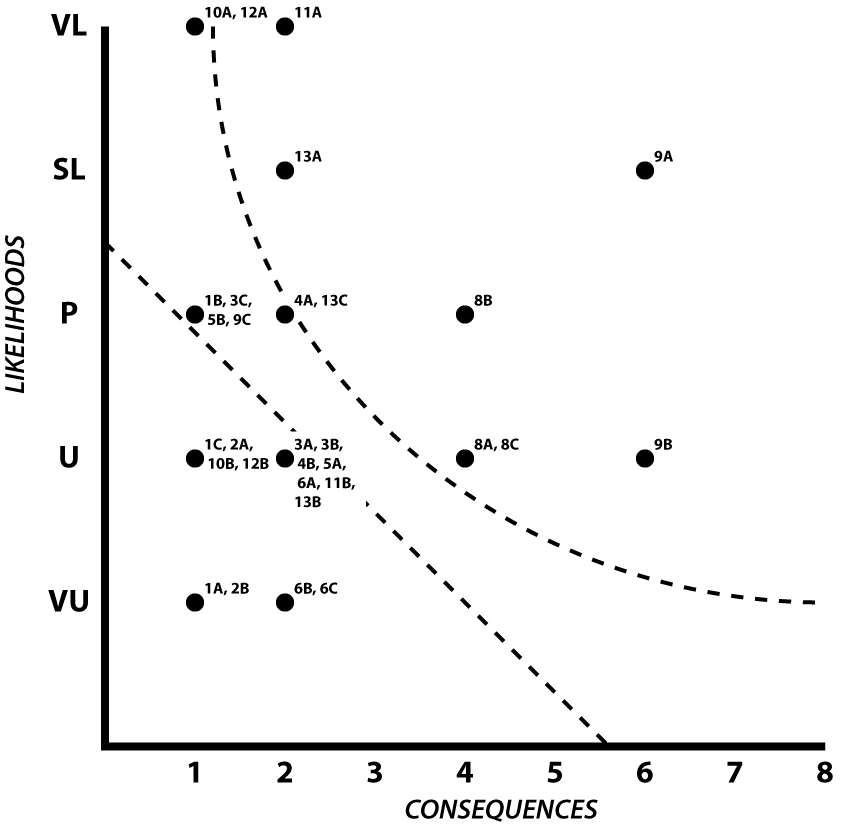
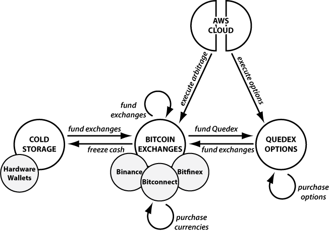

# Chapter Five: The Frank Family Fund Example

_Using risk modeling for more complex custodianship_

***Version: 2019-01-16 1.0.0***

## Introduction to The Frank Family Fund

This example details how to use this course's risk modeling methodology for a more complex system of digital-asset custodianship: the Frank Family Fund. In this made-up example, Frank has created a Family Fund intended to benefit his children and grandchildren. In late 2016, his manager Faythe decided to make a purchase of bitcoins due to the doubling of its value over the previous year. She placed \$6M of the Frank Family Fund’s money into the cryptocurrency. Over the next two years, bitcoin value naturally increased in value by about 10x, and Faythe managed another 2x growth due to expert leverage and arbitrage. This portion of the Fund is now worth approximately \$100M after various costs and fees.

Unfortunately, the infrastructure that Faythe has built up around the cryptocurrency holdings of the FFF is haphazard and (frankly) risky. Faythe manages it along with her CFO, Bob, and two interns, Chuck and Dan. Private keys are largely held by online exchanges, but those services are accessible through authenticated APIs on an Amazon Web Service (AWS) server, which the interns have used to automate the arbitrage of cryptocurrencies and the purchase and sale of options. Anyone in the office could probably do anything they wanted with the funds, and there’s also considerable exposure at AWS and the other online services.

The FFF could easily lose everything, and so it’s badly in need of some risk modeling.

## Section I: Asset Characterization

### Step 1: Identify Your Assets

***Faythe's Story.*** The assets in the FFF are divided between three locations.

60% of the funds are stored at three different exchanges: Bitconnect, Bitfinex, and Binance. These exchanges were the foundation of the FFF’s funds two years ago. As Faythe and her office gained experience with the money-making opportunities of cryptocurrency, they began using these exchanges for arbitrage: they purposefully maintain funds at different exchanges that support different pairings of cryptocurrencies, allowing for the quick purchase and sale of funds. Though the FFF occasionally dabbles in other cryptocurrencies in this way, it maintains most of its reserves in bitcoin or in Tether, with some Bitcoin Cash scattered across their accounts due to the fork. Authentication information for these accounts, which is used to automate arbitrage, exist on AWS.

20% of the funds are stored at Quedex, a bitcoin-settled options and futures market. This allows Faythe and her office to issue PUT calls for their bitcoin holdings as a hedge and also to further speculate on cryptocurrency futures using careful sets of PUT and CALL options. This has been a huge boon as bitcoin value has dropped in recent years. Again, these accounts are linked to the FFF’s AWS server, to support automated creation and maintenance of options

20% of the funds are stored in cold storage. This is a haphazard collection of two Trezors, one Ledger, and a few dozen paper wallets that represent some early purchases and some attempts to move a percentage of funds to a less exposed medium.

Faythe initially writes down the crypto-assets in the FFF as follows:

1. Bitcoins in Exchanges
   a) Bitconnect
   b) Bitfinex
   c) Binance
2. Bitcoins, Options, and Futures at Quedex
3. Bitcoins in Cold Storage
   a) Keys in Hardware Wallets
   b) Keys in Paper Wallets

Faythe then realizes that she needs to write down one more asset: the AWS server that contains authentication for the exchanges and Qudex:

4. Authentication Info at AWS

{pagebreak}

### Step 2: Value Your Assets

***Faythe's Story.*** Faythe initially values Frank’s assets based on the percentage of the FFF’s value at each location, converting the percentagesages to a simpler number from 1 to 10:

1. Bitcoins in Exchanges \[6\]
   a) Bitconnect \[2\]
   b) Bitfinex \[3\]
   c) Binance \[1\]

Faythe notes that about 20% of the holdings are at Bitconnect, 30% at Bitfinex, and 10% at Binance.

2. Bitcoins, Options, and Futures at Quedex \[2\]
3. Bitcoins in Cold Storage \[2\]
   a) Keys in Hardware Wallets \[. 5 = 1\]
   b) Keys in Paper Wallets \[1.5 = 2\]

About three-quarters of the FFF’s cold storage is old paper wallets, with the remaining minority being in high-tech hardware wallets. Though 1 + 2 don’t add up to the overall 2, Faythe still feels that this is a good representation of the asset values.

4. Authentication Info at AWS \[8\]

Faythe had never realized how high the valuation was for that AWS account, but sure enough it gives comprehensive access to all of the exchanges and Quedex. Those represent 80% of the FFF’s holdings, and they could all be lost if AWS was compromised, so she marks this as an 8.

Here are the final asset numbers for the FFF:

1. Bitcoins in Exchanges \[6\]
   a) Bitconnect \[2\]
   b) Bitfinex \[3\]
   c) Binance \[1\]
2. Bitcoins, Options, and Futures at Quedex \[2\]
3. Bitcoins in Cold Storage \[2\]
   a) Keys in Hardware Wallets \[1\]
   b) Keys in Paper Wallets \[2\]
4. Authentication Info at AWS \[8\]

{pagebreak}

### Step 3: Diagram Your Process

***Faythe's Story.*** Faythe decides to represent the FFF asset list as four nodes: the AWS cloud, the Bitcoin exchanges, the Quedex site, and the cold storage. Both the exchanges and the cold storage have subnodes, so she duly notes those too (though she expects to treat all of the exchanges as having the same vulnerabilities).

Because Faythe keeps careful records of everything, she didn’t miss any physical nodes. She also decides not to include any alternate nodes at this point. At some time in the (hopefully) far future, Frank’s funds will become available to his heirs, and some of them may want to cash out, but for now there are no fiat funds moving in and out of the system.

Faythe next draws out her interfaces. Most of them are just simple money exchanges, which run cash between cold storage, the Bitcoin exchanges, the Quedex site, and back. The FFF always uses the exchanges as the intermediary, because that’s where the majority of the cash is. Faythe treats the interfaces leading into the exchanges (“fund exchanges”) as all being the same, but recognizes that there might be unique vulnerabilities moving funds to cold storage and to Quedex.

The AWS cloud acts as the control for automated purchases and sales of both options and currencies, so there are interfaces from the cloud to both the exchanges and Quedex. Finally, there are internal interfaces for both the exchanges and Quedex that represent buying currencies (for arbitrage) and buying options. The options are mechanically simple, but the arbitrage is a complex system that involves simultaneously buying and selling currencies at two different exchanges, followed by a rebalancing of funds between the exchanges. Despite that complexity, Faythe decides to represent it as a simple “purchase currencies” interfaces, because that’s the core action at each of the exchanges.

{class: center, width: "70%"}

The end result reminds Faythe of the importance of both the AWS Cloud, which has considerable control over these cryptocurrency holdings, and the Bitcoin exchanges, which sit at the center of the diagram and connect to a half-dozen interfaces.

{pagebreak}

## Section II: Risk Characterization

### Step 4: Brainstorm Interface Vulnerabilities

***Faythe's Story.*** Faythe numbers the interfaces and brainstorms vulnerabilities with Bob, Chuck, and Dan. Chuck seems disturbingly good at figuring out how things might break.

1. Freeze cash
   a) Paper wallet software did not generate a legitimate address
   b) I did not print paper wallet right
   c) I did not send to my paper or hardware wallet address
2. Fund Exchanges/Quedex
   a) I did not send to my exchange account
   b) Exchange did not record funds
3. Execute arbitrage
   a) I got bad data from exchange
   b) I sent command to wrong exchange
   c) My auth expired and I could not conduct arbitrage
4. Purchase currencies
   a) I purchased currencies too late
   b) I bought wrong currency
5. Execute options
   a) I got bad data from Quedex
   b) My auth expired and I could not purchase options
6. Purchase options
   a) I confused PUT and CALL options
   b) I choose incorrect expiry for options
   c) I choose incorrect strike price for options

As she writes her list, Faythe also notices that funding Quedex and the exchanges have the same vulnerabilities, so she collapses them into one interface.

{pagebreak}

### Step 5: Brainstorm Custody Vulnerabilities

***Faythe's Story.*** Faythe has a lot of different assets involved in the FFF cryptocurrency setup. She’s the queasiest about the AWS node, because of its enormous control over her network, but she also realizes that those paper wallets are disasters waiting to happen.

7. Cold Storage: Paper Wallet
   a) Paper wallet is water damaged
   b) Paper wallet is burnt up in fire
   c) Paper wallet is thrown out as junk
   d) Paper wallet is stolen
8. Cold Storage: Hardware Wallet
   a) Hardware wallet stops working
   b) I forget Hardware wallet PIN
   c) Linked desktop software stops working
9. AWS
   a) My AWS node is targeted by hackers
   b) My AWS node is targeted by unethical employees
   c) My AWS node dies

Though the Quedex site and the Bitcoin exchanges will have different risk profiles due to their different asset exposures, they have largely the same potential problems, so Faythe lists them together:

10. Exchange (Bitconnect)
11. Exchange (Bitfinex)
12. Exchange (Binance)
    a) Company is targeted by hackers
    b) Bitcoins are stolen by employees
13. Quedex
    a) Company is targeted by hackers
    b) Bitcoins are stolen by employees
    c) Site problems prevent executing options in time

{pagebreak}

### Step 6: Brainstorm Non-Physical Vulnerabilities

***Faythe's Story.*** Faythe choose not to include any non-physical assets when she listed the FFF’s assets in Step 2. There are certainly reputation concerns if she had a big loss of bitcoin. And, physical security is a general issue — but it goes far beyond her company’s cryptocurrency holdings, so it’s part of her larger risk model. She thus can skip over this step when specifically working through bitcoin risks.

{pagebreak}

### Step 7: Assess Consequences & Likelihoods of Vulnerabilities

***Faythe’s Story.*** Faythe has a lot of vulnerabilities listed, 30 total, but she knows this is just the first step in winnowing everything down to the actual risks that she needs to really worry about. So, she writes down her total list of assets, interfaces, and related vulnerabilities and gets to work figuring out which ones are the most problematic.

She starts with the ***Consequences***. The assets (7-13) are easy, because they largely correlate with the values of the assets: in most cases, a vulnerability could result in the asset being entirely lost. There were just two exceptions, where vulnerabilities involve the automated software not making trades or purchases correctly (9c, 13c). That would certainly be bad for Faythe as a custodian and investor, but the actual loss of funds, even if this problem was ongoing for a long time, would be minimal when compared to the overall valuations.

The interfaces require Faythe to think more. When rebalancing funds, she never moves more than 10% of the fund’s cash around at a time (1, 2), so again it would be very bad if that were lost, but it doesn’t have the high consequence of some of the asset-related risks. Someday, if she were closing out cryptocurrency accounts, she might be moving more money and have to reassess this, but for the moment those interfaces get marked as low consequence. For the arbitrage and options (3, 4, 5, 6), Faythe sometimes quickly moves around up to 20% of the FFF’s funds, so there are higher potential consequences there.

She then moves on to ***Likelihoods***. She opts to use the likelihood scale of: Very Unlikely (VU), Somewhat Unlikely (U), Possible (P), Somewhat Likely (SL), and Very Likely (VL). Obviously, this is a personal assessment, but by dividing things into these five categories, Faythe is able to meaningfully differentiate the vulnerabilities … and if she’s one category off, it’s still meaningful. Though Faythe is a financial expert, she also has to assess the likelihood of whether her interns will make mistakes in their code or their understanding of the financial system.

When she’s done, she has a chart of consequences and likelihoods for each asset and interface:

1. Freeze cash
   a) Paper wallet software did not generate a legitimate address \[C: 1, L: VU\]
   b) I did not print paper wallet right \[C: 1, L: P\]
   c) I did not send to my paper or hardware wallet address \[C: 1, L: U\]
2. Fund Exchanges/Quedex
   a) I did not send to my exchange account \[C: 1, L: U\]
   b) Exchange did not record funds \[C: 1, L: VU\]
3. Execute arbitrage
   a) I got bad data from exchange \[C: 2, L: U\]
   b) I sent command to wrong exchange \[C: 2, L: U\]
   c) My auth expired and I could not conduct arbitrage \[C: 1, L: P\]
4. Purchase currencies
   a) I purchased currencies too late \[C: 2, L: P\]
   b) I bought wrong currency \[C: 2, L: U\]
5. Execute options
   a) I got bad data from Quedex \[C: 2, L: U\]
   b) My auth expired and I could not purchase options \[C: 1, L: P\]
6. Purchase options
   a) I confused PUT and CALL options \[C: 2, L: U\]
   b) I choose incorrect expiry for options \[C: 2, L: VU\]
   c) I choose incorrect strike price for options \[C: 2, L: VU\]
7. Cold Storage: Paper Wallet
   a) Paper wallet is water damaged \[C: 2, L: P\]
   b) Paper wallet is burnt up in fire \[C: 2, L: U\]
   c) Paper wallet is thrown out as junk \[C: 2, L: P\]
   d) Paper wallet is stolen \[C: 2, L: VU\]
8. Cold Storage: Hardware Wallet
   a) Hardware wallet stops working \[C: 1, L: U\]
   b) I forget Hardware wallet PIN \[C: 1, L: P\]
   c) Linked desktop software stops working \[C: 1, L: U\]
9. AWS
   a) My AWS node is targeted by hackers \[C: 8, L: SL\]
   b) My AWS node is targeted by unethical employees \[C: 8, L: U\]
   c) My AWS node dies \[C: 1, L: P\]
10. Exchange (Bitconnect)
    a) Company is targeted by hackers \[C: 2, L: VL\]
    b) Bitcoins are stolen by employees \[C: 2, L: U\]
11. Exchange (Bitfinex)
    a) Company is targeted by hackers \[C: 3, L: VL\]
    b) Bitcoins are stolen by employees \[C: 3, L: U\]
12. Exchange (Binance)
    a) Company is targeted by hackers \[C: 1, L: VL\]
    b) Bitcoins are stolen by employees \[C: 1, L: U\]
13. Quedex
    a) Company is targeted by hackers \[C: 2, L: SL\]
    b) Bitcoins are stolen by employees \[C: 2, L: U\]
    c) Site problems prevent executing options in time \[C: 1, L: P\]

{pagebreak}

### Step 8: Chart Consequences & Likelihoods to Reveal Risks

***Faythe’s Story.*** Faythe is now ready to chart out all the risks for the FFF.

As she does, she notices that her two axes aren’t quite in alignment because her likelihoods are a 5-point scale and her consequences only went up to eight points, not the full ten. She could resolve this in two ways, either by just truncating the consequences, and having them run a little short, or by doing her best to make the five likelihood points and the eight consequence points take up the same amount of room; she does the latter. She plots in all her risks, then draws her risk-tolerance line at 70% (and an asymptotic curve at 20%).

{class: center, width: "70%"} 

The overall chart looks pretty good. As Faythe suspected, the interfaces are the least of her problems. Safety for the FFF depends largely on her securing the places where assets are sitting.

{pagebreak}

### Step 9: Consider Asset Valuation Changes

***Faythe’s Story.*** Before resolving risks, Faythe considers all of the FFF’s assets in turn. She wants to know if they make sense, and if changing them could reduce risks.

First, up are the exchanges (10-12) and Quedex (13). Looking over the record of usage for the last year, she finds that the FFF usually uses all of the Quedex (13) and Binance (12) funds, but the Bitconnect (10) and Bitfinex (11) accounts are both overfunded: there are often bitcoins sitting there, not being used. So, she’s going to reduce them by 10% each, with the excess going to cold storage.

This should put Bitconnect and Bitfinex closer to the risk-tolerance line and also drop the value of the AWS account (9).

This in turn raises the question of which cold storage to use, because it just creates more risk when Faythe must manage the potential issues of both hardware wallets (8) and paper wallets (7). Though Faythe rated the dangers of the two somewhat similarly, looking at all the options suggests that a hardware wallet is slightly better, so she consolidates on that. Doing so *will* raise some of the hardware wallet’s dangers up to just over the risk-tolerance lines but it’s a good tradeoff for the reductions in the danger of the online sites

1. Bitcoins in Exchanges \[~~6~~ 4\]
   a) Bitconnect \[~~2~~ 1\]
   b) Bitfinex \[~~3~~ 2\]
   c) Binance \[1\]
2. Bitcoins, Options, and Futures at Quedex \[2\]
3. Bitcoins in Cold Storage \[~~2~~ 4\]
   a) Keys in Hardware Wallets \[~~1~~ 4\]
   b) ~~Keys in Paper Wallets \[2\]~~
4. Authentication Info at AWS \[~~8~~ 6\]

Faythe also talks with Chuck and Dan about whether the functionality of the AWS node can be divided up, perhaps with arbitrage control and options control being operated by different servers. Dan starts working on it. When he’s done, Faythe will be able to revise her risk structure again. For now, she charts out the updates the result from moving finances around:

{class: center, width: "70%"} 

There are actually more risks above Faythe’s risk-tolerance lines than there were *before* this step, but Faythe feels better with them as a whole, because everything is generally closer to the line.

{pagebreak}

### Step 10: List Final Risks

***Faythe’s Story.*** Faythe now lists all the actual Risks revealed by her final chart. She explicitly includes the seven risks above both risk-tolerance lines and she explicitly excludes everything approximately even or both lines. That leaves her with ones in between the two lines. She decides the asset-related ones (10A, 12A) are very similar to other issues she’ll be dealing with, and keeps them, but she doesn’t worry about the procedure-related issues (4A, 13C).

1. 8A: Hardware wallet stops working
2. 8B: I forget Hardware wallet PIN
3. 8C: Linked desktop software stops working
4. 9A: My AWS node is targeted by hackers
5. 9B: My AWS node is targeted by unethical employees
6. 10A: Company is targeted by hackers
7. 11A: Company is targeted by hackers
8. 12A: Company is targeted by hackers
9. 13A: Company is targeted by hackers

Apparently, Faythe should be very worried about hackers, because the FFF has so much money in hot wallets and other online sites. That’s reasonable.

{pagebreak}

## Section III: Risk Resolution

### Step 11: Correlate Final Risks to Digital Adversaries

***Faythe’s Story.*** Faythe now correlates her list to a set of standardized adversaries. In doing so, she realises that hackers can come in many forms.

1. 8A: Hardware wallet stops working — ***Bitrot***
2. 8B: I forget Hardware wallet PIN — ***Key Fragility***
3. 8C: Linked desktop software stops working — ***Bitrot***
4. 9A: My AWS node is targeted by hackers — ***Personal*** or ***Systemic Network Attack***
5. 9B: My AWS node is targeted by unethical employees — ***Institutional Theft***
6. 10A: Company is targeted by hackers— ***Personal*** or ***Systemic Network Attack***
7. 11A: Company is targeted by hackers — ***Personal*** or ***Systemic Network Attack***
8. 12A: Company is targeted by hackers — ***Personal*** or ***Systemic Network Attack***
9. 13A: Company is targeted by hackers — ***Personal*** or ***Systemic Network Attack***

She then creates a prioritized list of adversaries to deal with:

1. Personal Network Attack \[9A, 10A, 11A, 12A, 13A\]
2. Systemic Network Attack \[9A, 10A, 11A, 12A, 13A\]
3. Bitrot \[8A, 8C\]
4. Institutional Theft \[9B\]
5. Key Fragility \[8B\]

This is a nice reduction from the 30 risks that Faythe initially laid
out … which is of course the point of the exercise.

{pagebreak}

### Step 12: Take Steps to Foil Adversaries

***Faythe’s Story.*** Faythe now runs through all of the suggestions listed in her five adversaries, paying special attention to the Network Attacks, as the risk-analysis system listed them as her most important vulnerability. She ends up cutting out the “Institutional Theft” solutions entirely, because they’re focused more on people stealing at her company than at the exchanges, and she doesn’t consider that an issue based on her rigorous background checks.

***Process Solutions:***

1. **Maintain Emergency Procedure. (x2)**
2. **Monitor the Industry. (x2)**
3. **Monitor Your Funds. (x2)**
4. **Practice Anonymity.**
5. **Redundantly Relay Your Secrets.**
6. **Take the Time.**
7. **Verify Your Keys.**

For the process solutions, Faythe decides to concentrate on the first three, which showed up more than once. Emergency Procedures are exactly the sort of documented workflow that she wants to add to a process that grew up in an ad hoc manner. Meanwhile, regularly monitoring the industry and the FFF’s funds should help to offset some of the implicit danger of having funds in hot wallets. She sets the interns on the latter: they’ll spend some time watch Bitcoin news sources, and will also write some software to alert Faythe if funds suddenly change in an unexpected way.

***Cold Storage Solutions:***

1. **Backup Your OS File System.**
2. **Maintain Setup Information.**
3. **Physically Store Your Keys.**
4. **Redundantly Store Your Keys.**
5. **Rotate Your Key Storage.**
6. **Verify & Rotate your Backups.**
7. **Verify Your Key Storage.**
8. **Cold Storage Scenario and Optional Steps:**
   a) Use a (Second) USB Stick
   b) Use Bags (Tamper-Evident)
   c) Use Metal Enhancement (Redundant Metal Devices) **(x2)**
   d) Use a (USB) Laser Printer.

The cold storage solutions are an epiphany for Faythe. She’d previously thought of the paper wallets and Ledger as a fire-and-forget solution to store some bitcoins in a less exposed way, but now she realizes that they’re full of dangers too.She sets the interns to adopting the entire cold storage procedure, with all the suggested optional steps. With Redundant Metal Tiles acting as a supplement to the Ledgers, Faythe no longer needs to worry about what would happen if she forgot the PIN, but simultaneously the PIN-locked Ledgers and the separated tiles provide excellent protection from any sort of casual theft.

***Hot Wallet Solutions:***

1. **Create Cold Storage Procedure. (x2)**
2. **Maintain Account Security. (x2)**
3. **Practice Session Security.**
4. **Question Policies & Procedures.**

Faythe knows that the hot wallets at the exchanges and Quedex represent the greatest vulnerabilities in the FFF’s cryptocurrency scheme, but unlike many investors, she doesn’t have the option to minimize that vulnerability, because she’s an active trader in options and cryptocurrency alike.

Still, she can try to reduce the danger, and these solutions point the way. First, she tells the interns to regularly rotate the passwords and other authentication information. Second, she begins preparing questions for the exchanges to assess how they protect their bitcoins; if they won’t answer or they give her answers that she doesn’t like, then Faythe will consider other alternatives: there are a lot of exchanges out there, and at least she can choose the ones that are best secured.

{pagebreak}

## Section IV: Process Repetition

### Step 13: Repeat the Process

***Faythe’s Story.*** The biggest changes to come out of Faythe’s risk-modeling work were procedural, informational, or related to the single node of cold storage. A few months later, Dan is also able to come up with a solution that allows splitting the AWS node without damaging the overall process that allows trading of both currencies and options.

Thus, Faythe’s final diagram is a bit different from the original:

{class: center, width: "70%"} 

She’ll use this new diagram as the foundation of a new risk-modeling exercise in 6-12 months time.
