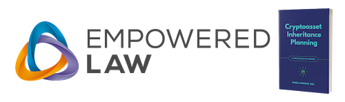
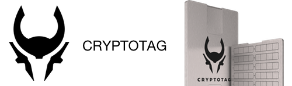

# Sponsors

{float: left, width: "30%"}

**[Adamant Capital](https://www.adamantcapitalfund.com/)** runs Adamant Fund I, a Bitcoin Alpha fund. Their mission is to responsibly outperform Bitcoin in a tax-efficient manner. Their vision is to build on Bitcoin as a collateral asset, as a basis for lending, as a financial benchmark, and as a developing technology

{float: left, width: "30%"}

**[Blockstream](https://blockstream.com/)** has a mission to create the financial infrastructure of the future. They build crypto-financial infrastructure based on Bitcoin, the most robust and secure blockchain. Applying cutting-edge cryptography and security engineering, they are building the products and networks that make financial markets more efficient by reducing reliance on trust. 

{float: left, width: "30%"}

**[Cryptoasset Inheritance Planning](https://t.co/hsLxiZdQya) by Pamela Morgan** is a clear blueprint to inheritance planning for those holding cryptocurrency, tokens, crypto-collectibles, and other cryptoassets. Since 2015, Pamela has educated thousands of cryptocurrency owners around the world about why inheritance planning for cryptoassets matters and how to do it in a secure, usable, resilient, and efficient manner.

{float: left, width: "30%"}

**[CryptoTag](https://cryptotag.io/)** is a crypto security company from Amsterdam. They believe cryptocurrencies and blockchain will make our society a better place. They are a security company whose customers count on them to be there when all the other layers of security, like hardware and software layers, fail.

{float: left, width: "30%"}

**[Digital Contract Design](https://contract.design)** creates contracts with trust minimization. They engage in Contract Design
to show how contracts could be made more reliable; they offer Threat Analysis to demonstrate how well contract design holds up in an adversarial setting; and they work with the W3C Credentials Community Group and Rebooting Web-of-Trust community to provide a Self-Sovereign Identity Wallet.

{float: left, width: "30%"}

**[Ledger](https://www.ledger.com/)** develops security and infrastructure solutions for cryptocurrencies, as well as blockchain applications for individuals and companies, by leveraging a distinctive, proprietary technology. Their Ledger Nano S and the touchscreen Ledger Blue can both directly support 23 cryptocurrencies — and dozens more via third party applications.

**[Unchained Capital](https://www.unchained-capital.com/)** is a new kind of financial services company. They are the first collaborative asset management firm that offers loans and vaults for your Bitcoin. It was founded by people who believe that cryptocurrencies have the potential to change the world but only if they're useful. They set out to build financial products for long-term crypto-investors to get more value from their assets today and in the future.

{float: left, width: "30%"}

**[Winstead](https://www.winstead.com/Practices/Corporate-SecuritiesMA/Fintech-Cryptocurrencies-Emerging-Technologies)** is a law firm whose Fintech, Cryptocurrencies & Emerging Technologies team  counsels clients on structuring digital asset transactions — from trading cryptocurrencies directly; participating in token launches; secondary trading of tokens; acquiring digital asset exposure through equity vehicles and derivatives; or making more traditional venture capital or other investments in companies building protocols, trading platforms other infrastructure.
